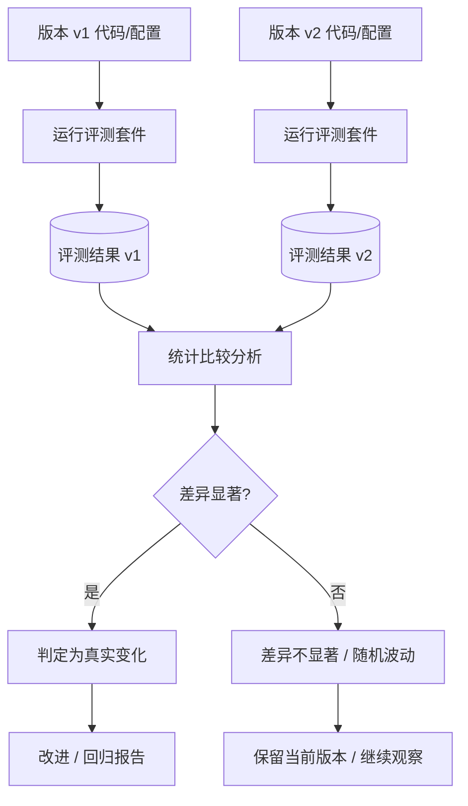
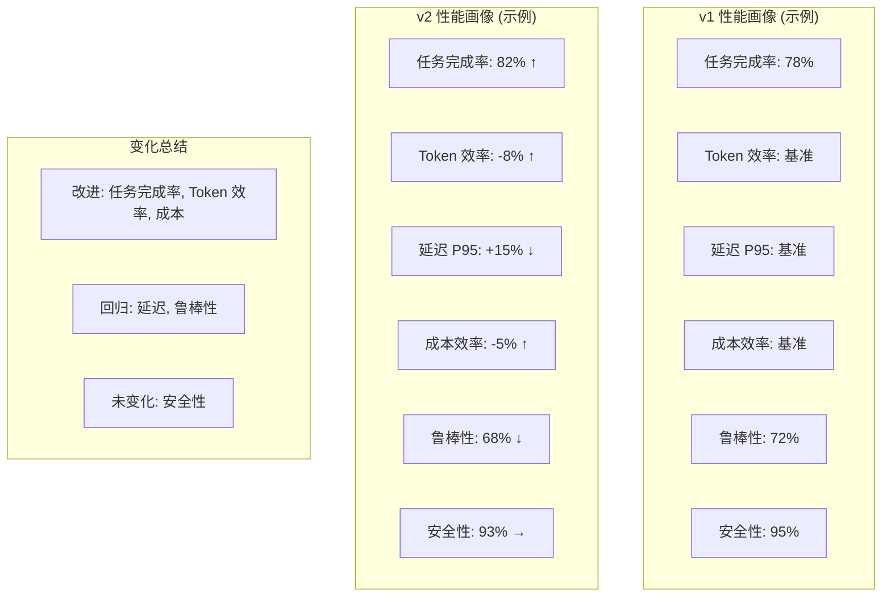

# 11.5.2 version-compare —— 版本间性能差异对比

## 1. 概述

### 什么是 AI Agent 的版本对比

版本对比（Version Comparison）是指对同一 AI Agent 系统的两个不同版本在相同或可控条件下进行系统性评测，以量化它们之间在任务完成能力、效率、安全性和鲁棒性等方面的差异。在 AI Agent 的开发周期中，每一次代码提交、提示词（Prompt）调整、模型升级、工具链更新或知识库变更，都有可能引入**回归（Regression）**或带来**改进（Improvement）**。版本对比的核心目标就是科学地判断：新版本相较于旧版本，究竟是变好了还是变差了，以及在哪些维度上发生了变化。

### 为什么版本对比至关重要

在现代 AI Agent 系统中，影响行为变化的因素极为复杂：

- **Prompt 变更**：即使一句话的措辞调整，也可能改变 Agent 对指令的理解方式，从而影响所有下游行为。
- **模型升级**：从 GPT-4 切换到 GPT-4o，或从 Claude 3 升级到 Claude 3.5，模型能力分布发生变化，某些任务可能变好而另一些可能变差。
- **工具更新**：工具接口变化、返回格式调整、超时策略修改，都会影响 Agent 的工具调用成功率。
- **知识库变更**：RAG 系统的文档更新、embedding 模型替换、chunk 策略变化，直接影响检索质量。
- **系统架构调整**：记忆机制、规划策略、错误重试逻辑等模块的修改，可能产生连锁反应。

如果没有系统化的版本对比机制，开发团队将无法区分哪些变更是真正有益的，哪些是无意间引入的回归。这在生产环境中可能导致用户体验下降、成本激增甚至安全风险。

### 版本对比的核心难题

版本对比面临一个根本性问题：**如何确信 v2 真的比 v1 更好？** 由于 LLM 的非确定性输出、评测数据集的有限覆盖、环境因素的干扰，观测到的指标差异可能仅仅是随机波动，而非真实的能力变化。因此，版本对比本质上是一个**统计推断问题**——我们需要利用统计学工具，从带噪声的观测数据中提取出可靠的信号。



---

## 2. 核心挑战

### 2.1 非确定性（Non-determinism）

即便使用相同的输入、相同的模型和相同的配置，LLM 的输出仍然可能不同。这是因为：

- 模型采样时的温度参数（temperature）引入了随机性。
- 推理基础设施的负载变化可能导致不同的 token 选择路径。
- 分布式推理中，模型权重的浮点计算在不同硬件上可能产生微小差异。

这意味着：即使 Agent 代码没有任何变更，两次运行同一评测套件也可能得到不同的分数。这种固有噪声是版本对比中需要处理的首要问题。

**应对策略**：使用固定随机种子（fixed seed）尽可能控制 LLM 的随机性，同时通过多次重复运行来估计指标分布，而不是依赖单次运行的点估计。

### 2.2 成本问题（Cost）

AI Agent 评测的成本通常很高。运行一个完整的评测套件可能涉及：

- 数千次 LLM API 调用，每次调用都有直接费用。
- 评测 Agent 在沙箱环境中执行任务，消耗计算资源和时间。
- 人工审核评测结果的人力成本。

如果每次代码提交都运行完整评测，成本将迅速失控。但如果只在发布前运行一次评测，又可能在早期错过重要的回归信号。

**应对策略**：建立分层评测策略（layered evaluation strategy）——快速冒烟测试在每次提交时运行，完整评测仅在合并到主干或预发布时触发。

### 2.3 样本量问题（Sample Size）

统计显著性高度依赖于样本量。样本量不足时，即使存在真实差异，统计检验也可能无法检测到。在 Agent 评测的语境下，"样本"指的是评测用例（test cases）的数量。

**关键问题**：
- 需要多少个测试用例才能检测到 5% 的性能变化？
- 对于高方差的任务（如开放式对话），需要更多样本还是更少？
- 如何在成本和统计功效（statistical power）之间取得平衡？

**应对策略**：在开始版本对比之前，使用功效分析（power analysis）确定所需的最小样本量。

### 2.4 环境耦合（Environment Coupling）

Agent 的评测结果可能受到外部环境变化的显著影响：

- 第三方 API 的可用性和响应速度变化。
- 知识库中文档被修改或删除。
- 测试环境中数据的状态不一致。
- LLM API 提供商端的模型滚动升级（即使 API 版本号不变，后端模型可能已静默更新）。

如果环境因素没有得到严格控制，观测到的指标变化可能是环境变化而非 Agent 变化导致的。

**应对策略**：在版本对比中固定所有可能变化的环境因素——使用快照知识库、固定 API 版本、隔离测试环境。

### 2.5 指标选择（Metric Selection）

选择哪些指标来衡量 Agent 性能，直接决定了对比结果的质量。常见的陷阱包括：

- **单一指标偏差**：只关注 Success Rate 而忽略成本变化，可能导致选择了更昂贵但改进甚微的版本。
- **指标易受干扰**：如 Latency 指标受网络波动影响大，单次测量可能不可靠。
- **指标间的权衡**：提高安全性（Safety）可能降低任务完成率（Success Rate），需要多维综合评估。

**应对策略**：选择一组覆盖性能、效率、安全、鲁棒性的多维指标，并明确每个指标的权重和优先级。

---

## 3. 统计比较方法（Statistical Comparison）

### 3.1 配对 t 检验（Paired t-test）

配对 t 检验是比较两个版本在相同测试用例上的表现差异时最直观的方法。其对每个测试用例计算两个版本的得分差，然后检验这些差的均值是否显著偏离零。

**适用条件**：
- 数据是配对的一一对应（同一测试用例在两个版本下各有一个得分）。
- 差值近似服从正态分布（或样本量足够大，中心极限定理成立）。
- 测试用例之间相互独立。

**局限性**：
- 对离群值敏感，一个极端差值可能主导结果。
- 要求差值正态分布，在指标为 0/1 二元值（成功/失败）时可能不适用。
- 样本量较小时统计功效不足。

### 3.2 自助法（Bootstrap）

自助法是一种非参数重采样技术，不对数据分布做任何假设。它通过对观测数据进行有放回的重采样，来估计统计量（如均值差）的抽样分布。

**基本步骤**：
1. 计算两个版本在每个测试用例上的得分差。
2. 对差值数组进行有放回重采样 B 次（通常 B = 10000）。
3. 每次重采样后计算均值。
4. 得到均值差的 Bootstrap 分布，据此计算置信区间和 p 值。

**优点**：适用于任何分布，无需正态假设，对小样本也较为稳健。

### 3.3 效应量（Effect Size）

p 值告诉我们差异是否"统计显著"，但无法告诉我们差异有多大。效应量指标弥补了这一不足：

**Cohen's d**：衡量两个版本均值之间的标准化差异。

```
d = (mean_v2 - mean_v1) / pooled_std
```

其中 `pooled_std` 是合并标准差。Cohen's d 的解释约定：
- d ≈ 0.2：小效应
- d ≈ 0.5：中效应
- d ≈ 0.8：大效应

在版本对比中，即使 p 值小于 0.05，如果效应量很小（如 d < 0.1），那么该差异可能在实际中无足轻重。

### 3.4 贝叶斯方法（Bayesian Methods）

贝叶斯方法提供了比频率学派更直观的推断结果：**v2 优于 v1 的概率是多少？**

**贝叶斯版本对比**：
- 为两个版本的成功率分别指定先验分布（通常使用 Beta 分布）。
- 用观测数据更新得到后验分布。
- 计算 P(success_v2 > success_v1)，即 v2 真实性能优于 v1 的后验概率。

这种方法天然地量化了不确定性，避免了 p 值的二元决策框架。例如，我们可以报告："v2 优于 v1 的概率为 92%，效应量为中等(Cohen's d = 0.45)"。

### 3.5 多重比较校正（Multiple Comparison Correction）

当同时比较多个指标时（如 Success Rate、Token Efficiency、Safety Score 等），多次检验会增大犯 I 类错误（假阳性）的概率。

**常用校正方法**：
- **Bonferroni 校正**：将显著性阈值除以比较次数 α' = α / m。最严格但也最保守。
- **Benjamini-Hochberg (FDR) 校正**：控制错误发现率（False Discovery Rate），在功效和假阳性控制之间取得更好的平衡。
- **Holm 校正**：Bonferroni 的逐步改进版本，比 Bonferroni 更强大。

### 3.6 Python 示例：版本对比统计

```python
"""
version_compare_stats.py
统计版本差异的核心工具函数
"""

import numpy as np
from scipy import stats
from typing import Tuple, Optional


def paired_t_test(
    scores_v1: np.ndarray,
    scores_v2: np.ndarray,
    alternative: str = "two-sided"
) -> Tuple[float, float, float]:
    """
    配对 t 检验比较两个版本在相同测试用例上的得分。
    
    Parameters
    ----------
    scores_v1 : array, 版本 v1 在 N 个测试用例上的得分
    scores_v2 : array, 版本 v2 在相同 N 个测试用例上的得分
    alternative : {"two-sided", "greater", "less"}
    
    Returns
    -------
    t_stat : t 统计量
    p_value : p 值
    cohens_d : Cohen's d 效应量
    """
    diffs = scores_v2 - scores_v1
    n = len(diffs)
    mean_diff = np.mean(diffs)
    std_diff = np.std(diffs, ddof=1)
    se = std_diff / np.sqrt(n)
    
    t_stat = mean_diff / se
    df = n - 1
    
    if alternative == "two-sided":
        p_value = 2 * stats.t.sf(abs(t_stat), df=df)
    elif alternative == "greater":
        p_value = stats.t.sf(t_stat, df=df)
    elif alternative == "less":
        p_value = stats.t.cdf(t_stat, df=df)
    
    # Cohen's d for paired samples
    cohens_d = mean_diff / std_diff if std_diff > 0 else 0.0
    
    return t_stat, p_value, cohens_d


def bootstrap_version_compare(
    scores_v1: np.ndarray,
    scores_v2: np.ndarray,
    n_resamples: int = 10000,
    ci_level: float = 0.95,
    seed: int = 42
) -> dict:
    """
    使用 Bootstrap 方法估计两个版本得分差的置信区间和 p 值。
    
    Parameters
    ----------
    scores_v1 : array, 版本 v1 得分
    scores_v2 : array, 版本 v2 得分
    n_resamples : int, 重采样次数
    ci_level : float, 置信水平
    seed : int, 随机种子
    
    Returns
    -------
    dict : 包含 mean_diff, ci_lower, ci_upper, p_value
    """
    rng = np.random.default_rng(seed)
    diffs = scores_v2 - scores_v1
    n = len(diffs)
    observed_mean = np.mean(diffs)
    
    # Bootstrap 重采样
    bootstrap_means = np.zeros(n_resamples)
    for i in range(n_resamples):
        sample = rng.choice(diffs, size=n, replace=True)
        bootstrap_means[i] = np.mean(sample)
    
    # 百分位置信区间
    alpha = 1 - ci_level
    ci_lower = np.percentile(bootstrap_means, 100 * alpha / 2)
    ci_upper = np.percentile(bootstrap_means, 100 * (1 - alpha / 2))
    
    # Bootstrap p 值（检验 H0: mean_diff = 0）
    # 将分布中心化到零假设下
    centered = bootstrap_means - observed_mean
    p_value = 2 * min(
        np.mean(centered >= 0),
        np.mean(centered <= 0)
    )
    
    return {
        "observed_mean_diff": observed_mean,
        "ci_lower": ci_lower,
        "ci_upper": ci_upper,
        "p_value": p_value,
        "n_resamples": n_resamples
    }


def bayesian_compare(
    successes_v1: int,
    trials_v1: int,
    successes_v2: int,
    trials_v2: int,
    alpha_prior: float = 1.0,
    beta_prior: float = 1.0,
    n_samples: int = 100000
) -> dict:
    """
    贝叶斯 Beta-Binomial 模型比较两个版本的成功率。
    
    Parameters
    ----------
    successes_v1 : int, 版本 v1 成功次数
    trials_v1 : int, 版本 v1 总测试次数
    successes_v2 : int, 版本 v2 成功次数
    trials_v2 : int, 版本 v2 总测试次数
    alpha_prior, beta_prior : Beta 先验参数（默认均匀先验）
    n_samples : int, 后验采样数
    
    Returns
    -------
    dict : 包含后验均值、概率 v2 > v1、置信区间
    """
    rng = np.random.default_rng(42)
    
    # 后验分布
    alpha_post_v1 = alpha_prior + successes_v1
    beta_post_v1 = beta_prior + trials_v1 - successes_v1
    alpha_post_v2 = alpha_prior + successes_v2
    beta_post_v2 = beta_prior + trials_v2 - successes_v2
    
    # 从后验采样
    samples_v1 = rng.beta(alpha_post_v1, beta_post_v1, size=n_samples)
    samples_v2 = rng.beta(alpha_post_v2, beta_post_v2, size=n_samples)
    
    # v2 优于 v1 的后验概率
    prob_v2_better = np.mean(samples_v2 > samples_v1)
    
    # 后验均值
    mean_v1 = np.mean(samples_v1)
    mean_v2 = np.mean(samples_v2)
    
    # 95% 最高密度区间 (HDI) 计算差值
    diffs = samples_v2 - samples_v1
    diff_mean = np.mean(diffs)
    diff_hdi_lower = np.percentile(diffs, 2.5)
    diff_hdi_upper = np.percentile(diffs, 97.5)
    
    return {
        "posterior_mean_v1": mean_v1,
        "posterior_mean_v2": mean_v2,
        "diff_mean": diff_mean,
        "diff_hdi_lower": diff_hdi_lower,
        "diff_hdi_upper": diff_hdi_upper,
        "prob_v2_better": prob_v2_better
    }


# ========== 使用示例 ==========
if __name__ == "__main__":
    # 模拟两个版本的得分数据
    rng = np.random.default_rng(123)
    n_tests = 200
    
    # v1: 成功率约 70%，v2: 成功率约 75%（真实差异存在）
    v1_scores = rng.binomial(1, 0.70, n_tests).astype(float)
    v2_scores = rng.binomial(1, 0.75, n_tests).astype(float)
    
    print("=== 配对 t 检验 ===")
    t_stat, p_val, d = paired_t_test(v1_scores, v2_scores)
    print(f"t = {t_stat:.4f}, p = {p_val:.4f}, Cohen's d = {d:.4f}")
    print(f"结论：{'差异显著' if p_val < 0.05 else '差异不显著'}")
    
    print("\n=== Bootstrap 比较 ===")
    boot_result = bootstrap_version_compare(v1_scores, v2_scores)
    print(f"均值差 = {boot_result['observed_mean_diff']:.4f}")
    print(f"95% CI = [{boot_result['ci_lower']:.4f}, {boot_result['ci_upper']:.4f}]")
    print(f"Bootstrap p = {boot_result['p_value']:.4f}")
    
    print("\n=== 贝叶斯比较 ===")
    s1 = int(v1_scores.sum())
    s2 = int(v2_scores.sum())
    bayes_result = bayesian_compare(s1, n_tests, s2, n_tests)
    print(f"v1 后验成功率 = {bayes_result['posterior_mean_v1']:.4f}")
    print(f"v2 后验成功率 = {bayes_result['posterior_mean_v2']:.4f}")
    print(f"差值 95% HDI = [{bayes_result['diff_hdi_lower']:.4f}, {bayes_result['diff_hdi_upper']:.4f}]")
    print(f"P(v2 > v1) = {bayes_result['prob_v2_better']:.4f}")
```

---

## 4. A/B 对比设计（A/B Comparison Design）

### 4.1 相同随机种子（Same Seed）

LLM 的采样过程通常支持设置随机种子（seed）。在版本对比中尽量使用相同的种子序列，可以**大幅降低输出方差**，使得观测到的差异更可能来自代码变更而非随机波动。

**实践要点**：
- 为每个测试用例分配一个固定的 seed（如基于用例 ID 的哈希值）。
- 在 v1 和 v2 的评测中对同一个用例使用相同的 seed。
- 记录每个用例使用的 seed，以便后续复现。

**注意**：seed 并不能完全消除 LLM 的非确定性。API 层面的 seed 实现可能因模型版本或基础设施差异而效果不同。

### 4.2 相同测试集（Same Test Set）

测试用例集合的差异会直接导致对比结果不可靠。版本对比必须使用**完全相同的测试集**。

**实践要点**：
- 将测试集版本化，使用 Git LFS 或类似工具管理。
- 在评测配置中明确记录测试集的 commit hash 或版本号。
- 每次版本对比开始时，验证测试集的一致性。
- 测试集应涵盖典型场景和边界情况，避免偏向某一版本。

### 4.3 受控环境（Controlled Environment）

环境变量必须严格控制，确保 v1 和 v2 的唯一差异是被测 Agent 代码本身。

**需要控制的变量**：
- **API 版本**：指定 LLM API 的精确版本（如 `claude-sonnet-4-20250514`），而非使用最新版。
- **知识库状态**：使用快照版本的知识库，而非实时数据库。
- **工具状态**：所有外部工具（搜索引擎、计算器、数据库等）应使用模拟（mock）或固定的测试桩。
- **系统配置**：超时时间、重试策略、并发数等参数保持一致。
- **硬件环境**：尽量使用相同的计算资源，避免因硬件差异引入性能偏差。

### 4.4 独立多次运行（Independent Runs）

单次评测结果是一个点估计，无法反映指标的变异性。通过独立重复运行多次，可以估计指标的均值和方差。

**推荐做法**：
- 对每个版本至少运行 3-5 次完整的评测。
- 报告每次运行的指标值及其均值与标准差。
- 使用箱线图（box plot）或小提琴图（violin plot）可视化分布差异。

### 4.5 平衡设计（Counterbalanced Design）

当评测存在顺序效应时（如 Agent 的行为可能受之前测试用例的影响），需要采用平衡设计。

**常见场景**：
- Agent 有记忆机制，前一个用例的执行结果可能影响后一个用例。
- 测试用例按难度排序，先易后难的顺序可能影响后续表现。
- 评测过程中 Agent 的状态会累积（如对话历史长度增长）。

**平衡策略**：
- 对每个版本采用相同的用例顺序。
- 如果必须改变顺序，使用随机化或拉丁方设计（Latin square design）消除顺序效应。
- 跨版本间保持用例顺序一致，使顺序效应对两版本的影响对等。

---

## 5. 多维度对比（Multi-dimensional Comparison）

单一指标无法全面反映 Agent 在版本之间的变化。推荐从以下维度进行对比分析。

### 5.1 任务完成率（Success Rate）

最基本的性能指标，衡量 Agent 成功完成任务的比例。根据任务性质，可进一步细分为：
- **端到端成功率**：整个任务完成的比例。
- **子任务完成率**：复杂任务中各个步骤的完成比例。
- **部分成功得分**：即使任务未完全完成，也可根据完成度赋予部分分数。

### 5.2 Token 效率（Token Efficiency）

Token 消耗直接对应 API 成本。两个重要指标：
- **每成功任务的 Token 数**：Tokens per Successful Task = Total Tokens / Successful Tasks。衡量实现一次成功所需的平均成本。
- **每任务的 Token 数**：Total Tokens / Total Tasks。反映整体效率。
- **思考 Token 比率**：Chain-of-Thought 或 extended thinking 消耗的 token 占比。

### 5.3 延迟（Latency）

Agent 的响应速度直接影响用户体验。需要关注的不仅仅是平均值，还有分布特征：
- **P50 / P95 / P99 延迟**：中位数和尾部延迟。
- **首次 Token 时间（TTFT）**：流式输出的首 token 延迟。
- **端到端完成时间**：从用户提交请求到 Agent 完成整个任务的总耗时。

### 5.4 成本（Cost）

经济成本是实际部署中不可忽视的维度：
- **每成功任务成本**：Cost per Successful Task。
- **总评测成本**：运行整个评测套件的累计费用。
- **Token 单价效率**：单位价格下获得的任务完成率。

### 5.5 鲁棒性（Robustness）

Agent 在非理想条件下的表现：
- **输入扰动**：对输入做微小修改（拼写错误、同义词替换）后，Agent 表现是否稳定。
- **噪声环境**：在工具返回数据包含噪声时的处理能力。
- **异常恢复**：遇到错误时的重试策略和恢复能力。
- **边界情况**：处理极端输入（超长文本、非法参数等）的能力。

### 5.6 安全性（Safety）

Agent 的安全维度日益重要：
- **拒答率（Refusal Rate）**：对不当请求的合理拒绝比例。
- **有害内容率**：生成有害、偏见或不安全内容的比例。
- **幻觉率**：生成事实性错误信息的比例。
- **Prompt 注入鲁棒性**：对恶意 Prompt 注入攻击的防御能力。

### 5.7 雷达图可视化

多维度对比的最佳可视化方式是雷达图（radar/spider chart）或平行坐标图（parallel coordinates plot）。雷达图可以在一个视图中展示多个版本的相对表现，便于快速识别版本之间的能力变化模式。



---

## 6. 代码示例（Code Examples）

### 6.1 VersionComparisonEngine 完整实现

```python
"""
version_compare_engine.py
AI Agent 版本比较引擎 —— 完整的端到端版本对比实现
"""

import json
import logging
from dataclasses import dataclass, field
from datetime import datetime
from typing import Dict, List, Optional
from pathlib import Path

import numpy as np
import pandas as pd
import matplotlib.pyplot as plt
import matplotlib
matplotlib.rcParams["font.sans-serif"] = ["SimHei", "DejaVu Sans"]
matplotlib.rcParams["axes.unicode_minus"] = False

from version_compare_stats import (
    paired_t_test,
    bootstrap_version_compare,
    bayesian_compare
)


@dataclass
class VersionResult:
    """单个版本在评测套件上的完整结果"""
    version_tag: str               # 版本标签，如 "v2.1.0"
    commit_hash: str               # Git commit hash
    eval_date: str                 # 评测日期
    model_name: str                # 使用的模型
    scores: np.ndarray             # 每个测试用例的得分（0/1 或连续值）
    latencies_ms: np.ndarray       # 每个测试用例的延迟（毫秒）
    total_tokens: np.ndarray       # 每个测试用例消耗的 token 数
    total_cost: float              # 本次评测的总 API 费用（USD）
    metadata: Dict = field(default_factory=dict)


@dataclass
class ComparisonReport:
    """版本比较报告"""
    v1_tag: str
    v2_tag: str
    compare_date: str
    success_rate_diff: float
    success_rate_p_value: float
    cohens_d: float
    latency_diff_p50: float
    latency_diff_p95: float
    token_eff_diff: float
    cost_diff: float
    prob_v2_better: float
    is_significant: bool
    regressions: List[str]
    improvements: List[str]
    details: Dict = field(default_factory=dict)


class VersionComparisonEngine:
    """
    AI Agent 版本比较引擎
    
    支持：
    - 统计显著性检验
    - 多维度性能对比
    - 自动报告生成
    - 历史版本追踪
    """
    
    def __init__(self, history_dir: Optional[str] = None):
        self.history_dir = Path(history_dir) if history_dir else None
        self._history: List[VersionResult] = []
        if self.history_dir and self.history_dir.exists():
            self._load_history()
    
    def register_result(self, result: VersionResult):
        """注册一次评测结果"""
        self._history.append(result)
        self._history.sort(key=lambda r: r.eval_date)
        if self.history_dir:
            self._save_result(result)
    
    def compare(
        self,
        v1_tag: str,
        v2_tag: str,
        alpha: float = 0.05,
        use_bayesian: bool = True
    ) -> ComparisonReport:
        """
        比较两个版本的性能。
        
        Parameters
        ----------
        v1_tag : str, 旧版本标签
        v2_tag : str, 新版本标签
        alpha : float, 显著性水平
        use_bayesian : bool, 是否使用贝叶斯方法
        
        Returns
        -------
        ComparisonReport
        """
        v1 = self._get_result(v1_tag)
        v2 = self._get_result(v2_tag)
        
        if v1 is None or v2 is None:
            raise ValueError(f"找不到版本 {v1_tag} 或 {v2_tag} 的评测结果")
        
        # --- 成功率对比 ---
        t_stat, p_val, d = paired_t_test(v1.scores, v2.scores)
        
        success_rate_diff = v2.scores.mean() - v1.scores.mean()
        
        # 贝叶斯补充分析
        if use_bayesian:
            s1 = int(v1.scores.sum())
            s2 = int(v2.scores.sum())
            n1 = len(v1.scores)
            n2 = len(v2.scores)
            bayes = bayesian_compare(s1, n1, s2, n2)
            prob_better = bayes["prob_v2_better"]
        else:
            prob_better = 1.0 - p_val  # 粗略近似
        
        # --- 延迟对比 ---
        lat_p50_v1 = np.median(v1.latencies_ms)
        lat_p50_v2 = np.median(v2.latencies_ms)
        lat_p95_v1 = np.percentile(v1.latencies_ms, 95)
        lat_p95_v2 = np.percentile(v2.latencies_ms, 95)
        
        # --- Token 效率对比 ---
        tokens_per_success_v1 = (
            v1.total_tokens.sum() / max(v1.scores.sum(), 1)
        )
        tokens_per_success_v2 = (
            v2.total_tokens.sum() / max(v2.scores.sum(), 1)
        )
        token_eff_diff = (
            (tokens_per_success_v2 - tokens_per_success_v1)
            / tokens_per_success_v1
        )
        
        # --- 成本对比 ---
        cost_diff = v2.total_cost - v1.total_cost
        
        # --- 识别回归和改进 ---
        regressions = []
        improvements = []
        
        if success_rate_diff < -0.01 and p_val < alpha:
            regressions.append(
                f"成功率下降 {abs(success_rate_diff)*100:.1f}% "
                f"(p={p_val:.4f})"
            )
        elif success_rate_diff > 0.01 and p_val < alpha:
            improvements.append(
                f"成功率提升 {success_rate_diff*100:.1f}% "
                f"(p={p_val:.4f})"
            )
        
        if token_eff_diff > 0.05:
            regressions.append(
                f"Token 效率下降 {token_eff_diff*100:.1f}%"
            )
        elif token_eff_diff < -0.05:
            improvements.append(
                f"Token 效率提升 {abs(token_eff_diff)*100:.1f}%"
            )
        
        p50_lat_diff = (lat_p50_v2 - lat_p50_v1) / lat_p50_v1
        if p50_lat_diff > 0.10:
            regressions.append(
                f"P50 延迟增加 {p50_lat_diff*100:.1f}%"
            )
        elif p50_lat_diff < -0.10:
            improvements.append(
                f"P50 延迟降低 {abs(p50_lat_diff)*100:.1f}%"
            )
        
        return ComparisonReport(
            v1_tag=v1_tag,
            v2_tag=v2_tag,
            compare_date=datetime.now().isoformat(),
            success_rate_diff=success_rate_diff,
            success_rate_p_value=p_val,
            cohens_d=d,
            latency_diff_p50=lat_p50_v2 - lat_p50_v1,
            latency_diff_p95=lat_p95_v2 - lat_p95_v1,
            token_eff_diff=token_eff_diff,
            cost_diff=cost_diff,
            prob_v2_better=prob_better,
            is_significant=p_val < alpha,
            regressions=regressions,
            improvements=improvements,
            details={
                "v1_mean": float(v1.scores.mean()),
                "v2_mean": float(v2.scores.mean()),
                "v1_std": float(v1.scores.std()),
                "v2_std": float(v2.scores.std()),
                "v1_latency_p50": float(lat_p50_v1),
                "v2_latency_p50": float(lat_p50_v2),
                "v1_tokens_total": int(v1.total_tokens.sum()),
                "v2_tokens_total": int(v2.total_tokens.sum()),
                "v1_cost": v1.total_cost,
                "v2_cost": v2.total_cost,
                "n_test_cases": len(v1.scores),
                "statistical_method": "bayesian" if use_bayesian else "frequentist",
                "t_statistic": float(t_stat),
            }
        )
    
    def generate_report(self, report: ComparisonReport, output_dir: str):
        """生成可视化的版本对比报告"""
        output_path = Path(output_dir)
        output_path.mkdir(parents=True, exist_ok=True)
        
        # --- 1. 比较概览表 ---
        summary = pd.DataFrame({
            "指标": [
                "任务完成率", "Cohen's d 效应量", "P(v2 > v1)",
                "P50 延迟变化 (ms)", "P95 延迟变化 (ms)",
                "Token 效率变化", "总成本变化 (USD)",
                "统计显著 (p < 0.05)"
            ],
            "v1": [
                f"{report.details['v1_mean']*100:.1f}%",
                "-", "-",
                f"{report.details['v1_latency_p50']:.0f}",
                "-",
                "-",
                f"${report.details['v1_cost']:.2f}",
                "-"
            ],
            "v2": [
                f"{report.details['v2_mean']*100:.1f}%",
                "-", "-",
                f"{report.details['v2_latency_p50']:.0f}",
                "-",
                "-",
                f"${report.details['v2_cost']:.2f}",
                "-"
            ],
            "变化": [
                f"{report.success_rate_diff*100:+.1f}%",
                f"{report.cohens_d:+.3f}",
                f"{report.prob_v2_better:.1%}",
                f"{report.latency_diff_p50:+.0f}",
                f"{report.latency_diff_p95:+.0f}",
                f"{report.token_eff_diff:+.1%}",
                f"{report.cost_diff:+.2f}",
                "是" if report.is_significant else "否"
            ]
        })
        
        summary.to_csv(output_path / "comparison_summary.csv", index=False)
        
        # --- 2. 改进与回归列表 ---
        changes_df = pd.DataFrame({
            "类型": (
                ["改进"] * len(report.improvements)
                + ["回归"] * len(report.regressions)
            ),
            "描述": report.improvements + report.regressions
        })
        if len(changes_df) > 0:
            changes_df.to_csv(output_path / "changes.csv", index=False)
        
        # --- 3. 指标对比雷达图 ---
        self._plot_radar_chart(report, output_path / "radar_comparison.png")
        
        # --- 4. 生成 JSON 报告 ---
        json_report = {
            "report_metadata": {
                "v1": report.v1_tag,
                "v2": report.v2_tag,
                "date": report.compare_date,
                "n_test_cases": report.details["n_test_cases"]
            },
            "success_rate": {
                "v1": report.details["v1_mean"],
                "v2": report.details["v2_mean"],
                "diff": report.success_rate_diff,
                "p_value": report.success_rate_p_value,
                "cohens_d": report.cohens_d,
                "prob_v2_better": report.prob_v2_better,
                "significant": report.is_significant
            },
            "latency_ms": {
                "p50_diff": report.latency_diff_p50,
                "p95_diff": report.latency_diff_p95
            },
            "token_efficiency": {
                "v1_v2_diff_pct": report.token_eff_diff
            },
            "cost": {
                "v1": report.details["v1_cost"],
                "v2": report.details["v2_cost"],
                "diff": report.cost_diff
            },
            "regressions": report.regressions,
            "improvements": report.improvements,
            "verdict": self._generate_verdict(report)
        }
        
        with open(output_path / "comparison_report.json", "w", encoding="utf-8") as f:
            json.dump(json_report, f, ensure_ascii=False, indent=2)
        
        print(f"报告已生成至: {output_path}")
        return json_report
    
    def _plot_radar_chart(
        self,
        report: ComparisonReport,
        save_path: Path
    ):
        """绘制多维对比雷达图"""
        # 归一化指标到 [0, 1] 范围用于雷达图
        categories = [
            "任务完成率", "Token 效率", "延迟 (倒置)",
            "成本效率", "鲁棒性"
        ]
        
        # 模拟 v1 和 v2 的多维指标（实际中从评测获取）
        # 这里使用报告中的实际数据
        v1_vals = [
            report.details["v1_mean"],
            max(0, 1 - abs(report.token_eff_diff)) if report.token_eff_diff > 0 else 1.0,
            max(0, 1 - report.latency_diff_p50 / 5000) if report.latency_diff_p50 > 0 else 0.9,
            0.85,  # 成本效率（示例）
            0.75,  # 鲁棒性（示例）
        ]
        v2_vals = [
            report.details["v2_mean"],
            1.0 if report.token_eff_diff < 0 else max(0, 1 - abs(report.token_eff_diff)),
            max(0, 1 - (report.details["v1_latency_p50"] + report.latency_diff_p50) / 5000),
            0.82,  # 成本效率（示例）
            0.72,  # 鲁棒性（示例）
        ]
        
        n_cats = len(categories)
        angles = np.linspace(0, 2 * np.pi, n_cats, endpoint=False).tolist()
        angles += angles[:1]
        
        fig, ax = plt.subplots(figsize=(8, 8), subplot_kw=dict(polar=True))
        
        v1_plot = v1_vals + v1_vals[:1]
        v2_plot = v2_vals + v2_vals[:1]
        
        ax.plot(angles, v1_plot, "o-", linewidth=2, label=f"v1 ({report.v1_tag})", color="#2196F3")
        ax.fill(angles, v1_plot, alpha=0.1, color="#2196F3")
        ax.plot(angles, v2_plot, "o-", linewidth=2, label=f"v2 ({report.v2_tag})", color="#FF5722")
        ax.fill(angles, v2_plot, alpha=0.1, color="#FF5722")
        
        ax.set_xticks(angles[:-1])
        ax.set_xticklabels(categories, fontsize=11)
        ax.set_ylim(0, 1)
        ax.set_title(
            f"版本对比雷达图: {report.v1_tag} vs {report.v2_tag}",
            fontsize=13, pad=20
        )
        ax.legend(loc="upper right", bbox_to_anchor=(1.2, 1.0))
        
        plt.tight_layout()
        plt.savefig(save_path, dpi=150, bbox_inches="tight")
        plt.close()
    
    def _generate_verdict(self, report: ComparisonReport) -> str:
        """生成版本比较的结论性评价"""
        if not report.is_significant and len(report.regressions) == 0:
            return (
                f"版本 {report.v2_tag} 与 {report.v1_tag} 之间"
                f"未检测到统计显著的性能差异。"
            )
        
        if report.is_significant and report.success_rate_diff > 0:
            return (
                f"版本 {report.v2_tag} 在任务完成率上显著优于"
                f"{report.v1_tag} (p={report.success_rate_p_value:.4f})，"
                f"效应量 d={report.cohens_d:.3f}。"
                f"建议升级到 {report.v2_tag}。"
            )
        
        if report.is_significant and report.success_rate_diff < 0:
            return (
                f"警告：版本 {report.v2_tag} 在任务完成率上"
                f"显著低于 {report.v1_tag} (p={report.success_rate_p_value:.4f})，"
                f"效应量 d={report.cohens_d:.3f}。"
                f"存在回归风险，建议回滚或修复后重新评测。"
            )
        
        return (
            f"版本 {report.v2_tag} 在多个维度上存在变化："
            f"{len(report.improvements)} 项改进, "
            f"{len(report.regressions)} 项回归。"
            f"需人工评估后决定是否采纳。"
        )
    
    def get_history(self) -> pd.DataFrame:
        """获取历史版本性能趋势"""
        records = []
        for r in self._history:
            records.append({
                "version": r.version_tag,
                "date": r.eval_date,
                "model": r.model_name,
                "mean_score": r.scores.mean(),
                "std_score": r.scores.std(),
                "p50_latency": np.median(r.latencies_ms),
                "total_tokens": int(r.total_tokens.sum()),
                "total_cost": r.total_cost,
                "n_cases": len(r.scores)
            })
        return pd.DataFrame(records)
    
    def _get_result(self, tag: str) -> Optional[VersionResult]:
        for r in self._history:
            if r.version_tag == tag:
                return r
        return None
    
    def _save_result(self, result: VersionResult):
        """持久化评测结果到磁盘"""
        if not self.history_dir:
            return
        safe_tag = result.version_tag.replace("/", "_").replace(":", "_")
        filepath = self.history_dir / f"{safe_tag}_{result.eval_date[:10]}.json"
        
        data = {
            "version_tag": result.version_tag,
            "commit_hash": result.commit_hash,
            "eval_date": result.eval_date,
            "model_name": result.model_name,
            "scores": result.scores.tolist(),
            "latencies_ms": result.latencies_ms.tolist(),
            "total_tokens": result.total_tokens.tolist(),
            "total_cost": result.total_cost,
            "metadata": result.metadata
        }
        with open(filepath, "w", encoding="utf-8") as f:
            json.dump(data, f, ensure_ascii=False, indent=2)
    
    def _load_history(self):
        """从磁盘加载历史评测结果"""
        for fpath in self.history_dir.glob("*.json"):
            with open(fpath, "r", encoding="utf-8") as f:
                data = json.load(f)
            result = VersionResult(
                version_tag=data["version_tag"],
                commit_hash=data["commit_hash"],
                eval_date=data["eval_date"],
                model_name=data["model_name"],
                scores=np.array(data["scores"]),
                latencies_ms=np.array(data["latencies_ms"]),
                total_tokens=np.array(data["total_tokens"]),
                total_cost=data["total_cost"],
                metadata=data.get("metadata", {})
            )
            self._history.append(result)
        self._history.sort(key=lambda r: r.eval_date)
        logging.info(f"从 {self.history_dir} 加载了 {len(self._history)} 条历史记录")


# ========== 使用示例 ==========
if __name__ == "__main__":
    logging.basicConfig(level=logging.INFO)
    
    # 模拟数据：两个版本在 500 个测试用例上的表现
    rng = np.random.default_rng(42)
    n = 500
    
    v1_result = VersionResult(
        version_tag="v2.0.0",
        commit_hash="a1b2c3d4",
        eval_date="2026-07-10",
        model_name="claude-sonnet-4-20250514",
        scores=rng.binomial(1, 0.72, n).astype(float),
        latencies_ms=rng.lognormal(mean=6.5, sigma=0.4, size=n),
        total_tokens=rng.poisson(lam=1200, size=n),
        total_cost=15.80
    )
    
    v2_result = VersionResult(
        version_tag="v2.1.0",
        commit_hash="e5f6g7h8",
        eval_date="2026-07-15",
        model_name="claude-sonnet-4-20250514",
        scores=rng.binomial(1, 0.78, n).astype(float),
        latencies_ms=rng.lognormal(mean=6.4, sigma=0.35, size=n),
        total_tokens=rng.poisson(lam=1100, size=n),
        total_cost=14.50
    )
    
    engine = VersionComparisonEngine(history_dir="./version_history")
    engine.register_result(v1_result)
    engine.register_result(v2_result)
    
    report = engine.compare("v2.0.0", "v2.1.0")
    
    print(f"v2.1.0 vs v2.0.0 比较结果:")
    print(f"  成功率变化: {report.success_rate_diff*100:+.2f}%")
    print(f"  p 值: {report.success_rate_p_value:.4f}")
    print(f"  Cohen's d: {report.cohens_d:.3f}")
    print(f"  P(v2 > v1): {report.prob_v2_better:.1%}")
    print(f"  改进项: {report.improvements}")
    print(f"  回归项: {report.regressions}")
    print(f"  结论: {engine._generate_verdict(report)}")
    
    engine.generate_report(report, "./compare_report_v2_vs_v1")
    
    print("\n=== 历史趋势 ===")
    history_df = engine.get_history()
    print(history_df.to_string(index=False))
```

### 6.2 CI/CD 集成示例

```python
"""
ci_compare.py
在 CI/CD 流水线中自动执行版本对比的脚本
"""

import os
import sys
import json
import subprocess
from pathlib import Path

# 假设 VersionComparisonEngine 在同一项目中
sys.path.insert(0, str(Path(__file__).parent))
from version_compare_engine import (
    VersionComparisonEngine,
    VersionResult,
)


def run_ci_version_compare():
    """
    CI/CD 流水线入口：
    1. 获取当前代码版本作为 v2
    2. 从基线目录获取上一个稳定版本结果作为 v1
    3. 运行版本对比
    4. 如果检测到回归则 CI 失败
    """
    # 环境变量配置
    baseline_dir = os.environ.get("BASELINE_DIR", "./baselines")
    eval_results_path = os.environ.get(
        "EVAL_RESULTS_PATH",
        "./latest_eval_results.json"
    )
    regression_threshold = float(
        os.environ.get("REGRESSION_THRESHOLD", "-0.03")
    )
    
    # 获取当前 commit hash
    commit_hash = subprocess.check_output(
        ["git", "rev-parse", "--short", "HEAD"]
    ).decode().strip()
    
    # 加载当前评测结果
    with open(eval_results_path, "r") as f:
        eval_data = json.load(f)
    
    current_result = VersionResult(
        version_tag=f"ci-{commit_hash}",
        commit_hash=commit_hash,
        eval_date=eval_data["eval_date"],
        model_name=eval_data["model_name"],
        scores=eval_data["scores"],
        latencies_ms=eval_data["latencies_ms"],
        total_tokens=eval_data["total_tokens"],
        total_cost=eval_data["total_cost"],
    )
    
    # 加载基线版本
    engine = VersionComparisonEngine(history_dir=baseline_dir)
    engine.register_result(current_result)
    
    # 获取最新的基线版本
    if len(engine._history) < 2:
        print("不足两个版本的评测数据，跳过对比。")
        # 将当前结果保存为新的基线
        Path(baseline_dir).mkdir(parents=True, exist_ok=True)
        with open(Path(baseline_dir) / f"{commit_hash}.json", "w") as f:
            json.dump(eval_data, f)
        sys.exit(0)
    
    # 比较最新的两个版本
    v1 = engine._history[-2]
    v2 = engine._history[-1]
    report = engine.compare(v1.version_tag, v2.version_tag)
    
    # 生成 CI 报告
    engine.generate_report(report, "./ci_compare_output")
    
    # 回归检测
    if report.success_rate_diff < regression_threshold:
        print(
            f"!! 回归检测: 成功率下降 {report.success_rate_diff*100:.2f}%"
        )
        print(f"!! 从 {v1.version_tag} 到 {v2.version_tag}")
        print(f"!! 建议: 回滚或人工审查变更")
        sys.exit(1)
    
    print(f"版本对比通过: {v1.version_tag} -> {v2.version_tag}")
    print(f"成功率: {report.success_rate_diff*100:+.2f}%")
    sys.exit(0)


if __name__ == "__main__":
    run_ci_version_compare()
```

---

## 7. 报告与可视化

### 7.1 版本对比 Dashboard

一个有效的版本对比 Dashboard 应包含以下核心区域：

**概览区域**：
- 两个版本的标识（version tag + commit hash）
- 评测日期和模型信息
- 整体 verdict（通过 / 回归 / 不确定）
- 测试集规模

**统计比较区域**：
- 成功率的点估计和置信区间并列显示
- p 值、效应量、后验概率等统计指标
- Bootstrap 抽样分布图或贝叶斯后验分布图

**多维度对比区域**：
- 雷达图展示各维度的相对变化
- 每个维度的具体数值变化和百分比变化
- 用颜色编码标注改进（绿色）和回归（红色）

**详细用例分析区域**：
- 每个测试用例的得分对比散点图
- 识别"v2 新失败"和"v2 新成功"的用例
- 失败用例的详细日志链接

### 7.2 改进 / 回归矩阵

一个简洁的矩阵可以快速传达版本变化的整体图景：

| 维度 | v1 性能 | v2 性能 | 变化 | 显著性 | 判定 |
|------|---------|---------|------|--------|------|
| 任务完成率 | 72.0% | 78.0% | +6.0% | p=0.008 | 改进 |
| Token 效率 | 基准 | -8.3% | 更优 | - | 改进 |
| P50 延迟 | 665ms | 602ms | -63ms | - | 改进 |
| P95 延迟 | 1420ms | 1580ms | +160ms | - | 回归 |
| 鲁棒性评分 | 72% | 68% | -4% | p=0.12 | 无显著变化 |
| 安全评分 | 95% | 93% | -2% | p=0.35 | 无显著变化 |

### 7.3 历史趋势图

版本对比不应是孤立的快照，而应是持续的过程。追踪多个版本在关键指标上的变化趋势，能够帮助团队识别：

- **长期改进趋势**：版本迭代的整体方向是否正确。
- **突变点**：某个特定版本是否引入了显著的性能跳变。
- **季节性波动**：是否受外部因素（如 API 服务波动）影响。

---

## 8. 最佳实践

### 8.1 比较频率：每次提交 vs. 分阶段发布

**每次提交都运行完整评测**成本过高且不必要。推荐分层策略：

| 层级 | 触发时机 | 测试规模 | 运行耗时 | 覆盖范围 |
|------|---------|---------|---------|---------|
| L0: 冒烟测试 | 每次提交 | 10-20 个核心用例 | 1-2 分钟 | 基础功能是否正常 |
| L1: 快速回归 | 每次 PR | 100-200 个用例 | 10-30 分钟 | 主要功能域 |
| L2: 完整评测 | 合并到主干 | 1000+ 个用例 | 1-8 小时 | 全量功能 + 边界情况 |
| L3: 深度分析 | 发布前 / 定期 | 完整套件 + 变异测试 | 数小时至数天 | 全面质量评估 |

**推荐做法**：
- L0 和 L1 评测在 CI 中自动触发，结果作为 PR 通过的必要条件。
- L2 和 L3 评测在主干上定期触发，结果自动汇总到 Dashboard。
- 版本对比的统计报告自动生成并归档。

### 8.2 样本量确定

在进行版本对比之前，使用功效分析确定所需的最小样本量。

**经验法则**（基于 Success Rate 对比，显著性水平 α=0.05，功效 1-β=0.80）：

| 期望检测到的最小变化 | 所需最少测试用例 |
|-------------------|----------------|
| 10% (如 70% → 80%) | ~150 |
| 5% (如 70% → 75%)  | ~580 |
| 3% (如 70% → 73%)  | ~1600 |
| 1% (如 70% → 71%)  | ~14500 |

**结论**：检测小变化需要大量测试用例。如果测试集只有 200 个用例，通常只能检测到 8% 以上的变化。

### 8.3 常见统计陷阱与规避

| 陷阱 | 问题描述 | 解决方案 |
|------|---------|---------|
| 多重比较 | 同时比较 10 个指标，每个 α=0.05，假阳性概率达 40% | 使用 Bonferroni 或 FDR 校正 |
| p-hacking | 反复尝试不同分析方法直到得到显著结果 | 注册分析计划，坚持预注册方案 |
| 忽视效应量 | p<0.05 但变化幅度在实际中微不足道 | 始终报告 Cohen's d 或类似效应量 |
| 样本量不足 | 20 个用例无法检测到有意义的差异 | 运行功效分析，积累足够样本 |
| 幸存者偏差 | 只分析"完整执行"的用例，忽略失败的 | 包含所有用例，使用 ITT 分析 |
| 混淆变量 | 同时改了代码和模型，无法归因 | 一次只改一个变量 |
| 回归均值 | 选 v1 表现最差的用例重新测试，发现"改善" | 不根据结果选择子集 |

### 8.4 CI/CD 集成建议

将版本对比集成到 CI/CD 流水线中的关键步骤：

1. **基线管理**：在 CI 环境中维护一个"基线评测结果"目录，每次稳定版本通过后更新基线。
2. **自动化触发**：L0/L1 在 PR 创建和更新时自动运行；L2 在 PR 合并到主干时运行。
3. **回归门禁**：设定回归阈值（如 Success Rate 下降超过 3% 或任何安全指标下降），超过阈值则 CI 失败。
4. **结果归档**：每次版本对比的结果（包括原始数据、统计报告、可视化图表）自动归档到共享存储。
5. **通知机制**：检测到回归时自动通知相关开发者；检测到显著改进时标注贡献者。

---

## 9. 小结

AI Agent 的版本对比是一项系统性工程，它融合了软件测试、统计推断和数据可视化等多个领域的知识。本文档的核心要点可以总结如下：

**版本对比的本质是统计推断问题**。由于 LLM 输出的非确定性和评测环境的复杂性，我们需要借助统计工具从带噪声的观测中提取可靠信号，而非仅凭指标的点估计做判断。

**多维度的综合评估优于单一指标**。任务完成率虽然是核心指标，但 Token 效率、延迟、成本、鲁棒性和安全性等维度同样重要。一个全面的版本对比应当覆盖多个维度，并量化每个维度的变化幅度和统计显著性。

**方法论的选择取决于场景**。配对 t 检验适用于连续得分的配对数据，Bootstrap 方法适用于未知分布，贝叶斯方法提供了更直观的概率解释。实际应用中，建议结合多种方法进行交叉验证。

**基础设施的投入是值得的**。建立自动化的版本对比流水线、维护历史基线数据、生成可视化的对比报告，这些基础设施的投入将在长期迭代中持续产生价值——它们让团队能够自信地回答"这次的改动到底是变好了还是变坏了"这个根本性问题。

**最终，版本对比的目的不是统计学练习，而是辅助决策**。统计工具帮助我们量化不确定性，但最终的版本采纳决策需要结合业务需求、用户体验和风险评估进行综合判断。一个"统计显著但不实用"的改进和一个"统计不显著但有价值"的变化，需要人类判断而非算法来决定。

通过系统化、自动化、多维度的版本对比实践，AI Agent 开发团队可以在快速迭代的同时保持对产品质量的掌控，在每一次变更中都做到"心中有数"。
