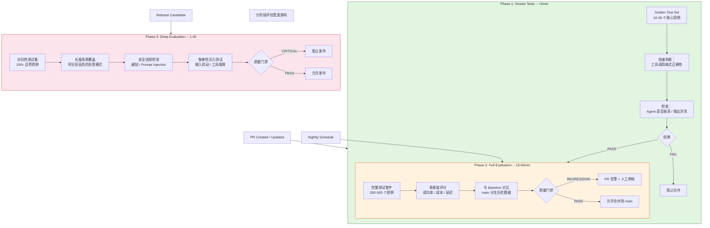

# 11.5.3 Continuous Evaluation - 持续评估（CI/CD 集成）

## 1. 概述

### 什么是 AI Agent 的持续评估？

持续评估（Continuous Evaluation）是将 AI Agent 的评测流程集成到持续集成与持续部署（CI/CD）管道中的实践。其核心思想是：**每当代码、提示词（Prompt）、模型配置或知识库发生变更时，自动触发一组评估任务，以量化变更对 Agent 性能的影响，并在质量不达标时阻止部署。**

与传统软件工程中的 CI/CD 不同，AI Agent 的持续评估关注的不只是代码是否编译通过、单元测试是否通过，而是回答以下问题：

- Agent 的回答质量是否下降？
- 工具调用（Tool Call）的正确率是否变化？
- 端到端任务成功率是否维持或提升？
- Agent 的响应延迟和 Token 消耗是否在预算内？
- 安全与对齐约束是否仍然被遵守？

### 为什么 Agent 的 CI/CD 比传统 CI/CD 更难？

传统 CI/CD 的核心是确定性测试：给定相同的输入，期望相同的输出。AI Agent 打破了这一假设：

| 维度 | 传统 CI/CD | Agent CI/CD |
|------|-----------|-------------|
| 输出确定性 | 输入确定，输出确定 | 相同输入可能产生不同输出 |
| 判断标准 | 二进制（通过/失败） | 连续评分（0-100）加多维度评估 |
| 测试速度 | 毫秒到秒级 | 秒到分钟级（LLM 推理慢） |
| 测试成本 | 仅计算资源 | LLM API 调用费用（$0.01-$1/次） |
| 环境依赖 | 依赖库/中间件 | 依赖 LLM API + 工具 API + 外部服务 |
| 测试维护 | 维护测试用例 | 维护测试用例 + 评估标准 + 预期行为 |

### 愿景

持续评估的愿景是：**每一次变更——无论是修改 Agent 系统提示词、更换底层模型、更新工具定义，还是调整检索参数——都能在进入生产环境之前，自动获得一份全面的质量报告。** 开发人员可以在 Pull Request 阶段就发现回归问题，而非等到线上事故出现后再回滚。

---

## 2. 核心挑战

### 2.1 高评估成本

AI Agent 的评估（Eval）需要使用 LLM 来处理测试用例，这意味着每一次 Eval Run 都有真实的 API 调用成本。

- 一次穿越多个工具的复杂 Agent 任务，可能消耗 10,000-50,000 Token
- 以 GPT-4 级别的模型计算，单个测试用例成本约 $0.05-$0.50
- 一个包含 500 个测试用例的完整评估套件，一次运行成本可能在 $25-$250
- 若每天运行 10 次（每次 PR 提交触发一次），每月成本可达 $7,500-$75,000

**应对策略：**
- 分阶段评估（见第 3 节），避免每次提交都运行全量评估
- 智能选择测试用例：仅运行与变更相关的评估集
- 评估结果缓存：对于未变更的模块跳过重评估

### 2.2 长运行时间

Agent 的端到端任务可能涉及多轮对话和多次工具调用。一次完整的任务可能需要 30 秒到 5 分钟才能完成。

- 500 个测试用例 x 平均 2 分钟 = 超过 16 小时的串行运行时间
- 即使并行化，也需要大量并发 Worker 和 API 配额支持

**应对策略：**
- 测试分片（Test Sharding）：将测试用例分布到多个并行 Worker
- 异步评估架构：评估结果聚合而非同步等待
- 超时控制和熔断机制：防止单个卡住的任务阻塞整个管道

### 2.3 非确定性（Flaky Tests）

这是 Agent 评估中最令人头疼的问题。同一个测试用例在同一次变更上运行两次，可能得到不同的结果：

- LLM 采样的随机性（temperature > 0）
- API 返回结果的时序差异
- 外部工具服务的状态变化
- LLM 模型更新导致的隐式行为漂移

**应对策略：**
- 统计式评估：在同一变更上运行多次，取统计结果（而非单次判定）
- 置信度区间报告：报告成功率 ± 置信区间
- Flaky Test 检测与隔离：自动标记波动过大的测试用例

### 2.4 环境管理

Agent 的运行环境远比传统应用复杂：

- LLM API 版本（模型版本可能被提供商静默更新）
- 外部工具 API 的状态与版本
- 知识库 / RAG 索引的状态
- 种子数据（测试用外部系统数据）

**应对策略：**
- 使用固定模型版本（如 `gpt-4-0613` 而非 `gpt-4`）
- Mock 外部工具 API，隔离测试与生产环境
- 使用 Docker/Snapshot 保证评估环境一致性

### 2.5 指标退化

随着时间推移，旧的评估指标可能会变得不再有意义：

- 模型升级后，原本困难的测试变得过于简单（天花板效应）
- Agent 学会了"作弊"——通过在特定测试集上过拟合来提高分数
- 用户需求演化，旧的评估标准不再反映真实使用场景

**应对策略：**
- 定期审计和更新评估套件
- 引入对抗性测试和来自生产环境的真实用例
- 建立指标过期机制，标记长期未更新的测试

---

## 3. 管道设计（Pipeline Design）

### 3.1 触发策略

| 触发方式 | 适用场景 | 评估级别 | 频率 |
|---------|---------|---------|------|
| PR 提交 | 每次代码变更 | Smoke + 影响分析 | 高 |
| PR 合并到 main | 集成验证 | Full Eval | 中 |
| 定时触发（每日/每周） | 回归检测 | Full/Deep Eval | 中低 |
| 手动触发 | 重大变更前 | Deep Eval | 低 |
| 模型提供商更新通知 | 外部模型变更 | Full Eval | 极低 |

### 3.2 分阶段评估模型



### 3.3 各阶段详细说明

#### Smoke Tests（冒烟测试）

执行最快、成本最低的预检查，确保 Agent 没有出现灾难性故障。

- **包含内容**：10-30 个"黄金"测试用例，覆盖最关键的用户旅程
- **执行时间**：< 5 分钟
- **触发条件**：每次 PR 提交
- **检查项**：
  - Agent 是否能正常启动并响应
  - 核心工具调用格式是否正确
  - 是否有异常抛出或崩溃
  - 基本输出结构是否合规
- **失败后果**：阻止合并（Hard Block）

#### Full Evaluation（完整评估）

全面的质量评估，在 PR 合并到主分支之前提供详细的回归分析。

- **包含内容**：200-500 个用例，覆盖所有功能模块
- **执行时间**：15-60 分钟（依赖并行度）
- **触发条件**：Smoke 通过 + PR 标记为 Ready for Review
- **评估维度**：
  - 任务成功率（Task Success Rate）
  - 工具调用正确率（Tool Call Accuracy）
  - 平均 Token 消耗
  - 端到端延迟
  - 用户满意度评分（LLM-as-Judge）

#### Deep Evaluation（深度评估）

更全面、更具破坏性的测试，用于发布前的最终验证。

- **包含内容**：对抗性测试 + 长尾场景 + 安全测试
- **执行时间**：1-4 小时
- **触发条件**：Release Candidate 创建 / 每周定时
- **评估维度**：
  - 对抗性鲁棒性（Adversarial Robustness）
  - Prompt Injection 防御
  - 工具滥用检测
  - 长尾 / 罕见场景覆盖
  - 多轮对话一致性

### 3.4 并行执行与分片策略

```python
# eval_sharding.py - 测试分片执行器示例
"""
AI Agent Evaluation Sharding Executor
将评估测试集分片到多个并行 Worker 中执行。
"""

import asyncio
import json
import time
from dataclasses import dataclass, field
from typing import Any, Callable


@dataclass
class EvalConfig:
    """评估配置"""
    concurrency: int = 8               # 并行 Worker 数
    shard_count: int = 4               # 分片数
    timeout_seconds: int = 300         # 单个测试超时
    retry_count: int = 2               # 失败重试次数
    api_key: str = ""                  # LLM API Key
    model_name: str = "gpt-4o"         # 评估用模型
    
    # 缓存配置
    cache_enabled: bool = True
    cache_ttl_hours: int = 24


@dataclass
class EvalResult:
    """单个测试用例的评估结果"""
    test_id: str
    passed: bool
    score: float
    latency_ms: float
    token_count: int
    cost_usd: float
    error: str | None = None
    metadata: dict[str, Any] = field(default_factory=dict)


class EvalCache:
    """评估结果缓存 - 避免重复运行未变更组件的测试"""
    
    def __init__(self, cache_dir: str = ".eval_cache"):
        self.cache_dir = cache_dir
        import os
        os.makedirs(cache_dir, exist_ok=True)
    
    def _content_hash(self, test_input: dict) -> str:
        """基于测试输入 + Agent 配置计算内容哈希"""
        import hashlib
        content = json.dumps(test_input, sort_keys=True)
        return hashlib.sha256(content.encode()).hexdigest()[:16]
    
    def get(self, test_input: dict) -> EvalResult | None:
        """尝试从缓存获取结果"""
        import os, json
        cache_key = self._content_hash(test_input)
        cache_path = f"{self.cache_dir}/{cache_key}.json"
        if os.path.exists(cache_path):
            with open(cache_path) as f:
                data = json.load(f)
            return EvalResult(**data)
        return None
    
    def set(self, test_input: dict, result: EvalResult):
        """写入缓存"""
        import json, os
        cache_key = self._content_hash(test_input)
        cache_path = f"{self.cache_dir}/{cache_key}.json"
        with open(cache_path, "w") as f:
            json.dump(result.__dict__, f, indent=2)


class ParallelEvalRunner:
    """并行评估运行器"""
    
    def __init__(self, config: EvalConfig):
        self.config = config
        self.cache = EvalCache() if config.cache_enabled else None
    
    async def run_single_test(
        self, 
        test_case: dict, 
        agent_fn: Callable
    ) -> EvalResult:
        """运行单个测试用例"""
        test_id = test_case["id"]
        
        # 1. 检查缓存
        if self.cache:
            cached = self.cache.get(test_case)
            if cached:
                print(f"[CACHE HIT] {test_id}")
                return cached
        
        # 2. 执行测试
        start = time.monotonic()
        try:
            result = await asyncio.wait_for(
                agent_fn(test_case["input"]),
                timeout=self.config.timeout_seconds
            )
            elapsed = (time.monotonic() - start) * 1000
            
            # 3. 评分
            is_pass, score = self._evaluate_result(
                test_case, result
            )
            
            eval_result = EvalResult(
                test_id=test_id,
                passed=is_pass,
                score=score,
                latency_ms=elapsed,
                token_count=result.get("token_usage", 0),
                cost_usd=self._estimate_cost(result)
            )
            
            # 4. 写入缓存
            if self.cache:
                self.cache.set(test_case, eval_result)
            
            return eval_result
            
        except asyncio.TimeoutError:
            return EvalResult(
                test_id=test_id,
                passed=False,
                score=0.0,
                latency_ms=self.config.timeout_seconds * 1000,
                token_count=0,
                cost_usd=0.0,
                error="Timeout"
            )
        except Exception as e:
            return EvalResult(
                test_id=test_id,
                passed=False,
                score=0.0,
                latency_ms=(time.monotonic() - start) * 1000,
                token_count=0,
                cost_usd=0.0,
                error=str(e)
            )
    
    async def run_shard(
        self,
        test_cases: list[dict],
        agent_fn: Callable,
        shard_id: int
    ) -> list[EvalResult]:
        """运行一个分片的所有测试"""
        semaphore = asyncio.Semaphore(self.config.concurrency)
        
        async def bounded_run(tc):
            async with semaphore:
                return await self.run_single_test(tc, agent_fn)
        
        tasks = [bounded_run(tc) for tc in test_cases]
        results = await asyncio.gather(*tasks)
        
        # 统计分片结果
        passed = sum(1 for r in results if r.passed)
        print(
            f"[SHARD {shard_id}] "
            f"{passed}/{len(results)} passed "
            f"(${sum(r.cost_usd for r in results):.2f})"
        )
        return results
    
    def _evaluate_result(
        self,
        test_case: dict,
        result: dict
    ) -> tuple[bool, float]:
        """
        评估 Agent 输出。
        接入第三方评估器（LLM-as-Judge / 规则评估器 / 工具调用验证器）。
        """
        # 在此插入您的评估逻辑
        # 例如: 调用 LangSmith / LangFuse 评估 API
        expected = test_case.get("expected_output", "")
        actual = result.get("output", "")
        
        # 简化的评估示例
        score = 1.0 if expected.lower() in actual.lower() else 0.0
        return score >= 0.8, score
    
    def _estimate_cost(self, result: dict) -> float:
        """估算 API 调用成本"""
        tokens = result.get("token_usage", 0)
        # GPT-4o: ~$2.50/1M input tokens, ~$10.00/1M output tokens
        input_tokens = result.get("input_tokens", tokens // 2)
        output_tokens = result.get("output_tokens", tokens // 2)
        return (input_tokens / 1_000_000 * 2.50 +
                output_tokens / 1_000_000 * 10.00)
```

### 3.5 智能缓存策略

**评估缓存**是降低持续评估成本的关键技术。其核心思想是：如果某个评估组件的输入没有变化，其评估结果可以直接复用。

缓存粒度决策矩阵：

| 变更类型 | 缓存策略 | 说明 |
|---------|---------|------|
| Agent System Prompt 修改 | 清除全部缓存 | Prompt 影响所有行为 |
| 工具定义修改 | 清除涉及该工具的测试缓存 | 仅影响使用该工具的测试 |
| RAG 知识库更新 | 清除 RAG 相关测试缓存 | 检索结果可能变化 |
| 评估框架代码修改 | 清除全部缓存 | 评估逻辑本身变化 |
| 测试用例增删 | 仅更新变更的测试 | 不影响其他测试 |
| CI 配置变更 | 不清除缓存 | 不影响 Agent 行为 |

---

## 4. CI/CD 集成（CI/CD Integration）

### 4.1 GitHub Actions 工作流设计

以下是一个完整的生产级 GitHub Actions 工作流，用于 AI Agent 的持续评估：

```yaml
# .github/workflows/agent-eval.yml
# AI Agent 持续评估管道 - 分阶段执行

name: Agent Evaluation Pipeline

on:
  # 1. PR 事件触发
  pull_request:
    types: [opened, synchronize, reopened]
    paths:
      - 'agent/**'
      - 'prompts/**'
      - 'tools/**'
      - 'evaluation/**'
      - '.github/workflows/agent-eval.yml'
  
  # 2. 推送到 main 分支
  push:
    branches: [main]
    paths:
      - 'agent/**'
      - 'prompts/**'
  
  # 3. 定时触发（每日回归）
  schedule:
    - cron: '0 6 * * *'  # 每天 UTC 6:00
  
  # 4. 手动触发
  workflow_dispatch:
    inputs:
      eval_level:
        description: 'Evaluation level'
        required: true
        default: 'full'
        type: choice
        options:
          - smoke
          - full
          - deep

env:
  # 评估配置
  EVAL_MODEL: gpt-4o
  EVAL_CONCURRENCY: 8
  EVAL_TIMEOUT: 300
  MAX_COST_USD: 50
  PYTHON_VERSION: '3.11'

jobs:
  # ============================================================
  # JOB 1: 变更检测与分析
  # ============================================================
  change-analysis:
    runs-on: ubuntu-latest
    outputs:
      has_agent_changes: ${{ steps.filter.outputs.agent }}
      has_prompt_changes: ${{ steps.filter.outputs.prompts }}
      has_tool_changes: ${{ steps.filter.outputs.tools }}
      eval_level: ${{ steps.set-level.outputs.level }}
    
    steps:
      - uses: actions/checkout@v4
        with:
          fetch-depth: 0  # 需要完整历史以计算 Baseline
      
      # 路径过滤：确定哪些模块发生了变更
      - uses: dorny/paths-filter@v3
        id: filter
        with:
          filters: |
            agent:
              - 'agent/**'
            prompts:
              - 'prompts/**'
            tools:
              - 'tools/**'
      
      # 根据触发类型确定评估级别
      - name: Set evaluation level
        id: set-level
        run: |
          if [[ "${{ github.event_name }}" == "pull_request" ]]; then
            echo "level=smoke" >> $GITHUB_OUTPUT
          elif [[ "${{ github.event_name }}" == "push" ]]; then
            echo "level=full" >> $GITHUB_OUTPUT
          elif [[ "${{ github.event_name }}" == "schedule" ]]; then
            echo "level=full" >> $GITHUB_OUTPUT
          elif [[ "${{ github.event_name }}" == "workflow_dispatch" ]]; then
            echo "level=${{ github.event.inputs.eval_level }}" >> $GITHUB_OUTPUT
          fi

  # ============================================================
  # JOB 2: Smoke Tests - 快速验证
  # ============================================================
  smoke-tests:
    needs: change-analysis
    if: needs.change-analysis.outputs.eval_level == 'smoke'
    runs-on: ubuntu-latest
    timeout-minutes: 10
    
    steps:
      - uses: actions/checkout@v4
      
      - name: Setup Python
        uses: actions/setup-python@v5
        with:
          python-version: ${{ env.PYTHON_VERSION }}
      
      - name: Install dependencies
        run: |
          python -m pip install --upgrade pip
          pip install pytest pytest-xdist pytest-asyncio
          pip install -r evaluation/requirements.txt
      
      - name: Run smoke tests
        env:
          OPENAI_API_KEY: ${{ secrets.OPENAI_API_KEY }}
          LANGSMITH_API_KEY: ${{ secrets.LANGSMITH_API_KEY }}
        run: |
          pytest evaluation/tests/smoke/ \
            --eval-level=smoke \
            --model=${{ env.EVAL_MODEL }} \
            --concurrency=${{ env.EVAL_CONCURRENCY }} \
            --junitxml=reports/smoke-results.xml \
            -n auto
      
      - name: Evaluate smoke test results
        if: always()
        run: |
          python evaluation/scripts/evaluate_results.py \
            --input reports/smoke-results.xml \
            --threshold 0.8 \
            --report reports/smoke-report.json
      
      - name: Upload smoke test artifacts
        if: always()
        uses: actions/upload-artifact@v4
        with:
          name: smoke-test-results
          path: reports/
      
      # 冒烟测试失败 = 硬阻断
      - name: Check smoke test gate
        if: failure()
        run: |
          echo "::error::Smoke tests failed - blocking PR merge"
          exit 1

  # ============================================================
  # JOB 3: Full Evaluation - 完整评估（可并行分片）
  # ============================================================
  full-evaluation:
    needs: [change-analysis, smoke-tests]
    if: >
      needs.change-analysis.outputs.eval_level == 'full' ||
      (needs.smoke-tests.result == 'success' && 
       needs.change-analysis.outputs.eval_level == 'smoke')
    runs-on: ubuntu-latest
    timeout-minutes: 120
    
    strategy:
      fail-fast: false  # 一个分片失败不影响其他分片
      matrix:
        shard: [1, 2, 3, 4]  # 4 个并行分片
    
    steps:
      - uses: actions/checkout@v4
      
      - name: Setup Python
        uses: actions/setup-python@v5
        with:
          python-version: ${{ env.PYTHON_VERSION }}
      
      - name: Install dependencies
        run: |
          pip install pytest pytest-xdist pytest-asyncio
          pip install -r evaluation/requirements.txt
      
      - name: Run evaluation shard ${{ matrix.shard }}
        env:
          OPENAI_API_KEY: ${{ secrets.OPENAI_API_KEY }}
          LANGSMITH_API_KEY: ${{ secrets.LANGSMITH_API_KEY }}
          LANGSMITH_PROJECT: agent-eval
        run: |
          pytest evaluation/tests/full/ \
            --eval-level=full \
            --model=${{ env.EVAL_MODEL }} \
            --shard=${{ matrix.shard }} \
            --total-shards=4 \
            --concurrency=${{ env.EVAL_CONCURRENCY }} \
            --junitxml=reports/full-results-shard-${{ matrix.shard }}.xml
      
      - name: Upload shard results
        if: always()
        uses: actions/upload-artifact@v4
        with:
          name: full-eval-shard-${{ matrix.shard }}
          path: reports/
  
  # ============================================================
  # JOB 4: 结果聚合与质量门禁
  # ============================================================
  quality-gates:
    needs: full-evaluation
    if: always()
    runs-on: ubuntu-latest
    
    steps:
      - uses: actions/checkout@v4
      
      - name: Download all shard results
        uses: actions/download-artifact@v4
        with:
          pattern: full-eval-shard-*
          path: reports/
          merge-multiple: true
      
      - name: Aggregate and evaluate quality gates
        id: quality
        env:
          LANGSMITH_API_KEY: ${{ secrets.LANGSMITH_API_KEY }}
        run: |
          python evaluation/scripts/aggregate_results.py \
            --input-dir reports/ \
            --baseline main \
            --output reports/aggregated-report.json \
            --cost-limit ${{ env.MAX_COST_USD }}
      
      - name: Generate comparison report
        run: |
          python evaluation/scripts/compare_baseline.py \
            --current reports/aggregated-report.json \
            --baseline .eval-baseline/main-latest.json \
            --output reports/comparison.html
      
      - name: Upload final report
        uses: actions/upload-artifact@v4
        with:
          name: eval-final-report
          path: |
            reports/aggregated-report.json
            reports/comparison.html
      
      # 如果是 PR，在 PR 上发布评论
      - name: Post PR comment
        if: github.event_name == 'pull_request'
        uses: actions/github-script@v7
        with:
          script: |
            const fs = require('fs');
            const report = JSON.parse(
              fs.readFileSync('reports/aggregated-report.json', 'utf8')
            );
            
            // 生成 Markdown 格式的评估报告评论
            const comment = generateEvalComment(report);
            
            await github.rest.issues.createComment({
              issue_number: context.issue.number,
              owner: context.repo.owner,
              repo: context.repo.repo,
              body: comment
            });
            
            function generateEvalComment(report) {
              return `## AI Agent Evaluation Report
              
              **Branch**: \`${report.branch}\`
              **Commit**: ${report.commit_sha.substring(0, 7)}
              **Duration**: ${report.total_duration_seconds}s
              **Total Cost**: \$${report.total_cost.toFixed(2)}
              
              | Metric | Current | Baseline | Change | Status |
              |--------|---------|----------|--------|--------|
              | Success Rate | ${report.success_rate}% | ${report.baseline.success_rate}% | ${report.delta.success_rate > 0 ? '+' : ''}${report.delta.success_rate}% | ${report.gates.success_rate} |
              | Avg Latency | ${report.avg_latency}ms | ${report.baseline.avg_latency}ms | ${report.delta.avg_latency > 0 ? '+' : ''}${report.delta.avg_latency}ms | ${report.gates.latency} |
              | Avg Cost | \$${report.avg_cost} | \$${report.baseline.avg_cost} | ${report.delta.avg_cost > 0 ? '+' : ''}\$${report.delta.avg_cost} | ${report.gates.cost} |
              
              **Overall: ${report.overall_status}**`;
            }
      
      - name: Final quality gate check
        if: failure()
        run: |
          echo "::error::Quality gates failed - check evaluation report"
          exit 1

  # ============================================================
  # JOB 5: Deep Evaluation (仅 Release / 定时触发)
  # ============================================================
  deep-evaluation:
    needs: change-analysis
    if: needs.change-analysis.outputs.eval_level == 'deep'
    runs-on: ubuntu-latest
    timeout-minutes: 360
    
    steps:
      - uses: actions/checkout@v4
      
      - name: Setup Python
        uses: actions/setup-python@v5
        with:
          python-version: ${{ env.PYTHON_VERSION }}
      
      - name: Install dependencies
        run: |
          pip install -r evaluation/requirements.txt
      
      - name: Run adversarial tests
        env:
          OPENAI_API_KEY: ${{ secrets.OPENAI_API_KEY }}
        run: |
          pytest evaluation/tests/deep/ \
            --eval-level=deep \
            --model=${{ env.EVAL_MODEL }} \
            --junitxml=reports/deep-results.xml \
            --timeout=600
      
      - name: Security audit
        run: |
          python evaluation/scripts/security_audit.py \
            --output reports/security-report.json
      
      - name: Performance benchmark
        run: |
          python evaluation/scripts/benchmark.py \
            --iterations=5 \
            --output reports/benchmark-report.json
      
      - name: Upload deep eval report
        uses: actions/upload-artifact@v4
        with:
          name: deep-eval-report
          path: reports/
```

### 4.2 GitOps for Prompts

将提示词（Prompt）作为代码管理是 Agent CI/CD 的核心实践之一。以下是一个推荐的提示词版本控制策略：

```
prompts/
  system/
    v1.0-agent-base.md       # Agent 基础系统提示词
    v1.1-agent-base.md       # 版本化：明确语义版本
    v2.0-agent-base.md
  tools/
    search-tool.md           # 搜索工具的描述提示词
    calculator-tool.md
  templates/
    response-format.j2       # Jinja2 输出格式模板
  config.yaml                # 提示词选择与路由配置
```

工作流：当 `prompts/` 目录下的文件发生变更时，自动触发完整的评估管道，比较新提示词与旧提示词的评估结果差异。

---

## 5. 质量门禁设计（Quality Gates）

质量门禁（Quality Gates）是持续评估管道的决策核心。它们定义了"变更是否足够好以至于可以上线"的标准。

### 5.1 统计门禁 vs. 绝对门禁

| 类型 | 定义 | 示例 | 适用场景 |
|------|------|------|---------|
| 绝对门禁 | 指标必须超过固定阈值 | 成功率 > 85% | 核心 KPI，不可妥协的指标 |
| 统计门禁 | 与 Baseline 相比无显著退化 | 成功率下降 < 3% (p<0.05) | 渐进式改进场景 |
| 混合门禁 | 同时满足绝对和统计条件 | 成功率 > 80% 且下降 < 5% | 生产环境的严格管控 |

### 5.2 Green / Yellow / Red 阈值系统

```
质量门禁颜色系统
  
  GREEN (通过)
    - 所有指标满足或超过 Baseline
    - 无新增严重错误
    - 允许自动合并 / 部署
  
  YELLOW (警告)
    - 部分指标轻度退化（在警告阈值内）
    - 无阻断性错误（Blocker）
    - 需要人工审查但允许合并
    - 自动通知相关开发者
  
  RED (阻断)
    - 关键指标严重退化（超出阻断阈值）
    - 存在阻断性错误
    - 阻止合并 / 部署
    - 需要回滚或修复
```

### 5.3 多维度门禁配置

```yaml
# quality-gates.yaml
# AI Agent 质量门禁配置 - 分层定义

gates:
  # ========== 成功维度 ==========
  success_rate:
    description: "端到端任务成功率"
    weight: 0.40                    # 权重 40%
    absolute:
      warning: 0.85                # 黄线：成功率低于 85% 告警
      critical: 0.70              # 红线：成功率低于 70% 阻断
    relative:
      warning: -0.03              # 黄线：相比 Baseline 下降 >3%
      critical: -0.08             # 红线：相比 Baseline 下降 >8%
    minimum_samples: 30            # 最少样本数才做统计判决
    statistical_test: "z-test"     # 统计检验方法
  
  # ========== 成本维度 ==========
  cost_per_task:
    description: "单任务平均 Token 消耗成本"
    weight: 0.15                    # 权重 15%
    absolute:
      warning: 0.50                # 黄线：单任务超过 $0.50
      critical: 1.00              # 红线：单任务超过 $1.00
    relative:
      warning: 0.10               # 黄线：相比 Baseline 增加 >10%
      critical: 0.25              # 红线：相比 Baseline 增加 >25%
  
  # ========== 延迟维度 ==========
  latency_p95:
    description: "端到端响应延迟 P95"
    weight: 0.15                    # 权重 15%
    absolute:
      warning: 10000              # 黄线：P95 延迟 > 10 秒
      critical: 30000             # 红线：P95 延迟 > 30 秒
    relative:
      warning: 0.20               # 黄线：增加 >20%
      critical: 0.50              # 红线：增加 >50%
  
  # ========== 工具调用维度 ==========
  tool_call_accuracy:
    description: "工具调用参数正确率"
    weight: 0.20                    # 权重 20%
    absolute:
      warning: 0.90
      critical: 0.80
    relative:
      warning: -0.02
      critical: -0.05
  
  # ========== 安全维度 ==========
  safety_violations:
    description: "安全违规次数"
    weight: 0.10                    # 权重 10%（但一票否决）
    absolute:
      warning: 1                   # 黄线：1 次违规
      critical: 2                  # 红线：2 次或以上违规（一票否决）
    veto: true                      # 安全违规具有一票否决权

# 综合评分计算规则
scoring:
  method: "weighted_sum"           # 加权求和
  composite_thresholds:
    green: 0.85                    # 综合评分 >= 85 分 → GREEN
    yellow: 0.70                   # 综合评分 >= 70 分 → YELLOW
    # < 70 分 → RED
```

### 5.4 渐进式回滚

当质量门禁检测到严重回归时，自动回滚策略应遵循以下原则：

1. **自动回滚触发器**：综合评分降至 RED 区域
2. **回滚范围**：
   - 如果是提示词变更：回退到上一个已知良好的提示词版本
   - 如果是模型配置变更：回退到上一个模型配置
   - 如果是代码变更：回退上一个部署版本
3. **回滚通知**：自动创建 Jira 工单并通知相关开发者
4. **事后分析**：触发 Postmortem 流程，更新评估套件以防止相同问题再次发生

---

## 6. 报告与通知（Reporting & Notifications）

### 6.1 PR 自动评论

持续评估管道最重要的输出之一，是在 Pull Request 上自动生成的评估报告评论。该评论应包含：

- 汇总状态（Green / Yellow / Red）
- 各维度指标与 Baseline 的对比
- 显著退化的高亮标记
- 建议的后续操作

### 6.2 趋势图表

在 CI Artifacts 中生成趋势图表，帮助团队理解 Agent 性能随时间的演变：

- **指标走势图**：成功率、成本、延迟随时间的变化曲线
- **回归热力图**：各测试类别在不同提交上的通过率变化
- **成本追踪图**：CI 评估的总成本按周/月统计

### 6.3 通知集成

| 渠道 | 触发条件 | 内容 |
|------|---------|------|
| PR Comment | 每次评估完成 | 完整评估报告 |
| Slack 消息 | Yellow 阈值被触发 | 简要警告 + 查看报告的链接 |
| Slack Alert | Red 阈值被触发 | 阻断告警 + 责任人 @提及 |
| Email | 每日回归报告（Schedule） | 昨日所有评估趋势摘要 |
| 飞书 / Teams | 自定义 Webhook | 与 Slack 类似的可配置通知 |
| PagerDuty | 安全违规（Veto） | 严重告警 + 紧急处理流程 |

---

## 7. 工具与集成（Tools & Integration）

### 7.1 LangSmith 与 LangFuse

| 功能 | LangSmith | LangFuse |
|------|-----------|----------|
| Eval 追踪 | 原生支持的评估追踪和看板 | 基于 Trace 的评估和评分 |
| CI/CD 集成 | `LangSmithEval` 客户端 | `langfuse` Python SDK + API |
| Baseline 对比 | 自动的 Baseline 管理 | 需要手动设置 Baseline |
| 数据集管理 | Hub 数据集 + 版本控制 | Dataset 管理 + 版本追踪 |
| 自托管 | 不支持（SaaS Only） | 支持自托管（Docker） |
| 成本 | 按量计费 | 开源 + 付费版 |

### 7.2 自定义评估运行器 vs. 托管服务

| 方案 | 优势 | 劣势 | 推荐场景 |
|------|------|------|---------|
| 自定义 Runner（pytest + 自建） | 完全可控，低成本 | 需要大量开发维护 | 团队有 DevOps 能力 |
| LangSmith 托管 | 开箱即用，功能丰富 | 按量付费，数据离岸 | 快速原型和中小团队 |
| LangFuse 自托管 | 数据主权，开源可控 | 需要运维基础设施 | 数据敏感或大团队 |
| 混合方案 | 平衡控制与效率 | 两套系统维护成本 | 成熟团队的过渡方案 |

### 7.3 基础设施考虑

**计算资源**：
- GitHub Actions Runner：适合 Smoke 和部分 Full Eval
- 自建 Runner（Kubernetes / AWS Batch）：适合大规模并行评估
- GPU 实例：仅当评估涉及模型推理时（不使用 API）

**API 配额管理**：
- 设置全局 API 调用速率限制（Rate Limit）
- 监控并告警接近配额上限的情况
- 多 API Key 轮转策略
- 降级策略：API 配额不足时降低评估并发度，而非跳过评估

**缓存基础设施**：
- Redis / S3 作为评估缓存后端
- 缓存键设计：`{agent_version}:{test_id}:{input_hash}`
- 缓存 TTL：根据变更频率设置（推荐 24-72 小时）

---

## 8. 最佳实践与挑战

### 8.1 管理评估成本

| 策略 | 成本降低 | 风险 | 实施难度 |
|------|---------|------|---------|
| 分阶段评估 | 60-80% | 遗漏回归 | 低 |
| 智能缓存 | 40-60% | 缓存过期导致误判 | 中 |
| 测试优先级排序 | 20-40% | 低优先级测试覆盖不足 | 高 |
| 使用低成本模型评估 | 70-90% | 评估准确率下降 | 中 |
| 采样评估（非全量） | 50-70% | 统计误差增大 | 中 |

**推荐的经济策略**：使用蒸馏模型（如 GPT-4o-mini）运行 90% 的常规评估，仅对边界用例使用 GPT-4o 进行深度评估。研究表明，在多数场景下，低成本模型的评估结果与高成本模型的相关性达到 r=0.85-0.95。

### 8.2 处理 Flaky Tests

Flaky Tests（不稳定的测试）是持续评估中最大的运维挑战之一：

**检测策略**：
1. **N 次运行法**：每个测试运行 N 次（建议 3-5 次），取多数结果
2. **历史波动率追踪**：记录每个测试的历史通过率
3. **自动标识**：如果一个测试在最近 10 次运行中通过率在 40-60% 之间，标记为 Flaky

**处理策略**：
```
Flaky Test 处理流程
  
  检测到 Flaky Test
  ├── 自动重试（最多 3 次）
  │   └── 通过 → 标记为 PASS（但记录 Flaky 标签）
  ├── 隔离到 Flaky Suite
  │   └── 从主评估套件移除，放入独立运行队列
  └── 发送告警给测试维护者
      └── 分析根因
          ├── LLM 随机性 → 降低 temperature / 增加确定性提示词
          ├── 外部依赖问题 → Mock 或 Stub 不稳定依赖
          └── 测试本身缺陷 → 修复测试断言
```

### 8.3 评估套件维护

评估套件本身需要像产品代码一样被维护：

- **定期审计**：每季度审查评估套件，移除过时测试，添加新场景
- **测试质量指标**：追踪测试本身的信度（Test-Retest Reliability）
- **评估即代码**：评估用例和评估标准纳入版本控制
- **测试数据漂移监控**：检查评估数据是否仍然代表真实用户场景

### 8.4 扩展到多 Agent 系统

当系统中有多个 Agent 协作时，持续评估的复杂度指数级上升：

**协同评估策略**：
1. **单元评估**：独立评估每个 Agent 的性能
2. **集成评估**：评估 Agent 之间的交接（Handoff）质量
3. **端到端评估**：从用户入口到最终输出的全链路评估
4. **冲突检测**：多个 Agent 之间的目标冲突检测

多 Agent 场景下的额外门禁：
- 交接成功率（Handoff Success Rate）
- 信息传递保真度（Information Fidelity）
- 冲突次数（Agent 矛盾输出）
- 协调开销（额外 Token 消耗）

---

## 9. 小结

持续评估（Continuous Evaluation）是 AI Agent 工程化落地的关键基础设施。它将 Agent 的质量保障从"上线前手动测试"升级为"每次变更自动验证"的系统化流程。

**核心要点回顾：**

1. **分阶段策略**：Smoke → Full → Deep，平衡速度、成本与覆盖
2. **质量门禁量化**：Green/Yellow/Red 三层体系，结合统计门禁与绝对门禁
3. **缓存是命脉**：没有智能缓存的持续评估在经济上不可持续
4. **Flaky 是头号敌人**：检测、隔离、重试是处理 Flaky Test 的三板斧
5. **评估即代码**：评估用例、标准、配置全部纳入版本控制
6. **渐进式落地**：从 Smoke Tests 开始，逐步扩展到 Full/Deep Eva

**推荐落地路线图：**

```
第 1 周  →  搭建 Smoke Tests（30 个黄金用例）
              + GitHub Actions 基础工作流
              + PR Comment 报告
              
第 2-3 周 →  扩展 Full Evaluation（200+ 用例）
              + 测试分片并行执行
              + Baseline 对比
              + 质量门禁 Yellow 级别
              
第 4 周   →  引入评估缓存
              + Flaky Test 检测
              + 成本监控
              
第 5-6 周 →  Deep Evaluation
              + 对抗性测试
              + 安全审计
              + 全量质量门禁（含 Red 阻断）
              
第 7-8 周 →  趋势分析与仪表盘
              + 通知集成（Slack / 飞书）
              + 定期审计流程
              + 团队文档与培训
```

持续评估不是一次性建设，而是需要持续演进的过程。随着 Agent 系统的复杂化，评估套件、门禁标准和分析能力也需要不断迭代。最终目标是：**让每一次变更都有数据支撑，让每一次上线都有质量保障。**
