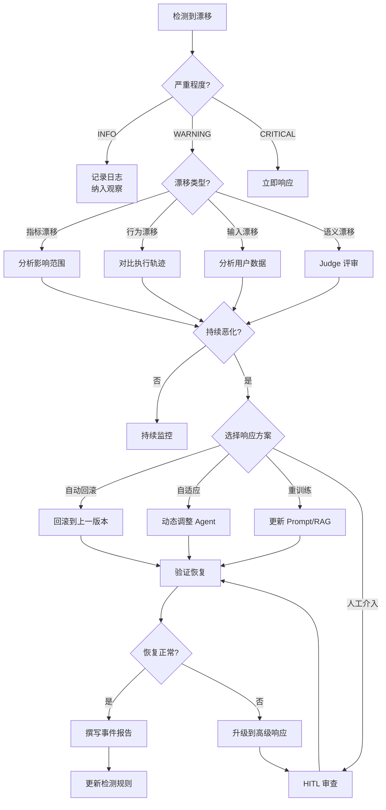

# 11.5.4 Drift Detection — 性能漂移检测：捕捉 AI Agent 的无声退化

## 简单介绍

性能漂移（Performance Drift）是 AI Agent 系统在生产环境中面临的最隐蔽的威胁之一。与传统的软件退化不同，Agent 的漂移可以在代码完全没有变更的情况下发生——模型更新、API 变化、数据分布偏移，甚至用户行为的变化都会导致 Agent 的表现悄然下降。这就是"无声回归"（Silent Regression）问题：**你的 Agent 昨天还能正确完成任务，今天却不行了，而没有任何人提交过代码变更。**

```
核心概念：

性能漂移（Performance Drift）
  Agent 在相同任务上的表现随时间推移而下降的现象。
  特征：代码未变，但输出质量、成功率、效率等指标发生变化。
  
无声回归（Silent Regression）
  没有明显的故障信号（没有报错、没有崩溃），但 Agent 的行为
  已经偏离了预期。用户可能感知到"AI 变笨了"，但难以定位原因。
  
漂移检测（Drift Detection）
  通过持续监控和统计分析，在漂移造成影响之前识别其发生。
  目标：尽早发现漂移，最小化对用户体验的影响。
```

```
漂移检测的核心问题链：

检测什么？                  →   各种漂移来源（LLM、工具、数据、环境……）
用什么检测？                →   统计方法、控制图、分布比较
什么时候触发告警？          →   阈值设置、时序模式分析
检测到之后怎么办？          →   响应策略（回滚、自适应、重训练）
```

## 背景

### 为什么 Agent 会无声退化？

传统软件的行为是确定性的：相同的输入 + 相同的代码 = 相同的输出。但 AI Agent 系统引入了多层非确定性，每一层都可能成为漂移的来源：

```
传统软件：                         AI Agent 系统：

源代码（不变）                     系统 Prompt（不变）
  ↓                                  ↓
编译/部署（不变）                   LLM 模型（可能变！）
  ↓                                  ↓
执行（确定性）                      LLM 推理（非确定性）
  ↓                                  ↓
输出（可预测）                      Tool 调用（依赖外部 API）
                                      ↓
                                    Agent 输出（依赖多层叠加）

漂移可能性：几乎为零              漂移可能性：几乎无处不在
```

这种非确定性使得 Agent 系统的回归检测远比传统软件复杂。在传统软件中，如果测试通过了，代码就是好的。但在 Agent 系统中，**即使所有测试通过，Agent 的实际表现也可能已经退化**。

### 从概念漂移到性能漂移

漂移检测在机器学习领域有深厚的研究基础，但传统 ML 漂移检测主要关注数据分布的变化（概念漂移、协变量漂移）。AI Agent 的漂移检测需要在这个基础上扩展：

```
传统 ML 漂移检测：                   AI Agent 漂移检测：

数据分布变化 → 模型精度下降          →  多种漂移来源叠加
重点：输入特征分布                  重点：Agent 行为 + 输出质量
检测方法：统计分布比较              检测方法：分布比较 + 行为分析 + 语义评估
响应：重新训练模型                  响应：回滚/更新 Prompt/切换模型/重训
```

## 漂移来源分析（Sources of Drift）

AI Agent 系统的漂移来源可以分为六大类。实际生产环境中的漂移往往是多类来源叠加的结果。

### LLM Model Drift — 底层模型漂移

这是 Agent 系统中最常见的漂移来源。当 LLM 提供商更新模型时（即使版本号相同），模型的行为可能发生微妙变化。

```
具体表现：

模型版本更新：
  GPT-4-0314 → GPT-4-0125 → GPT-4-1106 → GPT-4o
  每一次更新都可能改变输出风格、推理方式、工具调用格式
  
实际案例：
  2023 年 GPT-4 的一次更新后，大量开发者发现 Agent 的 JSON 输出格式
  发生了变化，导致下游解析器崩溃。代码没有变，API 调用没有变，
  但模型的行为变了。
  
  另一个案例：某个 Agent 依赖模型在特定场景下调用 "search" 工具。
  模型更新后，Agent 开始使用 "web_search" 工具名，导致工具调度失败。
  
隐形变化：
  - 输出风格：从详细转向简洁（或相反）
  - 推理长度：CoT 步骤增加或减少
  - 工具选择偏好：倾向使用某些工具而非其他
  - 安全策略：对某些输入的拒绝率变化
```

### Tool/API Drift — 工具与 API 漂移

Agent 依赖的外部工具和 API 的变化是另一个主要漂移来源。

```
工具漂移类型：

API 响应格式变化：
  第三方 API 修改了返回的 JSON 结构，Agent 可能无法正确解析。
  例：天气 API 将 "temp_c" 改为 "temperature_celsius"
  
API 行为变化：
  同样的请求得到不同的结果。
  例：搜索 API 改变了排序算法，Agent 得到的结果完全不同。
  
API 可用性变化：
  接口变慢、超时、限流。
  例：某个数据源 API 的 P99 延迟从 200ms 上升到 2s。
  
服务下线：
  依赖的服务停止提供。
  例：某个天气数据源下线，Agent 的所有天气查询任务失败。
  
数据内容变化：
  API 返回的数据内容发生变化。
  例：股票 API 增加了新的字段，Agent 未及时适配。
```

### Knowledge Base Drift — 知识库漂移

使用 RAG（检索增强生成）的 Agent 高度依赖知识库的内容质量。知识库的变化会直接影响 Agent 的输出。

```
知识库变化类型：

数据更新：
  知识库中的数据被更新或替换。
  例：产品文档更新后，Agent 对产品功能的回答发生变化。
  
数据删除：
  某些数据被移除。
  例：旧版本文档被删除后，Agent 无法回答关于旧功能的问题。
  
数据污染：
  错误或过时的数据被引入。
  例：用户提交的低质量内容污染了知识库。
  
向量索引变化：
  嵌入模型更新或索引策略改变。
  例：切换到新的 embedding 模型后，检索结果的相关性发生变化。
  
数据新鲜度问题：
  知识库中的信息过于陈旧。
  例：Agent 使用 3 个月前更新的文档回答用户问题，但产品已经迭代。
```

### Usage Pattern Drift — 使用模式漂移

用户如何使用 Agent 会随着时间变化，这种变化可能导致 Agent 在新型查询上的表现不足。

```
使用模式变化：

新查询类型：
  用户开始提出 Agent 设计时未预料到的问题类型。
  例：一个客服 Agent 原本处理退货问题，用户开始询问产品开发路线图。
  
查询复杂度变化：
  用户的查询变得更加复杂或更加简单。
  例：从"查订单状态"变为"比较这三种产品的优缺点并推荐"。
  
用户群体变化：
  用户群体的人口统计或技术背景变化。
  例：从内部技术团队使用扩展到非技术客户使用。
  
语言/表达方式变化：
  用户的表达方式发生变化。
  例：用户开始使用更多的专业术语或更多的口语化表达。
  
查询分布偏移：
  某些类型查询的比例发生显著变化。
  例：退货查询从 10% 上升到 40%，但 Agent 的退货处理能力未经优化。
```

### Environment Drift — 环境漂移

Agent 运行的底层环境变化也会导致性能漂移。

```
环境变化类型：

依赖库更新：
  Python 包、Node 模块等依赖更新。
  例：某个工具库的 API 在不兼容版本中发生了变化。
  
运行时变化：
  Python 版本、Node 版本、操作系统更新。
  例：Python 3.11 → 3.12 中某个库的行为变化。
  
基础设施变化：
  服务器迁移、容器化、网络配置变化。
  例：Agent 部署到不同区域的服务器后，API 延迟变化。
  
并发/负载变化：
  系统负载变化影响 Agent 的响应时间。
  例：Agent 的请求量增加后，上下文窗口缓存命中率变化。
```

### Concept Drift — 概念漂移

"什么是好的回答"本身会随着时间变化。用户的期望、行业的标准、公司的政策都在演变。

```
概念漂移表现：

质量标准变化：
  用户对回答质量的期望在提高。
  例：去年用户接受"可能有用"的回答，今年需要"准确且可操作"。
  
合规要求变化：
  新的法规或政策改变了 Agent 的行为边界。
  例：新的数据隐私法规要求 Agent 在回答某些问题时增加免责声明。
  
业务目标变化：
  公司对 Agent 的 KPI 发生了变化。
  例：从"回答速度优先"变为"准确率优先"。
  
行业标准变化：
  行业的最佳实践发生了变化。
  例：AI 伦理指南更新后，Agent 的某些回答方式不再被接受。
```

### 多源漂移叠加效应

在实际生产环境中，多种漂移可能同时发生，相互放大：

```
真实场景案例：

某 AI 客服 Agent 的表现在一周内下降了 30%。
深入分析发现三个漂移同时发生：

1. LLM 模型侧：    底层模型完成了版本更新，输出的回答风格变了
2. 知识库侧：       产品文档在上周完成了大规模重构
3. 使用模式侧：     由于新品发布，用户查询类型分布发生了偏移

单一漂移可能只造成 5-10% 的影响，但三者叠加导致了
30% 的性能下降。这就是漂移检测需要多维度的原因。
```

## 检测方法（Detection Methods）

漂移检测的核心是通过持续监控和统计分析来识别 Agent 行为的变化。以下介绍主流的检测方法，从经典的统计方法到专为 Agent 设计的检测策略。

### Distribution Comparison — 分布比较方法

分布比较是最基础的漂移检测方法，通过比较两个时间窗口内的数据分布来判断是否发生显著变化。

```
核心思路：
  参考窗口（Reference Window）← 历史数据分布
  检测窗口（Detection Window）← 最新数据分布
  比较两个窗口的差异 → 是否超过阈值 → 漂移判定
```

```python
import numpy as np
from scipy import stats
from typing import List, Optional, Tuple
from dataclasses import dataclass
from enum import Enum


class DriftSeverity(Enum):
    """漂移严重程度"""
    NONE = "none"
    WARNING = "warning"
    DRIFT = "drift"
    CRITICAL = "critical"


class DistributionTestType(Enum):
    """分布比较方法类型"""
    KS_TEST = "ks_test"              # Kolmogorov-Smirnov 检验
    WASSERSTEIN = "wasserstein"      # Wasserstein 距离（Earth Mover's Distance）
    JS_DIVERGENCE = "js_divergence"  # Jensen-Shannon 散度
    CHI_SQUARE = "chi_square"        # 卡方检验（适用于分类数据）


@dataclass
class DistributionTestResult:
    """分布检验结果"""
    test_type: DistributionTestType
    statistic: float
    p_value: Optional[float]
    threshold: float
    is_drift: bool
    severity: DriftSeverity
    details: str


class DistributionDriftDetector:
    """
    基于分布比较的漂移检测器。
    
    支持多种统计检验方法，适用于不同类型的指标数据。
    """

    def __init__(self, test_type: DistributionTestType = DistributionTestType.KS_TEST):
        self.test_type = test_type
        # 不同方法的默认阈值（经验值）
        self.thresholds = {
            DistributionTestType.KS_TEST: 0.15,
            DistributionTestType.WASSERSTEIN: 1.0,
            DistributionTestType.JS_DIVERGENCE: 0.1,
            DistributionTestType.CHI_SQUARE: 0.05,
        }

    def compare_distributions(
        self,
        reference: List[float],
        detection: List[float],
        threshold: Optional[float] = None
    ) -> DistributionTestResult:
        """
        比较两个分布是否发生显著变化。

        Args:
            reference: 参考窗口数据（历史分布）
            detection: 检测窗口数据（当前分布）
            threshold: 自定义阈值，默认使用预配置值

        Returns:
            检验结果，包含统计量和漂移判定
        """
        if threshold is None:
            threshold = self.thresholds[self.test_type]

        if self.test_type == DistributionTestType.KS_TEST:
            return self._ks_test(reference, detection, threshold)
        elif self.test_type == DistributionTestType.WASSERSTEIN:
            return self._wasserstein_test(reference, detection, threshold)
        elif self.test_type == DistributionTestType.JS_DIVERGENCE:
            return self._js_divergence_test(reference, detection, threshold)
        elif self.test_type == DistributionTestType.CHI_SQUARE:
            return self._chi_square_test(reference, detection, threshold)
        else:
            raise ValueError(f"Unknown test type: {self.test_type}")

    def _ks_test(
        self, ref: List[float], det: List[float], threshold: float
    ) -> DistributionTestResult:
        """Kolmogorov-Smirnov 检验：比较两个连续分布是否相同。"""
        statistic, p_value = stats.ks_2samp(ref, det)
        is_drift = statistic > threshold

        severity = self._calculate_severity(statistic, threshold)
        details = (
            f"KS statistic={statistic:.4f}, p-value={p_value:.4f}, "
            f"threshold={threshold}, drift={is_drift}"
        )

        return DistributionTestResult(
            test_type=DistributionTestType.KS_TEST,
            statistic=statistic,
            p_value=p_value,
            threshold=threshold,
            is_drift=is_drift,
            severity=severity,
            details=details,
        )

    def _wasserstein_test(
        self, ref: List[float], det: List[float], threshold: float
    ) -> DistributionTestResult:
        """
        Wasserstein 距离（Earth Mover's Distance）。
        
        衡量将一个分布"移动"到另一个分布所需的最小工作量。
        对连续数据的分布偏移非常敏感。
        """
        # 计算经验分布的 Wasserstein 距离
        ref_sorted = np.sort(ref)
        det_sorted = np.sort(det)

        # 插值使数组等长
        n = min(len(ref_sorted), len(det_sorted))
        ref_quantiles = np.linspace(0, 1, n)
        det_quantiles = np.linspace(0, 1, n)

        ref_interp = np.interp(ref_quantiles,
                               np.linspace(0, 1, len(ref_sorted)),
                               ref_sorted)
        det_interp = np.interp(det_quantiles,
                               np.linspace(0, 1, len(det_sorted)),
                               det_sorted)

        distance = np.mean(np.abs(ref_interp - det_interp))
        is_drift = distance > threshold

        severity = self._calculate_severity(distance, threshold)
        details = (
            f"Wasserstein distance={distance:.4f}, "
            f"threshold={threshold}, drift={is_drift}"
        )

        return DistributionTestResult(
            test_type=DistributionTestType.WASSERSTEIN,
            statistic=float(distance),
            p_value=None,
            threshold=threshold,
            is_drift=is_drift,
            severity=severity,
            details=details,
        )

    def _js_divergence_test(
        self, ref: List[float], det: List[float], threshold: float
    ) -> DistributionTestResult:
        """
        Jensen-Shannon 散度。
        
        KL 散度的对称化版本，值域 [0, 1]。
        适用于概率分布之间的比较。
        """
        # 将连续数据离散化为直方图
        all_data = np.concatenate([ref, det])
        bins = min(50, len(all_data) // 10)
        hist_ref, edges = np.histogram(ref, bins=bins, density=True)
        hist_det, _ = np.histogram(det, bins=edges, density=True)

        # 避免 log(0)
        hist_ref = np.clip(hist_ref, 1e-10, None)
        hist_det = np.clip(hist_det, 1e-10, None)

        # 平均分布
        m = 0.5 * (hist_ref + hist_det)

        # JS 散度 = 0.5 * KL(P||M) + 0.5 * KL(Q||M)
        kl_pm = np.sum(hist_ref * np.log(hist_ref / m))
        kl_qm = np.sum(hist_det * np.log(hist_det / m))
        js_div = 0.5 * (kl_pm + kl_qm)

        is_drift = js_div > threshold
        severity = self._calculate_severity(js_div, threshold)
        details = (
            f"JS divergence={js_div:.4f}, "
            f"threshold={threshold}, drift={is_drift}"
        )

        return DistributionTestResult(
            test_type=DistributionTestType.JS_DIVERGENCE,
            statistic=float(js_div),
            p_value=None,
            threshold=threshold,
            is_drift=is_drift,
            severity=severity,
            details=details,
        )

    def _chi_square_test(
        self, ref: List[float], det: List[float], threshold: float
    ) -> DistributionTestResult:
        """卡方检验：适用于分类数据的分布比较。"""
        # 将连续数据离散化
        all_data = np.concatenate([ref, det])
        bins = min(20, len(set(all_data)))
        if bins < 2:
            bins = 2

        hist_ref, edges = np.histogram(ref, bins=bins)
        hist_det, _ = np.histogram(det, bins=edges)

        # 卡方检验
        chi2, p_value = stats.chisquare(hist_ref, hist_det + 1e-10)
        is_drift = p_value < threshold

        severity = self._calculate_severity(1 - p_value, 1 - threshold)
        details = (
            f"Chi-square={chi2:.4f}, p-value={p_value:.4f}, "
            f"alpha={threshold}, drift={is_drift}"
        )

        return DistributionTestResult(
            test_type=DistributionTestType.CHI_SQUARE,
            statistic=float(chi2),
            p_value=p_value,
            threshold=threshold,
            is_drift=is_drift,
            severity=severity,
            details=details,
        )

    def _calculate_severity(
        self, statistic: float, threshold: float
    ) -> DriftSeverity:
        """根据统计量计算严重程度。"""
        ratio = statistic / threshold
        if ratio < 0.8:
            return DriftSeverity.NONE
        elif ratio < 1.2:
            return DriftSeverity.WARNING
        elif ratio < 2.0:
            return DriftSeverity.DRIFT
        else:
            return DriftSeverity.CRITICAL


# ============================================================
# 使用示例
# ============================================================

def demo_distribution_drift():
    """演示分布比较方法检测漂移。"""
    # 模拟成功率的分布
    np.random.seed(42)

    # 参考窗口：正常情况下成功率 ~85%
    reference = np.random.beta(8, 2, 1000)

    # 检测窗口：漂移后成功率 ~70%
    drifted = np.random.beta(7, 3, 500)

    # 检测窗口：无漂移
    normal = np.random.beta(8, 2, 500)

    detector = DistributionDriftDetector(DistributionTestType.KS_TEST)

    print("=== 有漂移的场景 ===")
    result = detector.compare_distributions(reference, drifted)
    print(f"  方法: {result.test_type.value}")
    print(f"  统计量: {result.statistic:.4f}")
    print(f"  阈值: {result.threshold}")
    print(f"  漂移: {result.is_drift}")
    print(f"  严重程度: {result.severity.value}")

    print("\n=== 无漂移的场景 ===")
    result = detector.compare_distributions(reference, normal)
    print(f"  统计量: {result.statistic:.4f}")
    print(f"  漂移: {result.is_drift}")
    print(f"  严重程度: {result.severity.value}")

    print("\n=== 不同检测方法的对比 ===")
    for method in DistributionTestType:
        det = DistributionDriftDetector(method)
        result = det.compare_distributions(reference, drifted)
        print(f"  {method.value:20s}: stat={result.statistic:.4f}, "
              f"drift={result.is_drift}, severity={result.severity.value}")


if __name__ == "__main__":
    demo_distribution_drift()
```

### Statistical Process Control (SPC) — 统计过程控制

SPC 源于制造业质量监控，通过控制图（Control Chart）来监控过程是否处于"受控状态"。对于 Agent 漂移检测，SPC 可以用于监控关键指标的时序变化。

```
控制图基本要素：

中心线（Center Line, CL）：过程的平均值
上控制限（Upper Control Limit, UCL）：均值 + k * 标准差
下控制限（Lower Control Limit, LCL）：均值 - k * 标准差
数据点：每个时间窗口的统计量

规则：
  一个点超出控制限 → 告警
  连续 7 个点在中心线一侧 → 告警
  连续 7 个点递增或递减 → 告警
```

**CUSUM（累积和）控制图**：对微小偏移特别敏感。

```
CUSUM 原理：
  累积偏差 = Σ(当前值 - 目标值)
  当累积偏差超过阈值 H 时触发告警

优势：
  - 对小偏移敏感（可以检测到 0.5σ 的偏移）
  - 可以精确定位漂移开始的时间点
  - 累积效应放大信号

K 值（参考值）：允许的偏移量的一半（通常设置为 0.5σ）
H 值（决策区间）：通常设置为 4σ 或 5σ
```

**EWMA（指数加权移动平均）控制图**：对近期数据赋予更高权重。

```
EWMA 原理：
  Z_t = λ * X_t + (1 - λ) * Z_{t-1}
  
  Z_t：t 时刻的 EWMA 值
  X_t：t 时刻的观测值
  λ：平滑系数（0 < λ ≤ 1，通常取 0.1-0.3）

优势：
  - 对近期数据更敏感
  - 可以检测到过程的缓慢漂移
  - 对正态性假设不敏感
```

### Changepoint Detection — 变点检测

变点检测的目标是在时间序列中找到分布发生变化的时刻。这比简单的分布比较更强大，因为它可以精确定位漂移发生的时间。

```
主流变点检测算法：

PELT（Pruned Exact Linear Time）
  原理：基于惩罚似然比的精确搜索
  优势：计算效率高 O(n)，适合大规模数据
  惩罚项：通常使用 BIC（贝叶斯信息准则）
  适用：均值变化、方差变化、分布变化
  
Binary Segmentation（二分分割）
  原理：递归地在序列中找到变点，然后分割
  优势：直观、速度快
  适用：单一变点和多变点场景
  
Bayesian Changepoint Detection（贝叶斯变点检测）
  原理：使用贝叶斯方法推断变点的后验概率
  优势：可以量化变点的不确定性
  适用：需要置信度评估的场景
```

### Metric-based Drift — 基于指标的漂移

这是最实用、最直接的漂移检测方法。通过监控 Agent 的关键性能指标在滚动窗口中的变化来检测漂移。

```
常用监控指标：

成功率指标：
  - Task Success Rate：任务成功完成的比例
  - Tool Call Success Rate：工具调用成功率
  - Goal Completion Rate：目标达成率

效率指标：
  - Average Task Duration：平均任务完成时间
  - Average Tool Calls per Task：平均工具调用次数
  - LLM Token Usage：Token 使用量
  - API Latency：API 调用延迟

质量指标：
  - Output Length：输出长度
  - Response Time：响应时间
  - Hallucination Rate：幻觉率（通过 LLM-as-Judge 检测）
  - User Feedback Score：用户反馈评分

成本指标：
  - Cost per Task：每次任务的成本
  - API Call Cost：API 调用成本
  - Total Daily Cost：每日总成本
```

### Embedding-based Drift — 基于嵌入的漂移

通过将 Agent 的输入和输出编码为嵌入向量，然后比较嵌入分布的变化来检测语义层面的漂移。

```
工作原理：

用户输入 → Embedding Model → 输入嵌入向量
Agent 输出 → Embedding Model → 输出嵌入向量
知识库文档 → Embedding Model → 文档嵌入向量

检测策略：
  1. 输入嵌入分布 vs 历史输入嵌入分布 → Input Drift
  2. 输出嵌入分布 vs 历史输出嵌入分布 → Output Drift
  3. 输入-输出嵌入差异的分布变化 → Behavioral Drift
  4. 检索文档嵌入分布变化 → Knowledge Base Drift
```

### LLM-as-Judge Drift Detector

利用另一个 LLM 来标记 Agent 行为的变化。这种方法特别适合检测语义层面的漂移，但这些漂移很难用数字指标捕捉。

```
LLM-as-Judge 漂移检测：

方法：
  定期抽取 Agent 的输入-输出对，让 Judge LLM 分析：
  - "这个回答和上周的回答风格是否一致？"
  - "Agent 的工具使用模式是否发生了变化？"
  - "输出的质量分数是否有系统性变化？"

优势：
  - 可以捕捉数字指标无法反映的细微变化
  - 可以提供自然语言的漂移描述
  - 可以检测不预期的行为变化

局限：
  - 成本较高（需要额外 LLM 调用）
  - Judge 本身也可能漂移（需要校准）
  - 不适合实时检测
```

### 完整漂移检测监控器

以下实现一个完整的漂移检测监控系统，整合多种检测方法：

```python
import json
import logging
from datetime import datetime, timedelta
from typing import Dict, List, Optional, Any, Callable
from collections import deque
from dataclasses import dataclass, field
from enum import Enum


class DriftType(Enum):
    """漂移类型"""
    METRIC_DRIFT = "metric_drift"           # 指标漂移
    DISTRIBUTION_DRIFT = "distribution_drift"  # 分布漂移
    EMBEDDING_DRIFT = "embedding_drift"      # 嵌入漂移
    BEHAVIORAL_DRIFT = "behavioral_drift"     # 行为漂移
    CONCEPT_DRIFT = "concept_drift"          # 概念漂移


@dataclass
class DriftEvent:
    """漂移事件"""
    drift_type: DriftType
    timestamp: datetime
    metric_name: str
    statistic: float
    threshold: float
    severity: str  # info / warning / critical
    message: str
    details: Dict[str, Any] = field(default_factory=dict)

    def to_dict(self) -> Dict:
        return {
            "drift_type": self.drift_type.value,
            "timestamp": self.timestamp.isoformat(),
            "metric_name": self.metric_name,
            "statistic": self.statistic,
            "threshold": self.threshold,
            "severity": self.severity,
            "message": self.message,
            "details": self.details,
        }


@dataclass
class DriftDetectorConfig:
    """漂移检测器配置"""
    # 滚动窗口大小
    reference_window_size: int = 1000   # 参考窗口样本数
    detection_window_size: int = 100    # 检测窗口样本数

    # 检测频率
    check_interval_minutes: int = 15     # 每 15 分钟检查一次

    # 阈值配置
    ks_threshold: float = 0.15          # KS 检验阈值
    js_threshold: float = 0.1           # JS 散度阈值
    wasserstein_threshold: float = 1.0  # Wasserstein 距离阈值

    # 指标阈值
    metric_drift_threshold: float = 0.1  # 指标均值变化 >= 10% 视为漂移

    # 告警配置
    min_samples_for_detection: int = 30  # 最少样本数
    cooldown_minutes: int = 60           # 同类型漂移冷却时间

    # 多级告警
    warning_z_score: float = 2.0         # Warning: |z| > 2
    critical_z_score: float = 3.0        # Critical: |z| > 3


class MetricBuffer:
    """
    指标缓冲区 — 维护指标的滚动窗口数据。
    """

    def __init__(self, max_size: int):
        self.max_size = max_size
        self.data: deque = deque(maxlen=max_size)
        self.timestamps: deque = deque(maxlen=max_size)

    def add(self, value: float, timestamp: Optional[datetime] = None):
        """添加一个新的数据点。"""
        self.data.append(value)
        self.timestamps.append(timestamp or datetime.now())

    @property
    def size(self) -> int:
        return len(self.data)

    @property
    def mean(self) -> float:
        if not self.data:
            return 0.0
        return sum(self.data) / len(self.data)

    @property
    def std(self) -> float:
        if len(self.data) < 2:
            return 0.0
        mean = self.mean
        variance = sum((x - mean) ** 2 for x in self.data) / (len(self.data) - 1)
        return variance ** 0.5

    def get_recent(self, n: int) -> List[float]:
        """获取最近的 n 个数据点。"""
        return list(self.data)[-n:]

    def to_array(self) -> List[float]:
        return list(self.data)


class DriftMonitor:
    """
    完整的漂移检测监控系统。
    
    集成多种检测方法，支持多级告警，含冷却机制防止告警风暴。
    """

    def __init__(
        self,
        config: DriftDetectorConfig,
        logger: Optional[logging.Logger] = None,
    ):
        self.config = config
        self.logger = logger or logging.getLogger(__name__)

        # 指标缓冲区（按指标名分组）
        self.metric_buffers: Dict[str, MetricBuffer] = {}
        self.reference_buffers: Dict[str, MetricBuffer] = {}

        # 漂移事件历史
        self.drift_events: List[DriftEvent] = []

        # 告警冷却追踪
        self.last_alert_time: Dict[str, datetime] = {}

        # 统计信息
        self.total_checks = 0
        self.drift_count = 0
        self.false_positive_count = 0

    def record_metric(
        self,
        metric_name: str,
        value: float,
        timestamp: Optional[datetime] = None,
    ):
        """
        记录一个指标值。
        
        Args:
            metric_name: 指标名称（如 "success_rate", "latency_p50"）
            value: 指标值
            timestamp: 时间戳
        """
        if metric_name not in self.metric_buffers:
            self.metric_buffers[metric_name] = MetricBuffer(
                self.config.detection_window_size
            )

        self.metric_buffers[metric_name].add(value, timestamp)

        # 自动更新参考窗口
        self._update_reference_buffer(metric_name, value, timestamp)

    def _update_reference_buffer(
        self, metric_name: str, value: float, timestamp: Optional[datetime]
    ):
        """更新参考窗口数据。"""
        if metric_name not in self.reference_buffers:
            self.reference_buffers[metric_name] = MetricBuffer(
                self.config.reference_window_size
            )
        self.reference_buffers[metric_name].add(value, timestamp)

    def check_drift(self, metric_name: str) -> Optional[DriftEvent]:
        """
        检查指定指标是否发生漂移。
        
        Args:
            metric_name: 要检查的指标名

        Returns:
            如检测到漂移返回 DriftEvent，否则返回 None
        """
        self.total_checks += 1

        buffer = self.metric_buffers.get(metric_name)
        ref_buffer = self.reference_buffers.get(metric_name)

        if not buffer or not ref_buffer:
            return None

        if buffer.size < self.config.min_samples_for_detection:
            return None

        detection_data = buffer.to_array()
        reference_data = ref_buffer.to_array()

        # --- 方法 1: 基于均值的漂移检测 ---
        ref_mean = np.mean(reference_data)
        det_mean = np.mean(detection_data)
        ref_std = np.std(reference_data) if len(reference_data) > 1 else 1.0

        if ref_std == 0:
            ref_std = 1.0  # 避免除零

        # Z-score：当前均值相对于参考分布的位置
        z_score = (det_mean - ref_mean) / (ref_std / (len(detection_data) ** 0.5))

        # 相对变化百分比
        if abs(ref_mean) > 1e-6:
            relative_change = abs(det_mean - ref_mean) / abs(ref_mean)
        else:
            relative_change = abs(det_mean - ref_mean)

        # --- 方法 2: 基于分布比较的漂移检测 ---
        try:
            ks_stat, ks_p = stats.ks_2samp(reference_data, detection_data)
        except Exception:
            ks_stat, ks_p = 0.0, 1.0

        # --- 综合漂移判定 ---
        drift_detected = False
        drift_severity = "info"
        drift_reasons = []

        # Z-score 检查
        if abs(z_score) > self.config.critical_z_score:
            drift_detected = True
            drift_severity = "critical"
            drift_reasons.append(
                f"Z-score={z_score:.2f} 超过临界阈值 "
                f"{self.config.critical_z_score}"
            )
        elif abs(z_score) > self.config.warning_z_score:
            drift_detected = True
            drift_severity = "warning"
            drift_reasons.append(
                f"Z-score={z_score:.2f} 超过警告阈值 "
                f"{self.config.warning_z_score}"
            )

        # KS 检验检查
        if ks_stat > self.config.ks_threshold and ks_p < 0.05:
            if drift_severity != "critical":
                drift_detected = True
                drift_severity = drift_severity or "warning"
            drift_reasons.append(
                f"KS statistic={ks_stat:.4f} (p={ks_p:.4f}) 超过阈值 "
                f"{self.config.ks_threshold}"
            )

        # 相对变化检查
        if relative_change > self.config.metric_drift_threshold:
            if drift_severity != "critical":
                drift_detected = True
                drift_severity = drift_severity or "warning"
            drift_reasons.append(
                f"相对变化 {relative_change:.1%} 超过阈值 "
                f"{self.config.metric_drift_threshold:.1%}"
            )

        if not drift_detected:
            return None

        # --- 冷却检查 ---
        alert_key = f"{metric_name}_{drift_severity}"
        last_alert = self.last_alert_time.get(alert_key)
        if last_alert and (
            datetime.now() - last_alert
        ).total_seconds() < self.config.cooldown_minutes * 60:
            self.logger.debug(f"冷却中，跳过告警: {alert_key}")
            return None

        # --- 创建漂移事件 ---
        event = DriftEvent(
            drift_type=DriftType.METRIC_DRIFT,
            timestamp=datetime.now(),
            metric_name=metric_name,
            statistic=float(abs(z_score)),
            threshold=float(self.config.warning_z_score),
            severity=drift_severity,
            message="; ".join(drift_reasons),
            details={
                "z_score": float(z_score),
                "relative_change": float(relative_change),
                "ks_statistic": float(ks_stat),
                "ks_p_value": float(ks_p),
                "ref_mean": float(ref_mean),
                "det_mean": float(det_mean),
                "ref_std": float(ref_std),
                "det_window_size": buffer.size,
                "ref_window_size": ref_buffer.size,
            },
        )

        # 记录事件和冷却
        self.drift_events.append(event)
        self.last_alert_time[alert_key] = datetime.now()
        self.drift_count += 1

        self.logger.warning(
            f"漂移检测 [{drift_severity}] {metric_name}: {event.message}"
        )

        return event

    def check_all_metrics(self) -> List[DriftEvent]:
        """检查所有已注册的指标。"""
        events = []
        for metric_name in list(self.metric_buffers.keys()):
            event = self.check_drift(metric_name)
            if event:
                events.append(event)
        return events

    def get_drift_summary(self) -> Dict:
        """获取漂移检测的汇总统计。"""
        return {
            "total_checks": self.total_checks,
            "drift_count": self.drift_count,
            "false_positive_count": self.false_positive_count,
            "drift_rate": (
                self.drift_count / self.total_checks
                if self.total_checks > 0 else 0
            ),
            "active_metrics": len(self.metric_buffers),
            "recent_events": [
                e.to_dict() for e in self.drift_events[-10:]
            ],
            "metrics_summary": {
                name: {
                    "current_mean": buffer.mean,
                    "current_std": buffer.std,
                    "sample_count": buffer.size,
                }
                for name, buffer in self.metric_buffers.items()
            },
        }

    def get_drift_report(self, hours: int = 24) -> Dict:
        """
        生成给定时间范围内的漂移报告。

        Args:
            hours: 回溯的小时数

        Returns:
            包含漂移事件统计的报告
        """
        cutoff = datetime.now() - timedelta(hours=hours)
        recent_events = [
            e for e in self.drift_events if e.timestamp > cutoff
        ]

        severity_counts = {"info": 0, "warning": 0, "critical": 0}
        type_counts: Dict[str, int] = {}

        for event in recent_events:
            severity_counts[event.severity] = (
                severity_counts.get(event.severity, 0) + 1
            )
            dt = event.drift_type.value
            type_counts[dt] = type_counts.get(dt, 0) + 1

        # 按指标分组统计
        by_metric: Dict[str, List[DriftEvent]] = {}
        for event in recent_events:
            if event.metric_name not in by_metric:
                by_metric[event.metric_name] = []
            by_metric[event.metric_name].append(event)

        return {
            "report_period_hours": hours,
            "total_events": len(recent_events),
            "severity_distribution": severity_counts,
            "type_distribution": type_counts,
            "most_drifted_metrics": sorted(
                [
                    {"metric": m, "count": len(events),
                     "severity": max(e.severity for e in events)}
                    for m, events in by_metric.items()
                ],
                key=lambda x: x["count"],
                reverse=True,
            ),
            "events": [e.to_dict() for e in recent_events[-50:]],
        }


# ============================================================
# 使用示例
# ============================================================

def demo_drift_monitor():
    """演示漂移检测监控系统。"""
    import numpy as np
    np.random.seed(42)

    config = DriftDetectorConfig(
        reference_window_size=500,
        detection_window_size=50,
        check_interval_minutes=15,
        ks_threshold=0.15,
        metric_drift_threshold=0.1,
        warning_z_score=2.0,
        critical_z_score=3.0,
        min_samples_for_detection=20,
    )

    monitor = DriftMonitor(config)

    # 阶段 1: 正常数据（无漂移）
    print("阶段 1: 注入正常数据...")
    for i in range(300):
        value = np.random.normal(0.85, 0.05)  # 成功率 ~85%
        monitor.record_metric("success_rate", value)
        monitor.record_metric("latency_ms", np.random.exponential(200))

    # 阶段 2: 漂移数据（成功率逐步下降）
    print("\n阶段 2: 注入漂移数据（成功率逐步下降）...")
    for i in range(100):
        # 成功率从 ~85% 逐步下降到 ~70%
        drift_factor = i / 100
        value = np.random.normal(0.85 - drift_factor * 0.15, 0.05)
        monitor.record_metric("success_rate", value)
        monitor.record_metric("latency_ms", np.random.exponential(200 + drift_factor * 100))

    # 阶段 3: 检查漂移
    print("\n阶段 3: 检测漂移...")
    events = monitor.check_all_metrics()

    if events:
        for event in events:
            print(f"\n  [{event.severity.upper()}] {event.metric_name}")
            print(f"  时间: {event.timestamp.strftime('%H:%M:%S')}")
            print(f"  原因: {event.message}")
            print(f"  详情: Z-score={event.details['z_score']:.2f}, "
                  f"相对变化={event.details['relative_change']:.1%}, "
                  f"KS统计量={event.details['ks_statistic']:.4f}")
    else:
        print("  未检测到漂移")

    # 阶段 4: 生成报告
    print("\n阶段 4: 漂移检测汇总")
    summary = monitor.get_drift_summary()
    print(f"  总检查次数: {summary['total_checks']}")
    print(f"  检测到漂移: {summary['drift_count']} 次")
    print(f"  漂移率: {summary['drift_rate']:.2%}")


if __name__ == "__main__":
    demo_drift_monitor()
```

## 漂移类型（Types of Drift）

漂移检测的维度可以进一步细分为五种类型，每种类型需要不同的检测策略和响应方案。

### Metric Drift — 指标漂移

指标漂移是最容易量化和检测的漂移类型。它直接反映在 Agent 的关键性能指标的变化上。

```
实例：成功率的指标漂移

时间   | 成功率 | 检测窗口均值 | 参考窗口均值 | Z-score
───    ───       ───           ───           ───
周一     85%       85.2%         85.1%         0.1     ← 正常
周二     84%       84.8%         85.0%         0.3     ← 正常
周三     82%       83.5%         85.1%         1.8     ← 轻微变化
周四     78%       80.2%         85.0%         3.2     ← 告警 (critical)
周五     75%       77.8%         85.1%         4.5     ← 严重漂移

检测方法：
  - 滚动窗口均值对比
  - 控制图（CUSUM / EWMA）
  - 分布比较（KS 检验）
```

### Behavioral Drift — 行为漂移

行为漂移指 Agent 的决策模式和行动策略发生变化，即使最终指标没有明显变化。

```
行为漂移的具体表现：

工具选择变化：
  之前：80% 的情况下调用 search，20% 调用 calculator
  现在：50% search，30% calculator，20% database
  原因：LLM 更新改变了工具偏好

推理路径变化：
  之前：先分析问题 → 分解步骤 → 逐步执行 → 汇总
  现在：直接搜索 → 生成回答（跳过分析步骤）
  结果：回答质量可能下降，但速度可能提升

参数选择变化：
  之前：search(query="...", limit=5)
  现在：search(query="...", limit=3)
  影响：检索到的信息量减少

异常行为模式：
  之前不出现的错误模式现在出现了：
  - 重复调用同一个工具（循环）
  - 跳过必要的验证步骤
  - 在不需要时过度检索

检测方法：
  - 工具调用频率分布对比
  - 工具调用序列模式分析
  - Agent 执行轨迹的嵌入相似度
  - LLM-as-Judge 行为分析
```

### Semantic Drift — 语义漂移

语义漂移指 Agent 输出的质量、风格、语气等语义层面的变化。这是最难量化的漂移类型。

```
语义漂移的维度：

输出风格：
  从"正式专业"变为"过于口语化"或"过于冗长"
  例：原本"根据您的需求，以下三个选项供参考:…"
  变为："好哒！来看看这几个选择吧～"

输出结构：
  从"结构化列表"变为"大段文字"
  例：原本有组织的 Markdown 输出变得混乱

语气和态度：
  从"客观中立"变为"过于积极"或"过于保守"
  例：原本"这个方案有优点也有风险"变为"这个方案绝对没问题"

事实准确度：
  回答的事实错误率上升
  例：Agent 开始混淆产品版本号或功能名称

语调一致性：
  对不同类型的问题用不一致的语调回应
  例：有些回答热情，有些回答冷淡

检测方法：
  - LLM-as-Judge 质量评分趋势
  - 输出嵌入分布变化
  - 输出长度/结构统计特征变化
  - 用户反馈情感分析
```

### Input Drift — 输入漂移

输入漂移指用户查询的分布发生变化。即使 Agent 本身没有变化，输入的变化也可能导致输出质量下降。

```
输入漂移检测：

查询主题分布：
  之前：30% 账户问题，25% 订单问题，20% 产品咨询, 25% 其他
  现在：50% 技术问题，20% 投诉，15% 账户，15% 其他
  影响：Agent 在技术问题上表现不佳

查询语言变化：
  之前：80% 中文，10% 英文，10% 中英混合
  现在：60% 中文，25% 英文，15% 中英混合
  影响：Agent 的英文能力可能不如中文

查询长度变化：
  平均查询长度从 20 字变为 50 字
  影响：长查询可能包含复杂上下文

查询复杂度变化：
  单意图查询比例从 70% 变为 40%
  复杂多步查询从 30% 变为 60%
  影响：Agent 在处理复杂查询时的成功率可能不足

检测方法：
  - 输入嵌入分布比较
  - 查询长度/复杂度统计变化
  - 主题分类分布变化
  - 关键词频率变化
```

### Output Drift — 输出漂移

输出漂移指 Agent 输出的风格、长度、结构等特征发生变化，通常由模型更新或 Prompt 变化引起。

```
输出漂移检测：

长度变化：
  平均输出长度从 200 tokens 变为 400 tokens
  原因：模型更新后输出更详细（或更简洁）
  影响：成本增加、用户体验变化

格式变化：
  结构化输出（JSON/Markdown）的使用率变化
  例：原本 90% 的答案包含 Markdown 列表，现在只有 60%

调用方式：
  Streaming vs 非 Streaming 的比例变化
  逐字输出 vs 一次输出完整回答的变化

语言分布：
  输出语言与输入语言不匹配的情况增加
  例：用户用中文提问，Agent 用英文回答

检测方法：
  - 输出长度/Token 数统计
  - 输出格式类型分类
  - 输出-输入语言匹配度
  - 输出嵌入分布
```

### Multi-dimensional Drift Heatmap — 多维度漂移热力图

实际应用中，单一维度的漂移检测往往不够。一个综合的热力图可以同时展示多个维度的漂移情况。

```
多维度漂移热力图概念：

          Metrics        Behavior       Semantic      Input        Output
          ──────        ────────       ────────      ─────        ──────
周初       ██ 正常       ██ 正常        ██ 正常      ██ 正常      ██ 正常
          ██ 正常       ██ 正常        ██ 正常      ██ 正常      ██ 正常

周中       ██ 正常       ██ 正常        ██ 正常      ██ 轻微      ██ 正常
          ██ 轻微       ██ 正常        ██ 正常      ██ 轻微      ██ 正常

周末       ██ 告警       ██ 轻微        ██ 轻微      ██ 告警      ██ 正常
          ██ 告警       ██ 轻微        ██ 告警      ██ 告警      ██ 轻微

颜色编码：  ■ 正常  ■ 轻微  ■ 告警  ■ 严重

解读：
  - 输入漂移先发生 → 用户行为变化
  - 随后指标漂移和行为漂移 → Agent 不适应新输入模式
  - 语义漂移最后出现 → 输出质量开始下降

行动计划：
  1. 分析输入漂移的具体内容（用户群变化？新功能发布？）
  2. 调整 Agent 的 Prompt 或 RAG 数据以适配新输入模式
  3. 持续监控语义漂移是否得到控制
```

## 早期预警系统（Early Warning System）

早期预警系统的目标是在漂移对用户体验产生显著影响之前发现它，并采取适当的行动。

### Alert Design — 告警设计

告警设计需要平衡"尽早发现"和"避免噪音"两个目标。以下是一个多级告警系统的设计：

```
告警层级：

Level 0: INFO（信息记录）
  触发条件：轻微变化，Z-score 在 1.5-2.0 之间
  处理方式：记录日志，不发送通知
  示例："success_rate 均值从 85% 变化到 83%"
  操作：纳入日报汇总

Level 1: WARNING（警告）
  触发条件：明显变化，Z-score 在 2.0-3.0 之间
  处理方式：发送邮件通知，更新仪表盘
  示例："success_rate Z-score=2.3，连续 3 个检测周期处于警告状态"
  操作：值班同学在 24 小时内关注

Level 2: CRITICAL（严重）
  触发条件：严重变化，Z-score > 3.0 或连续 5 个 WARNING
  处理方式：PagerDuty/钉钉/企业微信即时通知
  示例："success_rate Z-score=3.5，运行质量严重下降"
  操作：立即响应，30 分钟内启动应急流程
```

### Threshold Setting — 阈值设置

阈值设置是漂移检测中最难的部分。阈值太松会漏报漂移，太紧会导致大量误报。

```
静态阈值 vs 动态阈值：

静态阈值（Fixed Threshold）：
  优点：简单、可预测、容易理解
  缺点：不适应数据的内在变化（工作日 vs 周末、高峰 vs 低峰）
  适用：稳定性要求高的核心指标

动态阈值（Dynamic Threshold）：
  优点：自适应数据波动，减少误报
  缺点：实现复杂，可能在真正的漂移中"适应"异常
  适用：有周期性波动的指标

动态阈值的实现策略：

1. 时间感知阈值：
   - 工作日和周末使用不同的基线
   - 按小时维护 24 个基线
   - 考虑节假日的影响

2. 自适应阈值：
   阈值 = 历史均值 + k * 历史标准差
   k 值根据数据波动性自动调整

3. 分位数阈值：
   使用历史数据的 P5 和 P95 作为阈值
   适合非正态分布的数据
```

### Temporal Patterns — 时间模式识别

不同类型的漂移有不同的时间特征，识别这些特征有助于选择合适的响应策略。

```
漂移时间模式：

突发漂移（Sudden Drift）：
  特征：指标在短时间内骤变
  例子：LLM 模型更新后立即出现行为变化
  检测：对单个时间点敏感的方法（控制图）
  响应：快速回滚或切换

渐进漂移（Gradual Drift）：
  特征：指标缓慢但持续地变化
  例子：用户查询分布随着时间逐渐变化
  检测：对累积变化敏感的方法（CUSUM）
  响应：需要分析根本原因，渐进调整

周期性漂移（Seasonal Drift）：
  特征：指标呈现周期性变化模式
  例子：工作日和周末的用户行为不同
  检测：需要去除季节性因素后再检测
  响应：无需特殊处理（除非模式发生变化）

增量漂移（Incremental Drift）：
  特征：每次变化很小但不断增加
  例子：知识库逐渐过时，Agent 的准确率逐周下降
  检测：长期趋势分析
  响应：知识库更新策略
```

### False Positive Management — 误报管理

误报是漂移检测系统在实际运营中面临的最大挑战。过多的误报会导致"告警疲劳"（Alert Fatigue）。

```
告警疲劳的恶性循环：

系统发送告警 → 团队响应 → 检查后发现是误报
  ↓                                                   ↑
  重复几次后                                         ↑
  ↓                                                   ↑
  团队开始忽略告警 → 真正的漂移被遗漏 → 造成事故

打破循环的策略：

1. 告警聚合
   - 类似告警合并为一条
   - 相同指标的告警在冷却期内不重复发送
   - 按严重程度分级发送

2. 逐步升级
   - 单个检测点漂移 → 记录日志
   - 连续 3 次检测点漂移 → WARNING
   - 连续 5 次检测点漂移 → CRITICAL
   - 跨指标同时漂移 → 自动升级

3. 误报学习
   - 标记误报事件
   - 分析误报模式（时间、指标、幅度）
   - 自动调整阈值或添加排除规则
   - 例：如果每天下午 3 点出现误报（批量任务），自动排除

4. 人工确认环节
   - CRITICAL 告警需要至少 2 人确认
   - 降低误报导致的无效响应
```

### Code Example: 告警配置与管理系统

```python
from typing import Dict, List, Optional, Callable
from dataclasses import dataclass, field
from datetime import datetime, timedelta
import logging


class AlertSeverity(Enum):
    """告警严重等级"""
    INFO = "info"
    WARNING = "warning"
    CRITICAL = "critical"


@dataclass
class AlertRule:
    """告警规则定义"""
    metric_name: str
    severity: AlertSeverity
    threshold: float
    description: str
    # 冷却时间（秒）
    cooldown_seconds: int = 3600
    # 需要连续多少次检测到漂移才触发
    min_consecutive_detections: int = 1
    # 通知渠道
    notification_channels: List[str] = field(default_factory=lambda: ["log"])


@dataclass
class Alert:
    """告警实例"""
    rule: AlertRule
    timestamp: datetime
    value: float
    message: str
    acknowledged: bool = False
    resolved: bool = False

    @property
    def age_minutes(self) -> float:
        return (datetime.now() - self.timestamp).total_seconds() / 60


class AlertManager:
    """
    告警管理器 — 管理告警规则的评估、触发、冷却和通知。
    """

    def __init__(self, logger: Optional[logging.Logger] = None):
        self.logger = logger or logging.getLogger(__name__)
        self.rules: Dict[str, List[AlertRule]] = {}
        self.active_alerts: List[Alert] = []
        self.alert_history: List[Alert] = []
        self.consecutive_counts: Dict[str, int] = {}

        # 冷却追踪
        self.last_alert_time: Dict[str, datetime] = {}

        # 通知处理器
        self.notification_handlers: Dict[str, Callable] = {
            "log": self._log_notification,
            "email": self._email_notification,
            "pagerduty": self._pagerduty_notification,
        }

    def add_rule(self, rule: AlertRule):
        """添加告警规则。"""
        if rule.metric_name not in self.rules:
            self.rules[rule.metric_name] = []
        self.rules[rule.metric_name].append(rule)
        self.logger.info(f"添加告警规则: {rule.metric_name} "
                         f"[{rule.severity.value}] (阈值={rule.threshold})")

    def evaluate(self, metric_name: str, value: float) -> Optional[Alert]:
        """
        评估一个指标值是否需要触发告警。

        Args:
            metric_name: 指标名称
            value: 当前指标值

        Returns:
            如果触发告警返回 Alert，否则返回 None
        """
        rules = self.rules.get(metric_name, [])
        for rule in rules:
            if not self._should_trigger(rule, metric_name, value):
                continue

            # 检查冷却
            alert_key = f"{metric_name}_{rule.severity.value}"
            last_time = self.last_alert_time.get(alert_key)
            if last_time:
                elapsed = (datetime.now() - last_time).total_seconds()
                if elapsed < rule.cooldown_seconds:
                    self.logger.debug(
                        f"冷却中，跳过告警: {alert_key} "
                        f"({elapsed:.0f}s / {rule.cooldown_seconds}s)"
                    )
                    return None

            # 创建告警
            alert = Alert(
                rule=rule,
                timestamp=datetime.now(),
                value=value,
                message=(
                    f"[{rule.severity.value.upper()}] {metric_name}: "
                    f"当前值 {value:.4f}, 阈值 {rule.threshold}"
                ),
            )

            self.active_alerts.append(alert)
            self.alert_history.append(alert)
            self.last_alert_time[alert_key] = datetime.now()

            # 发送通知
            self._send_notifications(rule, alert)

            self.logger.warning(
                f"告警触发: {rule.metric_name} [{rule.severity.value}], "
                f"值={value:.4f}, 阈值={rule.threshold}"
            )

            return alert

        return None

    def _should_trigger(
        self, rule: AlertRule, metric_name: str, value: float
    ) -> bool:
        """判断是否应该触发告警。"""

        # 检查是否超过阈值
        if value <= rule.threshold:
            self.consecutive_counts[metric_name] = 0
            return False

        # 更新连续计数
        self.consecutive_counts[metric_name] = (
            self.consecutive_counts.get(metric_name, 0) + 1
        )

        # 检查是否达到连续检测次数要求
        return (
            self.consecutive_counts[metric_name]
            >= rule.min_consecutive_detections
        )

    def acknowledge_alert(self, alert_id: int) -> bool:
        """确认告警。"""
        if 0 <= alert_id < len(self.active_alerts):
            self.active_alerts[alert_id].acknowledged = True
            return True
        return False

    def resolve_alert(self, alert_id: int) -> bool:
        """解决告警（恢复正常后调用）。"""
        if 0 <= alert_id < len(self.active_alerts):
            alert = self.active_alerts[alert_id]
            alert.resolved = True
            self.active_alerts.remove(alert)
            self.logger.info(
                f"告警已解决: {alert.rule.metric_name}"
            )
            return True
        return False

    def resolve_all_for_metric(self, metric_name: str):
        """解决指定指标的所有活跃告警。"""
        resolved = []
        for alert in self.active_alerts[:]:
            if alert.rule.metric_name == metric_name:
                alert.resolved = True
                self.active_alerts.remove(alert)
                resolved.append(alert)
        if resolved:
            self.logger.info(
                f"已解决 {metric_name} 的 {len(resolved)} 个活跃告警"
            )

    def _send_notifications(self, rule: AlertRule, alert: Alert):
        """发送告警通知。"""
        for channel in rule.notification_channels:
            handler = self.notification_handlers.get(channel)
            if handler:
                try:
                    handler(rule, alert)
                except Exception as e:
                    self.logger.error(
                        f"通知发送失败 [{channel}]: {e}"
                    )

    def _log_notification(self, rule: AlertRule, alert: Alert):
        """日志通知。"""
        self.logger.info(
            f"[NOTIFICATION] {alert.message}"
        )

    def _email_notification(self, rule: AlertRule, alert: Alert):
        """邮件通知。"""
        # 实际实现需要配置 SMTP 或邮件服务
        self.logger.info(
            f"[EMAIL] 已记录邮件通知: {alert.message}"
        )

    def _pagerduty_notification(self, rule: AlertRule, alert: Alert):
        """PagerDuty 通知。"""
        # 实际实现需要集成 PagerDuty API
        self.logger.info(
            f"[PAGERDUTY] 已记录 PagerDuty 通知: {alert.message}"
        )

    def get_alert_summary(self) -> Dict:
        """获取告警摘要。"""
        return {
            "active_count": len(self.active_alerts),
            "total_history": len(self.alert_history),
            "active_alerts": [
                {
                    "metric": a.rule.metric_name,
                    "severity": a.rule.severity.value,
                    "value": a.value,
                    "age_minutes": a.age_minutes,
                    "acknowledged": a.acknowledged,
                }
                for a in self.active_alerts
            ],
            "rules_count": sum(len(rules) for rules in self.rules.values()),
        }
```

## 响应策略（Response Strategies）

检测到漂移后，团队需要有一套明确的响应策略。策略的选择取决于漂移的类型、严重程度和影响范围。

### 响应策略选择矩阵



### 五级响应策略

```
Level 0: Monitor（持续监控）
  触发：INFO 级别漂移
  动作：记录日志，更新仪表盘
  时间要求：无需立即处理
  示例：检测到成功率从 85% 下降到 84%
  结束条件：恢复正常或升级到下一级

Level 1: Investigate（调查分析）
  触发：WARNING 级别漂移
  动作：通知值班同学，启动分析
  时间要求：24 小时内
  示例：成功率连续 3 个周期低于 82%
  分析内容：漂移来源、影响范围、趋势

Level 2: Mitigate（缓解措施）
  触发：CRITICAL 级别漂移
  动作：启动应急响应
  时间要求：30 分钟内
  示例：成功率骤降至 60%
  措施：
    - 回滚 Prompt 到稳定版本
    - 切换备用模型
    - 启用安全模式（限制 Agent 能力）

Level 3: Resolve（根本解决）
  触发：缓解后
  动作：分析根因，实施修复
  时间要求：24 小时内
  措施：
    - 更新 Prompt 适应新模型
    - 修复工具调用
    - 更新知识库

Level 4: Prevent（预防改进）
  触发：事件总结后
  动作：改进检测系统
  时间要求：下一轮迭代
  措施：
    - 增加新的检测维度
    - 优化阈值
    - 添加自动化响应
```

### Auto-rollback — 自动回滚

对于 LLM 模型更新导致的漂移，自动回滚是最有效的应对策略之一。

```
自动回滚流程：

检测到漂移
  ↓
自动触发回滚条件：
  - 成功率下降超过 15%
  - 错误率上升超过 10%
  - 延迟增加超过 50%
  ↓
执行回滚：
  1. 切换 LLM 模型版本（如从 gpt-4o 回滚到 gpt-4-turbo）
  2. 恢复 Prompt 到上一稳定版本
  3. 切换工具端点到稳定版本
  ↓
验证回滚效果：
  - 比较回滚前后的关键指标
  - 运行回归测试套件
  ↓
记录事件：
  - 漂移时间线
  - 回滚决策日志
  - 后续跟进项目
```

### Adaptive Response — 自适应响应

某些情况下，回滚不可行（比如外部 API 强制升级），此时需要自适应策略。

```
自适应响应示例：

场景：搜索 API 升级，返回的数据结构发生变化

自适应方案 1: 响应适配器
  添加响应转换层：
  Agent 输出 ← 格式化器 ← 适配器 ← 新 API 响应
  在不修改 Agent 的前提下适配新格式

自适应方案 2: 动态 Prompt 调整
  根据检测到的漂移动态调整 Agent Prompt：
  if detect_output_drift("tool_format"):
      prompt.add_example("新格式的使用方式")
      
自适应方案 3: 模型回退链
  主模型   → 备选模型 1 → 备选模型 2 → 备选模型 3
  GPT-4o      GPT-4        Claude 4      Gemini 2.5
  当主模型漂移时自动切换到备选模型
```

## 工具与框架

以下工具和框架可以帮助构建漂移检测系统。

### Prometheus + Grafana

对于基于指标的漂移检测，Prometheus 和 Grafana 是最常用的开源方案。

```
监控架构：

Agent 系统 → 指标采集器 → Prometheus → Grafana（可视化 + 告警）
                  ↓
             告警管理器 → 通知渠道（邮件/PagerDuty/钉钉）

Prometheus 中的漂移检测指标记录示例：

# HELP agent_success_rate Agent 任务成功率
# TYPE agent_success_rate gauge
agent_success_rate{agent="customer_service", version="v1.2"} 0.85

# HELP agent_latency_seconds Agent 响应延迟
# TYPE agent_latency_seconds histogram
agent_latency_seconds_bucket{le="0.5"} 100
agent_latency_seconds_bucket{le="1.0"} 800
agent_latency_seconds_bucket{le="5.0"} 950

# HELP agent_tool_call_count 工具调用次数
# TYPE agent_tool_call_count counter
agent_tool_call_count{tool="search"} 1500

Grafana 告警规则示例（PromQL）：

# 检测成功率漂移
- alert: SuccessRateDrift
  expr: |
    avg_over_time(agent_success_rate[1h])
    /
    avg_over_time(agent_success_rate[7d])
    < 0.9
  for: 15m
  labels:
    severity: warning
  annotations:
    summary: "成功率漂移 (当前 {{ $value }})"
```

### Arize AI / WhyLabs

专业的 ML 可观测性平台，提供内置的漂移检测功能。

```
Arize AI 的漂移检测功能：

支持的漂移检测类型：
  - 数据漂移（Data Drift）：PSI、KL 散度、KS 检验
  - 模型漂移（Model Drift）：精度下降、置信度变化
  - 概念漂移（Concept Drift）：实际值与预测值的关系变化
  - 输出漂移（Output Drift）：输出分布变化

与 Agent 系统的集成：
  1. 通过 SDK 发送 Agent 的输入/输出/指标到 Arize
  2. 配置自动告警规则
  3. 通过仪表盘监控漂移趋势

WhyLabs 的优势：
  - 无代码配置漂移检测
  - 自动基线管理
  - 支持批量数据漂移分析
```

### 自定义漂移检测系统

使用 Python 统计库构建自定义检测系统：

```
推荐的 Python 库：

scipy.stats — 统计检验
  - ks_2samp: KS 检验
  - wasserstein_distance: Wasserstein 距离
  - chisquare: 卡方检验
  - ttest_ind: t 检验

numpy — 数值计算
  - 分布统计（均值、方差、分位数）
  - 直方图计算
  - 随机数生成（模拟数据）

ruptures — 变点检测
  - PELT 算法
  - Binary Segmentation
  - Window-based 检测

statsmodels — 统计建模
  - 时间序列分析
  - 季节性分解
  - 控制图（CUSUM、EWMA）

scikit-learn — 机器学习
  - 嵌入降维（PCA、t-SNE）
  - 异常检测（Isolation Forest、LOF）
  - 分布估计（Gaussian Mixture）
```

## 最佳实践

### Drift Detection Frequency and Cost

漂移检测的频率需要在及时性和成本之间找到平衡。

```
检测频率指南：

高频率检测（每分钟）：
  适用：核心业务指标（成功率、关键错误率）
  成本：计算资源消耗大
  方法：内存中的滚动窗口统计
  建议：仅在 CRITICAL 指标上使用

中等频率检测（每 15-30 分钟）：
  适用：重要的质量指标（响应时间、输出质量评分）
  成本：中等
  方法：定时任务 + 数据库查询
  建议：大多数指标使用这个频率

低频率检测（每天）：
  适用：非关键指标、分布分析、输入主题偏移
  成本：低
  方法：批处理分析
  建议：用于深度分析和趋势报告

特殊检测（事件触发）：
  适用：LLM 模型更新、依赖升级、配置变更后
  成本：按需
  方法：变更事件触发
  建议：每次变更后立即执行完整检测流程
```

### Balancing Sensitivity and Specificity

漂移检测的核心权衡：提高灵敏度会增加误报，提高特异性会增加漏报。

```
灵敏度与特异性的平衡策略：

偏向灵敏度（易告警但易误报）：
  适用场景：
    - 核心业务指标（宁可误报，不可漏报）
    - 监管合规要求
    - 用户体验敏感型 Agent
  配置：
    - 低阈值（Z-score > 1.5 即告警）
    - 小检测窗口（20-50 样本）
    - 轻冷却（30 分钟）
  风险：告警疲劳

偏向特异性（少误报但可能漏报）：
  适用场景：
    - 非关键指标
    - 内部使用的 Agent
    - 资源受限的团队
  配置：
    - 高阈值（Z-score > 3.0 才告警）
    - 大检测窗口（200-500 样本）
    - 长冷却（2-4 小时）
  风险：可能遗漏真实漂移

推荐策略（动态平衡）：
  - 核心指标：偏向灵敏度
  - 辅助指标：偏向特异性
  - 每周回顾：根据误报率调整
  - 告警反馈机制：标记误报后可自动调阈值
```

### Drift Detection for Multi-agent Systems

多 Agent 系统的漂移检测比单 Agent 复杂得多，需要分层监控。

```
多 Agent 系统漂移检测策略：

分层监控架构：

                                     全局监控层
                                   （整体系统健康度）
                                        ↓
                          ┌─────────────┼─────────────┐
                          ↓             ↓             ↓
                      Master Agent    Agent A       Agent B
                       监控 ↓          监控 ↓        监控 ↓
                     ┌────┴────┐    ┌──┴──┐      ┌──┴──┐
                     │ 子任务1  │    │工具1 │      │工具2 │
                     │ 子任务2  │    │工具2 │      │工具3 │
                     └─────────┘    └─────┘      └─────┘

关键检测点：
  1. 单个 Agent 级别：每个 Agent 的指标和行为
  2. Agent 间协作：消息传递、任务分配、协调效率
  3. 全局系统：整体成功率、端到端延迟

特殊考虑：
  - Agent 间漂移传播：一个 Agent 的漂移可能影响到其他 Agent
  - 协调机制监控：Master Agent 的分发策略是否仍然有效
  - 嵌套漂移检测：子 Agent 的漂移应该触发父 Agent 的检查
```

### Integrating with the Broader Observability Stack

漂移检测应该融入现有的可观测性体系，而不是独立存在。

```
可观测性集成：

架构整合：

                          ┌─────────────────────────┐
                          │      可观测性中心        │
                          │  (Grafana / Datadog)     │
                          └─────────────────────────┘
                                   ↑
                    ┌──────────────┼──────────────┐
                    ↓              ↓              ↓
            ┌────────────┐ ┌────────────┐ ┌────────────┐
            │  指标监控   │ │  日志分析   │ │  追踪系统   │
            │(Prometheus) │ │ (ELK/Loki) │ │ (Jaeger)   │
            └────────────┘ └────────────┘ └────────────┘
                    ↑              ↑              ↑
                    └──────────────┼──────────────┘
                                   ↑
                          ┌─────────────────────────┐
                          │    漂移检测引擎           │
                          │  (本文实现的 DriftMonitor)│
                          └─────────────────────────┘
                                   ↑
                          Agent 系统指标/日志/追踪数据

集成要求：
  1. 指标统一：使用相同的标签体系（agent_name, version, env）
  2. 告警联动：漂移检测告警应该与现有告警系统统一管理
  3. 数据关联：漂移事件可以关联到具体的日志和追踪数据
  4. 仪表盘统一：在同一个 Grafana Dashboard 中展示

告警联动示例：
  当 DriftMonitor 检测到漂移时：
    1. 在 Prometheus 中记录一个 metric
    2. 在 ELK 中记录一条结构化日志
    3. 在 Grafana Dashboard 中高亮显示
    4. 发送通知到值班群
```

## 核心矛盾

**漂移检测系统的价值在于"提前发现问题"，但漂移检测系统本身也会产生问题（误报、延迟、成本）。**

```
漂移检测系统的悖论：

1. 检测越早，误报越多
   如果你想在漂移发生 5 分钟内就发现它，
   你需要很低的阈值 → 大量误报
   
   如果你想减少误报，
   你需要更高的阈值或更长的窗口 → 发现的晚

2. 检测越全面，成本越高
   要检测所有类型的漂移（指标、行为、语义、输入、输出），
   需要多种检测方法并行运行 → 计算成本和 LLM 调用成本高
   
   要降低成本，只能检测最重要的几种漂移 → 可能漏掉某些类型

3. 自动化响应越快，风险越大
   自动回滚可以快速恢复，但：
   - 可能回滚到有问题的版本
   - 可能造成服务中断
   - 可能影响正在进行的任务
   
   人工确认后再响应更安全，但：
   - 延误了恢复时间
   - 依赖人的注意力和判断力
```

## 能力边界

| 能做 | 不能做 |
|------|--------|
| 检测大多数类型的性能漂移 | 预防漂移的发生（只能发现，不能阻止） |
| 在漂移严重影响用户体验前发出告警 | 在零误报的前提下检测所有漂移 |
| 精确定位漂移发生的时间点 | 自动确定漂移的根本原因（需要人工分析） |
| 支持多种统计检测方法 | 在所有数据类型上都达到最佳效果 |
| 与其他可观测性系统集成 | 完全替代传统的测试和监控 |
| 提供多级告警和冷却机制 | 自动平衡所有指标的阈值 |
| 支持多 Agent 系统的分层监控 | 在不增加成本的情况下覆盖所有维度 |

## 工程优化方向

1. **多方法融合检测**：单一检测方法总有局限性。推荐组合使用——KS 检验检测分布变化 + CUSUM 检测微小偏移 + LLM-as-Judge 检测语义漂移，三者投票决定是否触发告警。

2. **自适应阈值持续优化**：使用历史误报和漏报数据不断调整阈值。引入贝叶斯方法在检测到新数据后更新阈值的后验分布，使阈值随系统运行逐渐优化。

3. **漂移事件关联分析**：当一个漂移事件发生时，自动分析其他维度是否也发生了同步变化。例如，检测到成功率下降时，自动检查是否同时发生了输入漂移和工具延迟变化，加速根因定位。

4. **渐进式检测策略**：先使用低成本方法（滚动窗口统计）进行快速初筛，对可疑信号再启动高成本方法（分布检验、嵌入比较）进行深度分析，最后对确认的漂移使用 LLM-as-Judge 进行语义分析。

5. **环境隔离的灰度检测**：在新版本 Agent 上线前，先在灰度环境运行漂移检测。将流量按比例分发到新旧版本，比较两个版本的漂移指标差异，确保新版本不会引入漂移。

6. **漂移事件知识库**：积累历史漂移事件的处理经验，形成漂移模式库。当新漂移事件发生时，自动匹配历史相似事件，推荐经过验证的响应策略和修复方案，加速问题解决。

## 小结

性能漂移检测是 AI Agent 生产运维中最容易被忽视但又最关键的能力之一。与传统软件不同，Agent 系统在代码不变的情况下也可能出现性能退化，这种"无声回归"问题需要通过系统化的漂移检测来应对。

本文从漂移的六大来源出发，详细介绍了基于分布比较、统计过程控制和变点检测等多种检测方法，并给出了完整的 Python 实现。漂移检测不是一次性配置，而是需要持续优化的系统工程——需要在灵敏度与特异性之间权衡，在检测延迟与成本之间平衡，并通过多维度监控构建完整的早期预警体系。

对于生产环境中的 AI Agent，建议至少覆盖以下检测维度：核心指标（成功率、延迟）的滚动窗口漂移检测、工具调用模式的行为漂移检测、用户查询分布的输入漂移检测。结合自动告警和明确的响应策略，可以在漂移对用户产生影响之前及时发现并处理，确保 Agent 系统长期稳定运行。
