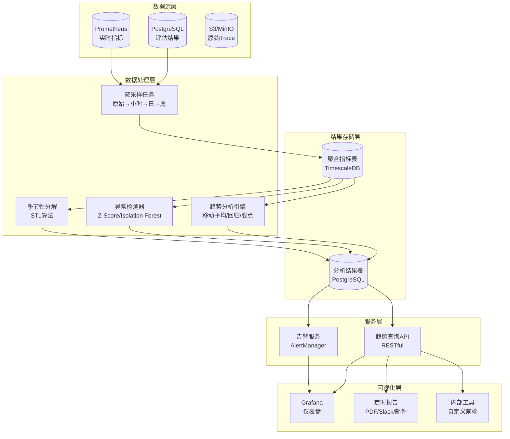

# 11.5.5 historical-analysis — 历史趋势分析

## 简单介绍

历史趋势分析（Historical Trend Analysis）是 Agent 评估体系中回答"我们是在变好还是变坏"的方法论。如果说单次评估是一张照片，那么历史趋势分析就是一段影片——它记录 Agent 性能随时间的变化轨迹，揭示渐进式退化、长期改进效果以及偶发性波动背后的结构性规律。

在传统软件工程中，我们有监控仪表盘、SLO 追踪和回归告警。但在 Agent 场景下，历史趋势分析面临独特挑战：Agent 的行为是非确定性的，单次评估的方差很大，模型的升级和回退频繁发生，外部依赖（如 API、工具）的变化也会影响行为。这些因素使得"性能是否在下降"这个看似简单的问题变得异常复杂。

### 为什么需要历史趋势分析

```
单次评估能回答的问题：
  ✅ Agent v2.3 的一次性成功率是多少？
  ✅ 相比 v2.2 的同一测试集，v2.3 是高了还是低了？

历史趋势能回答的问题：
  ✅ v2.3 上线后的成功率是稳定提升、持续下降，还是周期性波动？
  ✅ v2.2 → v2.3 的提升是真实的改进还是评估噪声？
  ✅ 每次模型升级后，Agent 的鲁棒性是变好了还是变差了？
  ✅ 上个月引入的 prompt 优化，效果是持续的还是已经衰减了？
  ✅ 我们是否正在经历"温水煮青蛙"式的渐进退化？

历史趋势分析的核心价值在于：**让性能变化可追溯、可解释、可预测。**
```

### "温水煮青蛙"问题（The Boiling Frog Problem）

这是 Agent 评估中最隐蔽的陷阱。想象以下场景：

```
第1周：Agent 成功率 93.2%  ── "还不错"
第2周：Agent 成功率 93.0%  ── "正常波动"
第3周：Agent 成功率 92.7%  ── "可能是测试集噪声"
第4周：Agent 成功率 92.1%  ── "需要关注一下"
第5周：Agent 成功率 91.0%  ── "开始调查"
第6周：Agent 成功率 89.5%  ── "出问题了！"

问题在于：从周维度看，每周的下降幅度（0.2%-0.9%）都容易被归因为"正常波动"，
但累积起来，6 周内下降了 3.7 个百分点——这在生产环境中可能是灾难性的。
```

每一周单独看，变化都不显著。但将时间拉长来看，趋势非常明显。这正是历史趋势分析要解决的核心问题：**在噪声中识别出有意义的趋势信号，在问题变得严重之前发出预警。**

---

## 核心问题

### 问题一：没有历史上下文，v2 真的更好吗？

这是 Agent 评估中最常见的误区。假设我们比较两个版本：

```
v1.0: 在一个 1000 条测试集上的成功率为 85.3%
v2.0: 同一测试集上的成功率为 86.1%

差异：+0.8 个百分点

问题：v2.0 真的更好吗？

需要考虑的因素：
  - 这 0.8% 的差异是否在统计置信区间内？
  - 测试集是否完全一样？（可能 v2.0 跑的时候测试集已被污染）
  - 评估环境是否相同？（LLM 的 API 延迟、温度参数、随机种子）
  - 这 0.8% 的来源是普遍提升还是少数几个 case 的随机波动？
  - 如果重复跑 10 次，v2.0 每次都赢吗？
```

没有历史趋势分析，我们只能看到两个孤立的点。有了历史数据，我们可以看到：

- 过去 3 个月的成功率波动范围是什么？
- 0.8% 的变化在历史波动范围内吗？
- v2.0 的提升是首次出现还是之前升级也带来过类似提升但后来又回退了？

### 问题二：趋势 vs. 噪声（Signal vs. Noise）

Agent 评估天生带有高噪声，原因包括：

| 噪声来源 | 影响程度 | 说明 |
|----------|----------|------|
| LLM 随机性 | 高 | 即使 temperature=0，不同推理也可能有差异 |
| 测试集顺序 | 中 | LLM 对输入顺序敏感 |
| API 延迟/超时 | 中 | 网络抖动可能导致工具调用失败 |
| 评估者偏差 | 高 | LLM-as-Judge 的不一致性 |
| 硬件环境 | 低-中 | 推理硬件差异可能导致行为变化 |
| 数据污染 | 高 | 测试用例可能出现在训练数据中 |

高噪声意味着我们需要更多的数据点和更复杂的统计方法来区分信号和噪声。一个常见误区是只看单个时间点的数据——这在 Agent 场景下几乎不可靠。

```
信号 vs 噪声判定原则：

  单点差异 < 历史标准差 × 2  → 很可能是噪声
  连续 3 个点同方向偏离       → 可能是趋势信号
  单点差异 > 历史标准差 × 3  → 需要立即关注
  趋势方向与预期方向一致      → 需要进一步验证 (避免确认偏误)
```

### 问题三：相关性 vs. 因果性

看到成功率上升，我们自然想归因于最近的改动。但现实往往更复杂：

```
观察：v2.0 部署后，成功率从 85% 上升到 87%

可能的解释：
  A) v2.0 的 prompt 优化确实让 Agent 更好了  ← 我们想听到的
  B) 测试集被污染了，模型记忆了答案         ← 常见但容易被忽略
  C) 外部工具 API 变稳定了，导致工具调用成功率高   ← 外部因素
  D) 评估者的评判标准变宽松了               ← 评估流程问题
  E) 用户输入的复杂度分布变了                ← 数据分布偏移
  F) 以上因素的组合                          ← 最可能的真相
```

历史趋势分析不能替代因果推断实验（如 A/B 测试），但它可以帮助我们排除错误的归因。例如，如果我们看到成功率在 v2.0 部署前就已经开始上升（pre-trend），那么 v2.0 的因果贡献就需要打问号。

### 问题四：数据存储成本

这是最实际的工程问题。假设：

```
一个中等规模的 Agent 评估系统：

单个测试用例:   ~1KB (输入 + 输出 + 元数据)
每次评估:      1000 个测试用例 → ~1MB
每日评估次数:  50 次 (CI、手动测试、定时评估)
每日数据量:    50MB
每月数据量:    ~1.5GB (raw data)
每年数据量:    ~18GB

加上 trace 数据、日志、中间步骤，实际量级可能是 3-5 倍
按 3 倍计算:  每年 ~54GB

数据保留策略直接决定成本。
```

不考虑数据保留策略，存储成本会线性增长。我们需要在"保留足够历史数据以进行趋势分析"和"控制存储成本"之间找到平衡。

---

## 数据存储设计

### 时间序列基础概念

历史趋势分析的核心数据模型是时间序列（Time Series）。理解时间序列的几个关键概念：

```
时间序列的三个基本维度：

  指标（Metric）        时间（Timestamp）        标签（Tag）
  ──────────            ─────────────            ─────────
  成功率的数值           2025-03-15T10:00:00Z     version=v2.3
  平均响应延迟           2025-03-15T10:00:00Z     model=gpt-4o
  工具调用成功率         2025-03-15T10:00:00Z     env=production
  Token 消耗量           2025-03-15T10:00:00Z     prompt=v3.1
```

### 指标类型（Metric Types）

根据查询和分析需求，历史数据需要以不同粒度和形式存储：

| 指标类型 | 示例 | 存储精度 | 典型查询 |
|----------|------|----------|----------|
| 计数型（Counter） | 总执行次数、总失败次数 | 原始累加 | 某个时间段的变化率 |
| 测量型（Gauge） | 当前成功率、当前 QPS | 采样值 | 当前状态快照 |
| 分布型（Histogram） | 延迟分布、得分分布 | 分位数或桶 | P50/P95/P99 延迟 |
| 汇总型（Summary） | 每日平均分、每日成功率 | 聚合值 | 日/周趋势 |

### 数据库选择

不同的存储方案各有优劣，选择取决于数据规模、查询模式和分析需求。

```
时间序列专用数据库 vs 通用数据库：

┌─────────────────────┬─────────────────────┬─────────────────────┐
│    InfluxDB         │    TimescaleDB      │    Prometheus       │
│                     │                     │                     │
│  优势:              │  优势:               │  优势:              │
│  - 专为时序优化      │  - PostgreSQL 生态  │  - CNCF 标准        │
│  - 高写入性能        │  - SQL 查询         │  - 强大的查询语言    │
│  - 自动数据压缩       │  - 复杂的 JOIN 操作  │  - 与 K8s 深度集成   │
│  - 内置降采样         │  - 混合事务/分析     │  - 自动发现          │
│  劣势:              │  劣势:               │  劣势:              │
│  - 类 SQL 查询能力弱  │  - 配置复杂          │  - 不支持长期存储    │
│  - JOIN 困难         │  - 写入吞吐不如专用TSDB│  - 基数限制          │
│  - 生态相对小        │  - 学习曲线陡峭       │  - 不适合复杂分析    │
└─────────────────────┴─────────────────────┴─────────────────────┘

┌─────────────────────┬─────────────────────┐
│    MongoDB          │    PostgreSQL        │
│                     │                     │
│  优势:              │  优势:               │
│  - 灵活 schema      │  - 成熟可靠          │
│  - 原生 JSON 存储    │  - 丰富扩展          │
│  - 水平扩展容易      │  - 复杂的关联查询     │
│  劣势:              │  劣势:               │
│  - 时序查询效率低     │  - 时序查询需额外优化  │
│  - 聚合性能不如 TSDB  │  - 大规模时序写入慢   │
│  - 数据压缩不专业     │  - 分区需要手动管理   │
└─────────────────────┴─────────────────────┘
```

**推荐方案**：对于 Agent 评估的历史趋势分析，混合架构往往是最佳实践——用 Prometheus 存储实时监控指标，用 TimescaleDB 或 PostgreSQL 存储详细的评估结果和元数据，用对象存储（S3/MinIO）归档原始 trace 数据。

### Schema 设计

以下是基于 PostgreSQL/TimescaleDB 的推荐 Schema 设计。

#### 评估运行元数据表

```sql
-- 每次评估运行的主记录
CREATE TABLE eval_runs (
    run_id          UUID PRIMARY KEY DEFAULT gen_random_uuid(),
    run_name        TEXT NOT NULL,              -- 例如 "nightly-regression-v2.3"
    agent_version   TEXT NOT NULL,              -- 被测 Agent 版本
    model_id        TEXT NOT NULL,              -- 例如 "gpt-4o-2025-05-13"
    prompt_version  TEXT,                       -- Prompt 模板版本
    environment     TEXT NOT NULL DEFAULT 'staging',  -- staging / production / ci
    test_suite_id   TEXT NOT NULL,              -- 测试套件 ID
    run_type        TEXT NOT NULL DEFAULT 'manual',    -- manual / ci / scheduled
    status          TEXT NOT NULL DEFAULT 'running',   -- running / completed / failed
    total_cases     INTEGER NOT NULL DEFAULT 0,
    passed_cases    INTEGER NOT NULL DEFAULT 0,
    failed_cases    INTEGER NOT NULL DEFAULT 0,
    avg_score       DOUBLE PRECISION,           -- 平均分 (0-1)
    avg_latency_ms  DOUBLE PRECISION,           -- 平均延迟 (ms)
    total_tokens    INTEGER,                    -- 总 Token 消耗
    total_cost_usd  DOUBLE PRECISION,           -- 总成本 (USD)
    trigger_reason  TEXT,                       -- 触发原因描述
    git_commit      TEXT,                       -- 关联的 Git commit
    git_branch      TEXT,                       -- 关联的分支
    started_at      TIMESTAMPTZ NOT NULL DEFAULT NOW(),
    completed_at    TIMESTAMPTZ,
    metadata        JSONB                       -- 扩展元数据
);

-- 按时间分区 (TimescaleDB hypertable)
SELECT create_hypertable('eval_runs', 'started_at');

-- 创建索引
CREATE INDEX idx_eval_runs_agent_version ON eval_runs (agent_version, started_at DESC);
CREATE INDEX idx_eval_runs_model_id ON eval_runs (model_id, started_at DESC);
CREATE INDEX idx_eval_runs_run_type ON eval_runs (run_type, started_at DESC);
CREATE INDEX idx_eval_runs_git_commit ON eval_runs (git_commit);
```

#### 单个测试用例结果表

```sql
-- 每个测试用例的详细结果
CREATE TABLE eval_test_results (
    result_id       UUID PRIMARY KEY DEFAULT gen_random_uuid(),
    run_id          UUID NOT NULL REFERENCES eval_runs(run_id) ON DELETE CASCADE,
    test_case_id    TEXT NOT NULL,              -- 测试用例 ID
    test_category   TEXT,                       -- 类别 (如 tool_use, reasoning, safety)
    test_difficulty TEXT DEFAULT 'medium',      -- easy / medium / hard
    status          TEXT NOT NULL,              -- passed / failed / error / skipped
    score           DOUBLE PRECISION,           -- 评分 (0-1)
    max_score       DOUBLE PRECISION DEFAULT 1.0,
    latency_ms      DOUBLE PRECISION,           -- 该用例的延迟
    token_count     INTEGER,                    -- 该用例的 Token 消耗
    error_type      TEXT,                       -- 失败类型 (如有)
    error_message   TEXT,                       -- 错误描述
    agent_output    TEXT,                       -- Agent 输出摘要
    expected_output TEXT,                       -- 期望输出 (可选)
    judge_output    TEXT,                       -- 评估者的评判理由
    judge_model     TEXT,                       -- 评估者模型
    metadata        JSONB,                      -- 扩展字段
    executed_at     TIMESTAMPTZ NOT NULL DEFAULT NOW()
);

-- 按运行和测试用例索引
CREATE INDEX idx_results_run_id ON eval_test_results (run_id);
CREATE INDEX idx_results_test_case ON eval_test_results (test_case_id, executed_at DESC);
CREATE INDEX idx_results_status ON eval_test_results (run_id, status);
CREATE INDEX idx_results_category ON eval_test_results (test_category, executed_at DESC);
```

#### 聚合指标表（预聚合层）

```sql
-- 按小时预聚合的指标，用于快速趋势查询
CREATE TABLE eval_metrics_hourly (
    bucket          TIMESTAMPTZ NOT NULL,       -- 时间桶，精确到小时
    agent_version   TEXT NOT NULL,
    model_id        TEXT NOT NULL,
    environment     TEXT NOT NULL,
    test_suite_id   TEXT NOT NULL,
    
    -- 成功率指标
    total_runs      INTEGER NOT NULL DEFAULT 0,
    total_cases     INTEGER NOT NULL DEFAULT 0,
    passed_cases    INTEGER NOT NULL DEFAULT 0,
    success_rate    DOUBLE PRECISION,           -- passed_cases / total_cases
    
    -- 效率指标
    avg_latency_ms  DOUBLE PRECISION,
    p50_latency_ms  DOUBLE PRECISION,
    p95_latency_ms  DOUBLE PRECISION,
    p99_latency_ms  DOUBLE PRECISION,
    
    -- 成本指标
    total_tokens    BIGINT NOT NULL DEFAULT 0,
    total_cost_usd  DOUBLE PRECISION,
    
    -- 分布信息
    score_mean      DOUBLE PRECISION,
    score_std       DOUBLE PRECISION,
    score_p50       DOUBLE PRECISION,
    score_p95       DOUBLE PRECISION,
    
    -- 类别细分
    category_breakdown JSONB,                   -- {"tool_use": {"pass": 45, "total": 50}, ...}
    
    PRIMARY KEY (bucket, agent_version, model_id, environment, test_suite_id)
);

SELECT create_hypertable('eval_metrics_hourly', 'bucket');

-- 按日聚合（由定时任务从小时表汇总）
CREATE TABLE eval_metrics_daily (
    bucket          DATE NOT NULL,
    agent_version   TEXT NOT NULL,
    model_id        TEXT NOT NULL,
    environment     TEXT NOT NULL,
    test_suite_id   TEXT NOT NULL,
    -- 字段与小时表类似
    total_cases     INTEGER NOT NULL DEFAULT 0,
    success_rate    DOUBLE PRECISION,
    avg_latency_ms  DOUBLE PRECISION,
    total_cost_usd  DOUBLE PRECISION,
    sample_count    INTEGER NOT NULL DEFAULT 0,
    
    PRIMARY KEY (bucket, agent_version, model_id, environment, test_suite_id)
);
```

### 数据保留与降采样策略

存储成本控制的关键在于分层的保留策略：

```
降采样金字塔：

  原始数据          保留 7 天         →  可做细粒度 debug
        │
        ▼
  小时聚合          保留 90 天        →  日间趋势分析
        │
        ▼
  日聚合            保留 18 个月      →  长期趋势分析
        │
        ▼
  周聚合            永久保留         →  年度对比、报告
        │
        ▼
  月聚合            永久保留（压缩）  →  战略决策
```

降采样实现示例（Python 定时任务）：

```python
import psycopg2
from datetime import datetime, timedelta

def run_downsampling():
    """每小时执行一次的降采样任务"""
    conn = psycopg2.connect("dbname=eval_history")
    cur = conn.cursor()
    
    now = datetime.utcnow()
    
    # Step 1: 从原始数据聚合到小时表
    cur.execute("""
        INSERT INTO eval_metrics_hourly (
            bucket, agent_version, model_id, environment, test_suite_id,
            total_runs, total_cases, passed_cases, success_rate,
            avg_latency_ms, total_tokens, total_cost_usd,
            score_mean, score_std
        )
        SELECT
            date_trunc('hour', r.started_at) AS bucket,
            r.agent_version, r.model_id, r.environment, r.test_suite_id,
            COUNT(DISTINCT r.run_id) AS total_runs,
            SUM(r.total_cases) AS total_cases,
            SUM(r.passed_cases) AS passed_cases,
            SUM(r.passed_cases)::FLOAT / NULLIF(SUM(r.total_cases), 0) AS success_rate,
            AVG(r.avg_latency_ms) AS avg_latency_ms,
            SUM(r.total_tokens) AS total_tokens,
            SUM(r.total_cost_usd) AS total_cost_usd,
            AVG(agg.avg_score) AS score_mean,
            STDDEV(agg.avg_score) AS score_std
        FROM eval_runs r
        JOIN (
            SELECT run_id, AVG(score) AS avg_score
            FROM eval_test_results
            WHERE executed_at >= %s AND executed_at < %s
            GROUP BY run_id
        ) agg ON r.run_id = agg.run_id
        WHERE r.started_at >= %s AND r.started_at < %s
            AND r.status = 'completed'
        GROUP BY 1, 2, 3, 4, 5
        ON CONFLICT (bucket, agent_version, model_id, environment, test_suite_id)
        DO UPDATE SET
            total_runs = EXCLUDED.total_runs,
            total_cases = EXCLUDED.total_cases,
            passed_cases = EXCLUDED.passed_cases,
            success_rate = EXCLUDED.success_rate,
            avg_latency_ms = EXCLUDED.avg_latency_ms
    """, (now - timedelta(hours=2), now, now - timedelta(hours=2), now))
    
    # Step 2: 从小时表聚合到日表
    cur.execute("""
        INSERT INTO eval_metrics_daily (
            bucket, agent_version, model_id, environment, test_suite_id,
            total_cases, success_rate, avg_latency_ms, total_cost_usd
        )
        SELECT
            bucket::DATE AS bucket,
            agent_version, model_id, environment, test_suite_id,
            SUM(total_cases),
            AVG(success_rate),
            AVG(avg_latency_ms),
            SUM(total_cost_usd)
        FROM eval_metrics_hourly
        WHERE bucket >= %s AND bucket < %s
        GROUP BY 1, 2, 3, 4, 5
        ON CONFLICT (bucket, agent_version, model_id, environment, test_suite_id)
        DO UPDATE SET
            total_cases = EXCLUDED.total_cases,
            success_rate = EXCLUDED.success_rate
    """, (now.date() - timedelta(days=1), now.date()))
    
    # Step 3: 清理超过保留期的原始数据
    cur.execute("""
        DELETE FROM eval_test_results
        WHERE executed_at < %s
    """, (now - timedelta(days=7),))
    
    conn.commit()
    cur.close()
    conn.close()
```

### 标签系统（Tagging System）

标签是历史趋势分析中最强大的工具之一。通过给每次评估打上多维标签，我们可以灵活地切片和切块数据。

```
标签设计原则：
  1. 可枚举性：标签值最好是有限的、可控的
  2. 一致性：同一种标签在全系统中使用统一的命名
  3. 索引性：频繁用于过滤的标签必须建索引
  4. 不可变性：标签一旦写入不应修改（历史数据的标签要反映当时的状态）

推荐的标签层次：

评估运行级别标签（每次评估运行固定）：
  ├── agent_version: "v2.3.0"          # Agent 版本
  ├── model_id: "gpt-4o-2025-05-13"    # 底层模型
  ├── model_provider: "openai"         # 模型提供商
  ├── prompt_version: "prompt-v3.1"    # Prompt 模板版本
  ├── environment: "staging"           # 部署环境
  ├── test_suite: "core-regression"    # 测试套件
  ├── run_type: "nightly"              # 运行类型
  ├── git_branch: "feature/new-planner"
  └── git_commit: "a1b2c3d4"

测试用例级别标签（每个用例独立）：
  ├── category: "tool_use"             # 能力类别
  ├── difficulty: "hard"               # 难度
  ├── domain: "finance"                # 领域
  ├── language: "zh-CN"               # 语言
  └── requires_tools: ["calculator", "search"]
```

标签系统使得以下查询成为可能：

```sql
-- 查询 gpt-4o 在 finance 领域 hard 难度任务上的成功率趋势
SELECT date_trunc('day', r.started_at) AS day,
       COUNT(*) AS total,
       AVG(CASE WHEN t.status = 'passed' THEN 1.0 ELSE 0.0 END) AS success_rate
FROM eval_runs r
JOIN eval_test_results t ON r.run_id = t.run_id
WHERE r.model_id = 'gpt-4o-2025-05-13'
  AND t.test_category = 'finance'
  AND t.test_difficulty = 'hard'
  AND r.started_at >= NOW() - INTERVAL '90 days'
GROUP BY 1
ORDER BY 1;
```

---

## 趋势分析方法

### 1. 移动平均（Moving Average）

移动平均是最基础也最有效的趋势分析方法。它通过平滑短期波动来揭示长期趋势。

```
简单移动平均 (SMA):
  SMA_t = (x_{t-n+1} + x_{t-n+2} + ... + x_t) / n
  
  n 的选择是核心问题：
    n=3  → 对变化反应快，但噪声较多
    n=7  → 适合周级别周期
    n=30 → 适合月级别趋势

指数移动平均 (EMA):
  EMA_t = α × x_t + (1-α) × EMA_{t-1}
  
  α = 2 / (n+1)，n 越大 α 越小，平滑效果越强
  
  EMA 相比 SMA 的优势：
  - 对近期数据赋予更高权重，反应更快
  - 不需要保留滑动窗口中的所有历史值
  - 在趋势方向变化时，EMA 比 SMA 更早发出信号
```

### 2. 线性回归趋势检测

线性回归将一个时间序列拟合为直线 `y = β₀ + β₁ × t`，其中 `β₁` 即为趋势斜率。

```
趋势解读：
  β₁ > 0 且 p-value < 0.05 → 显著上升趋势
  β₁ < 0 且 p-value < 0.05 → 显著下降趋势
  p-value ≥ 0.05           → 趋势不显著（可能是随机波动）

但线性回归的局限：
  - 假设趋势是线性的（在 Agent 场景下很少成立）
  - 对异常点敏感
  - 不考虑自相关（时间序列的相邻点通常相关）
```

### 3. 季节性分解（Seasonal Decomposition）

Agent 的性能经常表现出周期性模式：

```
常见的季节性模式：
  ┌──────────────────────────────────────────────┐
  │  日周期：工作日 vs 周末                         │
  │    - 工作日流量大，可能暴露更多问题             │
  │    - 周末评估环境可能使用非生产级资源             │
  ├──────────────────────────────────────────────┤
  │  周周期：周一 vs 周五                           │
  │    - 周一上游服务通常有部署，可能引发连锁问题      │
  │    - 周五的 API 稳定性可能更低                   │
  ├──────────────────────────────────────────────┤
  │  月周期：月初 vs 月末                           │
  │    - 月底有资源配额限制吗？                     │
  │    - 月初是否有新版本发布？                     │
  └──────────────────────────────────────────────┘

季节性分解（STL - Seasonal and Trend decomposition using Loess）：
  将时间序列分解为三个分量：
    Observed = Trend + Seasonal + Residual
    
  - Trend: 长期趋势（平滑后的基线）
  - Seasonal: 周期性成分（固定周期模式）
  - Residual: 剩余噪声（异常检测的重点关注对象）
```

### 4. 变点检测（Change Point Detection）

变点检测用于回答"什么时候发生了显著变化"。在 Agent 评估中，变点通常对应模型升级、prompt 修改、工具链变更等事件。

```
常用变点检测算法：

  PELT (Pruned Exact Linear Time):
    - 精确检测均值或方差的突变点
    - 计算效率高 (O(n))
    - 适合离线分析

  Bayesian Change Point:
    - 基于贝叶斯框架的概率方法
    - 给出变点位置的概率分布
    - 适合在线检测

  CUSUM (Cumulative Sum):
    - 累计偏差检测
    - 计算简单，适合实时监控
    - 对小幅持续漂移敏感（正好解决"温水煮青蛙"问题）
```

### 5. 异常检测（Anomaly Detection）

异常检测在趋势分析中的作用是标记出需要关注的偏离点。

```
三种常用方法：

  Z-Score 方法:
    z_t = (x_t - μ) / σ
    |z_t| > 3  → 标记为异常
    
    局限：假设数据正态分布，Agent 评估数据往往不满足

  Modified Z-Score (MAD):
    M_t = 0.6745 × (x_t - median) / MAD
    |M_t| > 3.5 → 标记为异常
    
    优点：对异常值更鲁棒，不假设正态分布

  Isolation Forest:
    - 基于随机森林的集成方法
    - 对高维数据有效
    - 可以检测多维度的异常（如"成功率高但延迟也高"的组合异常）
```

### 6. 贝叶斯结构时间序列（BSTS）

BSTS 是学术界最前沿的时间序列建模方法之一，特别适合干预效果评估。

```
BSTS 的核心优势：
  - 自动处理季节性和趋势
  - 给出预测的置信区间（而不只是点估计）
  - 可以评估某个干预（如模型升级）的因果效应
  - 适用于数据量较小的情况（贝叶斯方法的先天优势）

这正是 Google 的 CausalImpact 包背后的方法论，
广泛用于评估"某个事件是否对时间序列产生了显著影响"。
```

### 完整趋势分析引擎示例

以下 Python 代码实现了一个综合的趋势分析引擎，整合了多种方法：

```python
"""
Agent 评估历史趋势分析引擎
支持移动平均、趋势检测、变点发现、异常标记
"""

import numpy as np
import pandas as pd
from typing import Dict, List, Optional, Tuple
from dataclasses import dataclass
from datetime import datetime, timedelta
from scipy import stats
from scipy.signal import savgol_filter


@dataclass
class TrendResult:
    """趋势分析结果"""
    direction: str                  # "up" | "down" | "stable" | "insufficient_data"
    slope: float                    # 趋势斜率
    slope_p_value: float            # 斜率显著性
    recent_change_pct: float        # 最近周期变化百分比
    is_significant: bool            # 是否显著
    change_points: List[datetime]   # 检测到的变点
    anomalies: List[datetime]       # 检测到的异常点
    predicted_next: Optional[float] # 下一期预测值
    confidence_interval: Tuple     # 置信区间


class TrendAnalyzer:
    """Agent 评估趋势分析器"""
    
    def __init__(self, data: pd.DataFrame):
        """
        初始化分析器
        
        Args:
            data: DataFrame 必须包含 'date' 和 'value' 列
                  也可以包含 'metric' 列来区分不同指标
        """
        self.data = data.sort_values('date').reset_index(drop=True)
        self.values = data['value'].values
        self.dates = data['date'].values
    
    def simple_moving_average(self, window: int = 7) -> pd.Series:
        """简单移动平均"""
        return pd.Series(self.values).rolling(window=window).mean()
    
    def exponential_moving_average(self, span: int = 7) -> pd.Series:
        """指数移动平均"""
        return pd.Series(self.values).ewm(span=span, adjust=False).mean()
    
    def detect_linear_trend(self) -> Dict:
        """
        使用线性回归检测趋势方向和显著性
        """
        n = len(self.values)
        if n < 5:
            return {"slope": 0, "p_value": 1.0, "direction": "insufficient_data"}
        
        x = np.arange(n)
        y = self.values
        
        # 线性回归
        slope, intercept, r_value, p_value, std_err = stats.linregress(x, y)
        
        # 判断方向
        if p_value < 0.05:
            direction = "up" if slope > 0 else "down"
        else:
            direction = "stable"
        
        return {
            "slope": slope,
            "intercept": intercept,
            "r_squared": r_value ** 2,
            "p_value": p_value,
            "direction": direction,
            "is_significant": p_value < 0.05
        }
    
    def detect_change_points(self, min_distance: int = 5) -> List[int]:
        """
        基于滑动窗口的均值变点检测
        
        Args:
            min_distance: 变点之间的最小间隔
            
        Returns:
            变点位置的索引列表
        """
        if len(self.values) < 10:
            return []
        
        change_points = []
        n = len(self.values)
        
        # 使用滑动窗口比较前后两段的均值
        window_size = max(3, n // 10)
        
        for i in range(window_size, n - window_size):
            left = self.values[i - window_size:i]
            right = self.values[i:i + window_size]
            
            t_stat, p_value = stats.ttest_ind(left, right, equal_var=False)
            
            if p_value < 0.01 and abs(t_stat) > 3.0:
                # 检查是否太接近已有的变点
                if not change_points or (i - change_points[-1]) >= min_distance:
                    change_points.append(i)
        
        return change_points
    
    def detect_anomalies(self, method: str = "zscore", threshold: float = 3.0) -> np.ndarray:
        """
        异常值检测
        
        Args:
            method: 'zscore' 或 'mad' (Median Absolute Deviation)
            threshold: 异常判定阈值
            
        Returns:
            布尔数组，True 表示异常
        """
        anomalies = np.zeros(len(self.values), dtype=bool)
        
        if method == "zscore":
            mean = np.mean(self.values)
            std = np.std(self.values)
            if std > 0:
                z_scores = np.abs((self.values - mean) / std)
                anomalies = z_scores > threshold
        
        elif method == "mad":
            median = np.median(self.values)
            mad = np.median(np.abs(self.values - median))
            if mad > 0:
                modified_z = 0.6745 * (self.values - median) / mad
                anomalies = np.abs(modified_z) > threshold
        
        return anomalies
    
    def full_analysis(self) -> TrendResult:
        """
        完整趋势分析：综合多种方法
        """
        trend = self.detect_linear_trend()
        change_indices = self.detect_change_points()
        
        # 检测异常
        anomaly_mask = self.detect_anomalies(method="mad")
        anomaly_indices = np.where(anomaly_mask)[0]
        
        # 计算近期变化（最近 7 天 vs 前 7 天）
        if len(self.values) >= 14:
            recent = self.values[-7:]
            prior = self.values[-14:-7]
            recent_mean = np.mean(recent)
            prior_mean = np.mean(prior)
            change_pct = ((recent_mean - prior_mean) / prior_mean * 100) if prior_mean > 0 else 0
        else:
            change_pct = 0.0
        
        # 简单预测（基于最近趋势的外推）
        predicted = None
        ci = (None, None)
        if trend["is_significant"]:
            next_idx = len(self.values)
            predicted = trend["slope"] * next_idx + trend["intercept"]
            # 预测区间（标准误差 × 2）
            residuals = self.values - (trend["slope"] * np.arange(len(self.values)) + trend["intercept"])
            se = np.std(residuals)
            ci = (predicted - 2 * se, predicted + 2 * se)
        
        return TrendResult(
            direction=trend["direction"],
            slope=trend["slope"],
            slope_p_value=trend["p_value"],
            recent_change_pct=change_pct,
            is_significant=trend["is_significant"],
            change_points=[self.dates[i] for i in change_indices],
            anomalies=[self.dates[i] for i in anomaly_indices],
            predicted_next=predicted,
            confidence_interval=ci
        )
    
    def seasonal_decompose(self, period: int = 7) -> Dict:
        """
        季节性分解（简便实现）
        
        Args:
            period: 周期长度（默认 7 天一周）
        """
        if len(self.values) < period * 2:
            return {"error": "数据点不足，无法进行季节性分解"}
        
        # 计算趋势分量（使用 Savitzky-Golay 滤波）
        try:
            trend = savgol_filter(self.values, min(period * 2 + 1, len(self.values) - (1 - len(self.values) % 2)), 3)
        except ValueError:
            trend = pd.Series(self.values).rolling(window=period, center=True).mean().fillna(method='bfill').fillna(method='ffill').values
        
        # 去趋势
        detrended = self.values - trend
        
        # 计算季节分量（按周期位置平均）
        seasonal = np.zeros(len(self.values))
        for i in range(period):
            indices = list(range(i, len(self.values), period))
            seasonal[indices] = np.mean(detrended[indices])
        
        # 中心化季节分量（使得季节分量之和为零）
        seasonal -= np.mean(seasonal)
        
        # 剩余分量
        residual = self.values - trend - seasonal
        
        return {
            "trend": trend,
            "seasonal": seasonal,
            "residual": residual,
            "seasonal_strength": 1 - np.var(residual) / np.var(detrended) if np.var(detrended) > 0 else 0
        }


# 使用示例
if __name__ == "__main__":
    # 模拟 90 天的 Agent 成功率数据
    np.random.seed(42)
    n_days = 90
    
    dates = pd.date_range(end=datetime.now(), periods=n_days, freq='D')
    
    # 模拟一个逐渐下降的趋势（温水煮青蛙）
    base = 0.92
    drift = np.linspace(0, -0.04, n_days)
    noise = np.random.normal(0, 0.015, n_days)
    
    values = base + drift + noise
    values = np.clip(values, 0, 1)
    
    data = pd.DataFrame({"date": dates, "value": values})
    
    # 运行分析
    analyzer = TrendAnalyzer(data)
    result = analyzer.full_analysis()
    
    print(f"趋势方向: {result.direction}")
    print(f"趋势斜率: {result.slope:.6f} (每天)")
    print(f"显著性 p-value: {result.slope_p_value:.4f}")
    print(f"近期变化: {result.recent_change_pct:.2f}%")
    print(f"变点数量: {len(result.change_points)}")
    print(f"异常点数量: {len(result.anomalies)}")
    
    if result.direction == "down" and result.is_significant:
        print("\n⚠️ 告警：检测到显著下降趋势，建议立即调查！")
        print(f"  按当前趋势，30天后预测值为: {result.predicted_next:.1%}")
        print(f"  预测区间: [{result.confidence_interval[0]:.1%}, {result.confidence_interval[1]:.1%}]")
    
    # 季节性分解
    decompose = analyzer.seasonal_decompose(period=7)
    print(f"\n季节性强度: {decompose['seasonal_strength']:.3f}")
    print(f"  1.0 = 完全季节性的，0.0 = 无季节模式")
```

---

## 可视化

可视化是历史趋势分析中最直观的沟通工具。好的可视化能让趋势一目了然，而不需要读者理解复杂的统计概念。

### 趋势图（Trend Chart）

趋势图是历史趋势分析的核心可视化。关键设计要点：

```
一个高质量的趋势图应包含：

  1. 原始数据点（浅色半透明）   → 展示完整数据分布
  2. 平滑趋势线（EMA 或 LOESS） → 展示核心趋势
  3. 置信区间带（阴影区域）      → 展示不确定性
  4. 关键事件标注（竖线）        → 关联变更
  5. 异常点突出标记（红色标记）   → 提醒关注
  6. 参考线（SLO/SLA 阈值）      → 展示目标

时间轴格式：
  - 近 7 天：按小时
  - 近 30 天：按天
  - 近 90 天：按天或按周
  - 超过 90 天：按周或按月
```

### 回归热力图（Regression Heatmap）

回归热力图将 Agent 性能以热力图形式展示，横轴是版本或时间，纵轴是不同的评估维度或测试类别。

```
所有测试类别 × 所有版本的成功率矩阵：

              v2.0  v2.1  v2.2  v2.3  v2.4
 tool_use      88%   89%   87%   90%   91%  ← 稳定提升 ✓
 reasoning     85%   83%   80%   78%   75%  ← 持续下降 ⚠️
 safety        95%   96%   95%   94%   93%  ← 开始下降 ⚠️
 planning      78%   76%   79%   81%   84%  ← 近期改善 ✓
 coding        82%   81%   80%   79%   76%  ← 逐渐退化 ⚠️

颜色编码：绿色（>=90%）, 黄色（80-89%）, 橙色（70-79%）, 红色（<70%）

一行扫描：
  - reasoning 行：从上到下从 85% 降到 75%，持续退化，需要根因分析
  - planning 行：从 v2.2 开始改善，可以关联 v2.2 的 planning 模块优化
  - 右上角（tool_use, v2.4）：92% 是我们的最佳表现
```

### 分布对比图（Distribution Comparison）

不同版本之间的得分分布对比，可以揭示均值之外的重要信息。

```
传统图：v2.0 成功率 85%，v2.1 成功率 86%
结论：v2.1 比 v2.0 好 1 个百分点

分布图揭示的真相：
  ┌──────────────────────────────────┐
  │  v2.0: 中等分数集中，但长尾失败   │
  │  ████████████████░░░░░░░░░       │
  │  分数: 0.2 0.4 0.6 0.8 1.0       │
  │                                    │
  │  v2.1: 高分更多，失败模式更集中    │
  │  ████████████████████░░░░░        │
  │  分数: 0.2 0.4 0.6 0.8 1.0        │
  └──────────────────────────────────┘

分布对比的关键洞察：
  - v2.1 的高分区（0.9-1.0）更多，均值更高
  - 但 v2.1 的低分区（0.2-0.4）更集中——说明失败不是均匀分布的
  - 如果低分区集中在某一类任务中，这就是需要优先修复的方向
```

### 相关性矩阵（Correlation Matrix）

分析不同评估指标之间的相关关系，帮助理解指标间的相互作用。

```
成功率 vs 延迟 vs Token 消耗 vs 成本的相关性：

             成功率   延迟   Token  成本
   成功率      1.00  -0.23  -0.15  -0.18
   延迟       -0.23   1.00   0.87   0.91  ← 延迟和成本高度相关
   Token      -0.15   0.87   1.00   0.95  ← Token 和成本几乎完全相关
   成本       -0.18   0.91   0.95   1.00

关键发现：
  - 延迟、Token、成本三者高度相关（意料之中）
  - 成功率和成本弱负相关 → 更好的 Agent 可能需要更多推理
  - 没有强负相关 → 提效优化不会显著损害质量（反之亦然）
```

### 可视化架构图

以下是趋势分析可视化的整体架构设计：



### Grafana 仪表盘设计建议

对于 Grafana 仪表盘，推荐以下板块布局：

```
仪表盘："Agent 性能历史趋势"
刷新频率：5 分钟
时间范围默认：最近 30 天

Row 1: 全局概览
  ├── 综合成功率趋势图（时间序列 + EMA 平滑 + 置信区间）
  ├── 每日评估运行次数（柱状图）
  └── 活跃版本列表（表格，显示各版本最后 7 天成功率）

Row 2: 版本对比
  ├── 各版本成功率对比（箱线图）
  ├── 各版本延迟对比（箱线图，P50/P95）
  └── 版本迁移桑基图（展示测试用例在不同版本间的状态变化）

Row 3: 维度分解
  ├── 按测试类别分组的成功率趋势（多线图）
  ├── 按难度分组的成功率趋势（多线图）
  └── 按模型分组的成功率趋势（多线图）

Row 4: 异常与变点
  ├── 异常检测结果（散点图，高亮异常点）
  ├── 变点检测结果（在趋势图上标注变点位置）
  └── 告警历史（列表，显示近期触发的告警）

Row 5: 成本与效率
  ├── 每日 Token 消耗趋势（面积图）
  ├── 每日成本趋势（面积图）
  └── 每百次成功运行的 Token 效率（时间序列）
```

---

## 根因关联

发现趋势下降只是第一步。关键问题是：**是什么导致了下降？** 根因关联（Root Cause Correlation）试图将性能变化与具体的变更、事件或外部因素联系起来。

### 变更日志关联

将性能趋势与部署/变更日志对齐是最直接的根因分析方法：

```
时间线关联矩阵：

时间         成功率    延迟     事件
─────────────────────────────────────────────
3/1          92.1%    1.2s    -
3/2          92.3%    1.2s    -
3/3          91.8%    1.3s    模型升级 gpt-4 → gpt-4-turbo
3/4          90.2%    1.5s    
3/5          89.5%    1.6s    ← 成功率下降 2.6%，延迟上升 0.3s
3/6          89.1%    1.6s    prompt 模板 v2 上线（回滚昨天的模型？）
3/7          91.0%    1.2s    ← 恢复
3/8          91.2%    1.2s

关联分析：
  - 3/3 模型升级后，成功率和延迟同时恶化
  - 3/6 prompt 更新后，延迟恢复到正常水平，成功率的逆转可能来自prompt
  - 推断：gpt-4-turbo 的成功率低于 gpt-4，但 prompt 优化部分补偿了这个损失
```

实现这种关联的关键是建立统一的变更日志系统：

```python
from dataclasses import dataclass
from datetime import datetime
from typing import Optional

@dataclass
class ChangeEvent:
    """系统变更事件"""
    timestamp: datetime
    event_type: str           # "deploy" / "config_change" / "model_upgrade" / "tool_change"
    component: str            # "agent" / "prompt" / "model" / "tool"
    version_before: Optional[str]
    version_after: Optional[str]
    description: str
    author: str
    expected_impact: str      # "positive" / "negative" / "neutral"
    rollback_of: Optional[str] = None  # 如果是回滚，指向被回滚的事件 ID


def correlate_trend_with_events(
    trend_result: TrendResult,
    events: List[ChangeEvent],
    lookback_window_days: int = 3
) -> List[Dict]:
    """
    将趋势变化与最近的变更事件关联起来
    
    Args:
        trend_result: 趋势分析结果
        events: 变更事件列表
        lookback_window_days: 变点前回看的天数
        
    Returns:
        关联分析结果列表
    """
    correlations = []
    
    for cp in trend_result.change_points:
        window_start = cp - timedelta(days=lookback_window_days)
        window_end = cp + timedelta(days=1)
        
        nearby_events = [
            e for e in events
            if window_start <= e.timestamp <= window_end
        ]
        
        if nearby_events:
            correlations.append({
                "change_point": cp,
                "nearby_events": nearby_events,
                "time_gap_hours": [
                    (cp - e.timestamp).total_seconds() / 3600
                    for e in nearby_events
                ],
                "suspected_cause": nearby_events[0],  # 最接近变点的事件
                "confidence": "high" if len(nearby_events) == 1 else "medium"
            })
        else:
            correlations.append({
                "change_point": cp,
                "nearby_events": [],
                "suspected_cause": None,
                "confidence": "low",
                "note": "变点附近未找到关联事件，可能是外部因素"
            })
    
    return correlations
```

### 自然实验

在无法进行严格 A/B 测试的情况下，可以利用生产环境中的自然变化来估计因果效应。

```
自然实验（Natural Experiment）的核心思想：

  场景：模型发布新版本，所有用户自动切换。
  无法做 A/B 测试，但可以利用不同时段的数据来估计效果。

  方法：间断时间序列分析（Interrupted Time Series, ITS）

  逻辑：
    1. 记录干预前一段时间的结果（基线）
    2. 拟合干预前的趋势（控制时间的自然变化）
    3. 记录干预后的结果
    4. 比较：实际结果 vs 如果干预没发生的"反事实"预测结果
    5. 反事实 = 基线趋势的外推
    6. 因果效应 = 实际结果 - 反事实结果

  ┌─────────────────────────────────────────┐
  │  成功率                                  │
  │  ↑ 0.92 ────╮                            │
  │  │          ╰──╮                         │
  │  │  干预前趋势  ╲──╮                      │
  │  │              ╲ ╰── 反事实（外推）      │
  │  │               ╲  ─ ─ ─ ─ ─ ─ ─       │
  │  │                ╲       ↑               │
  │  │                 ╲      │ 因果效应       │
  │  │                  ────  │               │
  │  │  干预        实际 → ╲  │               │
  │  └───────────────────────────────────→ 时间│
  └─────────────────────────────────────────┘
```

### 多变量分析

当多个因素同时变化时，需要使用多变量方法来分离各自的影响：

```
多变量回归模型：

  success_rate ~ β₀ 
                + β₁ × model_version       # 模型版本影响
                + β₂ × prompt_version      # Prompt 影响
                + β₃ × has_new_tool        # 工具变更影响
                + β₄ × workload            # 负载影响
                + β₅ × is_weekend          # 周末效应
                + ε

  系数解读：
    β₁ = -0.023 (p=0.01) → 新模型导致成功率下降 2.3%
    β₂ = +0.015 (p=0.03) → 新 Prompt 提升成功率 1.5%
    β₃ = +0.008 (p=0.20) → 工具影响不显著
    β₄ = -0.005 (p=0.45) → 负载无显著影响
    β₅ = +0.012 (p=0.08) → 周末有微弱提升（不显著）
    
  结论：模型升级的负面影响超过了 Prompt 优化的正面效果。
  建议：要么回滚模型，要么进一步优化 Prompt。
```

### 根因归因的常见陷阱

```
陷阱 1：错把相关性当因果性
  "模型升级后成功率上升 2% → 模型升级让 Agent 更好了"
  但可能：升级后测试集同时被更换了

陷阱 2：忽略延迟效应
  变更的效果可能需要一段时间才能完全显现
  "deploy 后 3 天没有变化" ≠ "deploy 没有影响"
  有可能 Agent 先使用了缓存，缓存过期后才暴露问题

陷阱 3：辛普森悖论
  每个子类别的性能都改善了，但整体性能却下降了
  原因：测试集的类别分布发生了变化
  如果困难任务的比例增加了，即使每个类别都改善了，整体成功率也可能下降

陷阱 4：回归均值
  极端低的成功率后大概率会回升（纯粹的统计现象）
  不要把所有回升都归功于最近的 fix

陷阱 5：确认偏误
  我们倾向于寻找支持自己假设的证据
  如果认为 "our prompt optimization works"，就会更容易接受支持它的数据
  解决方案：预先注册分析方法和假设（pre-registration）
```

---

## 可行洞察

趋势分析的最终目标不是生成漂亮的图表，而是**推动决策和行动**。

### 从数据到决策

不同趋势信号对应不同的决策行动：

```
趋势信号 → 决策矩阵：

┌───────────────────────────────┬──────────────────────────────┐
│  检测到的趋势                   │  建议行动                      │
├───────────────────────────────┼──────────────────────────────┤
│  成功率持续下降（>3 天）         │  触发调查流程                   │
│  成功率显著下降（>5% 周同比）     │  立即回滚评估（如果可以）        │
│  成功率上升                     │  记录并继续监控                 │
│  延迟持续上升                    │  检查 token 使用、模型规格      │
│  延迟突然上升                    │  概率性上游 API 故障            │
│  方差增大（不稳定）              │  检查是否需要提高 temperature    │
│  成本上升但质量不变              │  优化 prompt 减少 token 消耗    │
│  特定类别持续下降                │  针对该类别的专项修复            │
│  周末/非工作时间异常              │  检查基础设施资源分配            │
│  变点突然出现                    │  关联变更日志，寻找根因          │
│  季节性模式改变                  │  数据分布可能发生了转变          │
└───────────────────────────────┴──────────────────────────────┘
```

### 回归分类馈送（Regression Triage Feed）

基于趋势分析的结果，可以构建一个自动化分类系统，持续监控并标记需要关注的变化：

```
回归分类自动馈送系统工作流：

  输入：每天最新的评估结果
    │
    ▼
  Step 1: 与历史基线对比
    ├── 与过去 7 天均值对比
    ├── 与过去 30 天趋势对比
    └── 与 SLO 阈值对比
    │
    ▼
  Step 2: 分类优先级
    ├── P0 (紧急): 成功率下降 > 5%，或完全故障
    ├── P1 (高): 成功率下降 3-5%，或特定类别严重退化
    ├── P2 (中): 成功率下降 1-3%，或延迟上升 > 30%
    └── P3 (低): 轻微变化，进入观察期
    │
    ▼
  Step 3: 生成报告
    ├── Slack 通知（P0/P1 即时推送）
    ├── Jira 工单自动创建（P0/P1）
    └── 日报（P2/P3 汇总）
    │
    ▼
  Step 4: 追踪
    ├── 记录每次告警的分类结果
    ├── 追踪告警到解决的时间
    └── 分析误报率，持续优化阈值
```

### 性能预算趋势（Performance Budget Trends）

将长期成本效率纳入趋势分析的范畴：

```
性能预算趋势追踪：

  核心指标：每成功任务的成本（Cost per Successful Task, CPST）
  
  CPST = 总 USD 成本 / 成功完成任务数

  预算线示例：
    允许趋势: CPST 在 +/- 10% 内波动
    告警阈值: CPST 上升超过 20%
    紧急阈值: CPST 上升超过 50%

  长期趋势：
    ┌──────┬────────┬────────┬────────┬────────┬────────┐
    │ 月份  │ 成功率  │ 每次成本 │ 总成本  │ CPST   │ 趋势    │
    ├──────┼────────┼────────┼────────┼────────┼────────┤
    │ 1月  │ 85%    │ $0.12  │ $120   │ $0.14  │ 基线    │
    │ 2月  │ 86%    │ $0.11  │ $110   │ $0.13  │ 改善 ↘ │
    │ 3月  │ 84%    │ $0.13  │ $130   │ $0.15  │ 恶化 ↗ │
    │ 4月  │ 88%    │ $0.10  │ $100   │ $0.11  │ 改善 ↘ │
    │ 5月  │ 87%    │ $0.14  │ $140   │ $0.16  │ 恶化 ↗ │
    └──────┴────────┴────────┴────────┴────────┴────────┘

  关键洞察：
    - 成功率上升不必然意味着 CPST 下降（如果成本上升更快）
    - 4 月的表现最佳：成功率 88% + CPST $0.11
    - 5 月的 CPST 上升 > 14%，需要检查是否为新版本的计算成本更高
```

### 质量趋势（Quality Trends）

长期的"我们是否在变好"需要多维度地衡量：

```
质量趋势综合指数：不仅仅是成功率

  Agent 质量得分 = w₁ × 成功率 + w₂ × 鲁棒性 + w₃ × 效率加权 + w₄ × 用户满意度

  长期趋势分析关注：
    - 绝对质量：综合得分本身是否在上升？
    - 质量增长速度：改进的速度是在加快还是放缓？
    - 质量天花板：是否接近了当前架构的理论上限？
    - 回归频率：回滚的次数和频率是否在减少？

  质量成熟度阶段：
    ┌─────────────────────────────────────────────────────┐
    │  阶段 1：快速提升                                    │
    │    - 每次迭代都有显著改进                             │
    │    - 改进来自 prompt 工程的基础优化                    │
    │    - 通常持续 1-3 个月                                │
    ├─────────────────────────────────────────────────────┤
    │  阶段 2：精细调优                                    │
    │    - 改进速度放缓，每次迭代 1-3%                      │
    │    - 需要更复杂的优化手段（fine-tuning、RAG 优化）     │
    │    - 回归的风险增加                                    │
    ├─────────────────────────────────────────────────────┤
    │  阶段 3：平台期                                      │
    │    - 改进 < 0.5%/迭代                                 │
    │    - 主要工作转向维护和防止退化                         │
    │    - 需要架构级变革来突破天花板                        │
    └─────────────────────────────────────────────────────┘
```

---

## 工具与实现

### Prometheus + Grafana 方案

对于实时监控和历史趋势分析，Prometheus + Grafana 是最成熟的开源方案。

```
Prometheus 数据采集示例（评估指标暴露）：

# 在 Agent 评估服务中暴露 Prometheus 指标
from prometheus_client import Histogram, Gauge, Counter, start_http_server

# 定义指标
EVAL_SUCCESS_RATE = Gauge(
    'agent_eval_success_rate',
    'Agent evaluation success rate',
    ['agent_version', 'model_id', 'test_category']
)

EVAL_LATENCY = Histogram(
    'agent_eval_latency_seconds',
    'Agent evaluation latency in seconds',
    ['agent_version', 'model_id'],
    buckets=(0.5, 1.0, 2.0, 5.0, 10.0, 30.0, 60.0)
)

EVAL_TOKEN_COUNT = Counter(
    'agent_eval_tokens_total',
    'Total tokens consumed in evaluation',
    ['agent_version', 'model_id', 'token_type']  # token_type: prompt / completion
)

# 每次评估完成后更新指标
def record_eval_result(run_result: dict):
    EVAL_SUCCESS_RATE.labels(
        agent_version=run_result['agent_version'],
        model_id=run_result['model_id'],
        test_category=run_result['test_category']
    ).set(run_result['success_rate'])
    
    EVAL_LATENCY.labels(
        agent_version=run_result['agent_version'],
        model_id=run_result['model_id']
    ).observe(run_result['avg_latency_seconds'])
    
    EVAL_TOKEN_COUNT.labels(
        agent_version=run_result['agent_version'],
        model_id=run_result['model_id'],
        token_type='prompt'
    ).inc(run_result['prompt_tokens'])

# 启动 HTTP 服务暴露指标（Grafana 从该端点拉取数据）
# start_http_server(8000)
```

Grafana 典型查询（使用 PromQL）：

```promql
# 查询 gpt-4o 的成功率 30 天趋势
avg_over_time(
  agent_eval_success_rate{
    model_id="gpt-4o-2025-05-13",
    test_category="tool_use"
  }[30d]
)

# 查询 P95 延迟趋势
histogram_quantile(
  0.95,
  sum(rate(agent_eval_latency_seconds_bucket{model_id="gpt-4o-2025-05-13"}[1h]))
  by (le)
)

# 查询 Token 消耗增长率
rate(agent_eval_tokens_total{token_type="completion"}[7d])
```

### Python 分析工具链

对于更复杂的趋势分析和报告生成，Python 生态提供了强大的工具：

```
推荐库组合：

  数据操作: pandas, numpy
  统计建模: statsmodels (ARIMA, 季节性分解), scipy (统计检验)
  变点检测: ruptures (PELT, Binary Segmentation)
  异常检测: scikit-learn (Isolation Forest, LOF)
  可视化: matplotlib, seaborn, plotly (交互式)
  报告生成: jinja2 (模板), weasyprint (PDF)
  自动化: Apache Airflow / Prefect (定时任务调度)
```

### 自定义报告 vs. 托管平台

```
自定义 Python 脚本 + Grafana:
  优点:
    - 完全可控
    - 可集成专用算法（如 BSTS、自定义变点检测）
    - 不需要额外付费
    - 可以生成定制化报告
  缺点:
    - 开发维护成本高
    - 需要基础设施支持
    - 交互式查询能力有限
  适合: 有独立数据工程团队的成熟组织

托管可观测平台 (Datadog, New Relic, Grafana Cloud):
  优点:
    - 开箱即用
    - 内置告警和仪表盘
    - 托管运维
    - 团队协作方便
  缺点:
    - 成本高（特别是数据量大时）
    - 灵活性受限（只能用平台提供的分析功能）
    - 数据出域 / 合规问题
  适合: 中小团队，不想投入基础设施

混合方案（推荐）:
    - Prometheus + Grafana: 实时监控和告警
    - PostgreSQL + Python: 深度分析和报告生成
    - MinIO/S3: 原始数据归档
  适合: 大多数中大型 Agent 评估项目
```

---

## 最佳实践

### 采样策略

在数据量非常大时，合理的采样策略可以在保持分析质量的同时控制成本：

```
分层采样（Stratified Sampling）方案：

  全面评估（Full Run）：
    - 频率：每天 1 次
    - 覆盖：所有类别 × 难度组合
    - 数量：完整测试集（例如 2000 条）
    - 用途：精确基线更新

  轻量评估（Light Run）：
    - 频率：每次部署 / PR 合并时
    - 覆盖：核心类别
    - 数量：测试集的 20%（约 400 条），按类别分布采样
    - 用途：快速反馈

  聚焦评估（Focused Run）：
    - 频率：根据需要触发
    - 覆盖：特定有问题的类别
    - 数量：该类别的全量 + 其他类别的抽样
    - 用途：根因分析

  自适应采样：
    - 当趋势稳定时，降低评估频率
    - 当检测到异常时，自动增加采样密度
    - 实现：基于趋势分析结果动态调整
```

### 趋势告警（非点告警）

传统告警基于固定阈值（如成功率 < 85% 就告警），这种方式的局限性在 Agent 场景下很明显。更好的方法是基于趋势的告警。

```
固定阈值告警的问题：
  - 在 85% 上下反复震荡时产生大量误报
  - 渐进退化（84.9% → 84.7% → 84.5% ...）永远不会触发告警
  - 不同的测试类别应该有不同的阈值

趋势告警策略：

  规则 1：趋势方向检测
    if 连续 N 天成功率下降 AND 下降幅度超过 M%
    → 触发告警
    例：连续 5 天下降，累计下降 > 2% → P2 告警

  规则 2：趋势斜率告警
    if 过去 7 天的线性回归斜率 < -0.005 (每天下降 > 0.5%)
    → 触发告警
    灵敏度：斜率负且 p-value < 0.05

  规则 3：变点告警
    if 检测到统计显著的变点
    → 触发告警（附带变点前后的均值变化）

  规则 4：预测告警（提前告警）
    if 基于当前趋势，预测 7 天后将跌破阈值
    → 触发预警通知

  规则 5：季节性调整告警
    if 当前值 / 季节性同期值 < 阈值
    → 触发告警（考虑了季节因素）
```

### 平衡细节与存储成本

```
数据分层存储的工程实现：

  Hot Tier (热存储, SSD):
    - 原始数据: 最近 7 天
    - 小时聚合: 最近 90 天
    - 查询性能: < 100ms
    - 存储成本: 高（但数据量小）

  Warm Tier (温存储, HDD):
    - 日聚合: 最近 18 个月
    - 周聚合: 所有历史
    - 查询性能: < 1s
    - 存储成本: 中

  Cold Tier (冷存储, S3/对象存储):
    - 原始归档: 从热存储过期的数据
    - 月聚合: 永久保留
    - 查询性能: 数秒到数分钟
    - 存储成本: 极低

  数据压缩：
    - 使用列式存储（Parquet）归档
    - 对 JSON 字段使用 JSONB 压缩
    - 对浮点数列使用适当精度（DOUBLE → REAL 可节省 50%）
```

### 其他关键实践

```
实践 1：版本标记的完整性
  
  每个评估运行必须有完整的版本信息：
    agent_version ✓  model_id ✓  prompt_version ✓  
    tool_version ✓  eval_script_version ✓  judge_model ✓

  缺少任何一个标签，该次评估的历史价值就会大打折扣。
  因为后续分析无法确定性能变化具体来源于哪个组件。

实践 2：环境一致性

  尽量在相同条件下运行历史评估：
  - 相同的时间段（避免 API 高峰期的延迟差异）
  - 相同的硬件配置
  - 相同的评估者模型
  - 相同的温度参数

  如果环境不得不变化，在标签中明确标注并在分析时做修正。

实践 3：定期校准

  定期（如每月）在标准参考数据集上运行评估，
  确认评估流程本身没有发生漂移。
  
  校准数据集：静态的、不更新的、人类标注的黄金标准测试集。
  如果校准集的得分突然变化，说明评估流程出了问题，
  而不是 Agent 本身的问题。

实践 4：分析结果本身也要被分析

  追踪趋势分析系统的性能：
  - 告警准确率（Precision of alerts）
  - 告警召回率（Recall of alerts）
  - 从趋势恶化到发现的时间
  - 误报率
  
  持续优化告警阈值和分析算法，避免"狼来了"效应。
```

---

## 小结

历史趋势分析是 Agent 评估体系中最容易被低估的环节。在一次评估中关注"这一刻的得分"是直觉性的，但真正的价值藏在时间的维度中。

```
核心观点总结：

  1. 趋势 > 单点
     - 单次评估的结果充满噪声，连续趋势才有意义
     - "温水煮青蛙"式的渐进退化是最危险的——趋势分析让它无处遁形

  2. 存储是基础，设计是关键
     - 合理的 Schema 设计 + 分层降采样 = 高效的历史数据管理
     - 标签系统决定了你能从什么维度分析数据
     - 在存储成本和分析粒度之间找到平衡

  3. 方法要组合
     - 移动平均 + 线性回归 + 季节性分解 + 变点检测 = 全方位的趋势理解
     - 没有万能的单一方法，不同问题需要不同工具

  4. 因果关系是终极目标
     - 趋势分析告诉你"发生了什么"，根因分析告诉你"为什么发生"
     - 从相关性到因果性，需要变更日志、自然实验和多变量分析的结合

  5. 洞察驱动行动
     - 让数据说话的目的是让正确的决策发生
     - 自动化的趋势告警 + 分类系统 = 从发现到行动的闭环

  6. 持续改进
     - 趋势分析系统本身也需要评估和优化
     - 告警阈值、采样策略、报告频率，都需要基于实际效果持续调整
```

历史趋势分析不是一个一次性搭建的"项目"，而是一个需要持续投入和迭代的"能力"。从最简单的表格记录开始，逐步引入移动平均、变点检测、因果推断，最终形成一个完整的趋势监控和分析体系。当你能够自信地回答"我们是在变好还是变坏"这个问题时，你的 Agent 评估体系就真正从"拍照"进化到了"录像"。

```
趋势分析的终极价值：

  对管理者：数据驱动的决策，不再拍脑袋
  对开发者：客观衡量自己的改进效果
  对运维者：提前发现潜在问题，减少生产事故
  对产品：了解 Agent 的真实质量演化轨迹
  对用户：获得持续稳定甚至不断改善的服务体验
```
