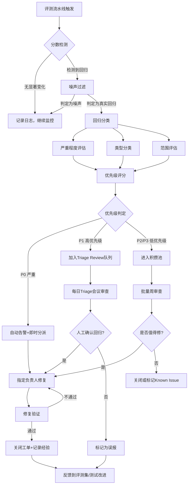

# 11.5.6 regression-triage — 回归问题分类与优先级

## 简单介绍

回归分类（Regression Triage）是回归分析流程中的决策环节。前面几个子模块解决了"有没有回归"和"哪里回归了"的问题——回归套件发现了分数下降，版本对比定位了差异，历史分析描绘了趋势。但这些发现只是一堆原始信号。**Triage 的任务是把这些信号转化为可执行的行动：这个回归严重吗？是什么类型的？谁来修？什么时候修？**

```
原始信号 → 分类 → 优先级排序 → 分派 → 修复 → 验证闭环
   ↑                                               │
   └───────────────────────────────────────────────┘
                   反馈到评估体系改进
```

在实际的 Agent 迭代中，每次模型升级、Prompt 调整、工具链变更，都可能引入几十上百个评测分数变化。其中有些是真实回归，有些是噪声，有些是 trade-off（一个任务好了另一个差了）。如果不做系统化的 triage，团队很快就会陷入"不知道哪个回归该先处理"的困境。

### 为什么 Agent 的 Triage 比传统软件更难

传统软件的回归 triage 相对直接：单元测试失败了 → 谁提交的代码 → 责任人修复。Agent 的回归 triage 面临几个独特挑战：

**1. 非确定性输出**
传统软件同样的代码每次运行结果一样。Agent 的输出有随机性——temperature > 0 时的输出天然不一致。这意味着不能因为一次评测分数下降就认定回归。

**2. 多因素耦合**
一个分数下降可能是由模型变化、Prompt 变化、工具 API 变化、评测集变化、环境变化中的任何一个或组合引起的。单一变量的归因几乎不可能。

**3. 慢反馈周期**
Agent 评测通常比传统单元测试慢得多——跑一次完整评测集可能需要几小时甚至几天。这意味着"失败-修复-验证"的循环周期很长，triage 的优先级判断更关键。

**4. 质量的主观性**
Agent 输出的质量往往不是二元通过/不通过，而是得分变化（如 85 分 -> 82 分）。判断这个 3 分下降是否值得关注需要统计思维，而非简单的"红了就是错"。

### 信号/噪声问题

回归 triage 的核心难题可以归结为一个问题：**这个变化是真实的回归还是随机波动？**

```
              ┌─────────────────────────────┐
              │  评测分数从 84.2 降到 81.7  │
              └─────────────┬───────────────┘
                            │
            ┌───────────────┴───────────────┐
            ▼                               ▼
    ┌──────────────────┐           ┌──────────────────┐
    │  真实回归          │           │  随机噪声         │
    ├──────────────────┤           ├──────────────────┤
    │ • 模型行为改变    │           │ • 模型采样随机性   │
    │ • Prompt 缺陷    │           │ • 评测集采样偏差    │
    │ • 工具异常        │           │ • 环境状态波动     │
    │ • 数据污染        │           │ • 评分模型不一致   │
    │ • 逻辑错误        │           │ • 网络/延迟抖动    │
    └──────────────────┘           └──────────────────┘
```

错误地把噪声当作回归会导致：
- 浪费工程资源排查不存在的"问题"
- 过度优化导致过拟合评测集
- 团队对评估体系失去信任

错误地把回归当作噪声则会导致：
- 真实的质量退化被忽略
- 问题积压到上线前才被发现
- 用户先于团队感知到变差

因此，回归 triage 的第一步不是"修复所有下降"，而是"判断哪些下降值得修复"。

---

## 回归分类体系

要系统化地处理回归，首先需要一个统一的分类体系。不同维度的分类服务于不同的决策场景。

### 按严重程度分类 (By Severity)

严重程度决定响应速度。借鉴 PagerDuty 的 incident 分级模型，回归也可以按 SEV1-SEV4 分级：

```
严重程度分级矩阵：

                        影响范围
                   窄              广
          ┌──────────────────────────────┐
    严    │  SEV2:                     SEV1:                    │
    重    │  核心功能退化(窄范围)         核心功能退化(广范围)     │
    性    │  例: 特定 API 调用全崩        例: 所有任务成功率降 20%│
          │  响应: <4h                   响应: <1h              │
          ├──────────────────────────────┤
    不    │  SEV3:                     SEV4:                    │
    严    │  非核心功能降质              质量波动/风格变化         │
    重    │  例: 复杂任务耗时增 30%       例: 输出格式微调          │
          │  响应: <24h                  响应: 积攒批量处理        │
          └──────────────────────────────┘
```

**SEV1 — Critical（严重）：**
- 用户可见的完全任务失败
- 安全问题（拒绝不足或过度拒绝）
- 核心指标大幅下降（如成功率下降 > 15%）
- 线上事故级别，需要立即响应

**SEV2 — Major（主要）：**
- 一致性的质量退化（非偶发）
- 关键工具选择错误率上升
- 核心指标中度下降（如成功率下降 5-15%）
- 需要当天或次日修复

**SEV3 — Minor（次要）：**
- 偶发的质量波动
- 非关键路径上的行为变化
- 少量测试案例退化（< 5% 的评测集）
- 可以规划到下个迭代修复

**SEV4 — Cosmetic（轻微）：**
- 风格变化，不影响功能正确性
- 输出格式的差异
- 非功能性变化（如推理链措辞不同但结论相同）
- 积攒到一定数量后批量处理

### 按类型分类 (By Type)

类型决定了由谁修复以及如何修复。

**1. Accuracy regression（准确率回归）：**
Agent 比以前犯了更多错误。可能是模型能力变化、Prompt 丢失了关键指令、工具接口变更。

**2. Efficiency regression（效率回归）：**
Agent 完成任务更慢了——更多 step、更多 token、更长的延迟。可能由冗余的推理步骤、不必要的工具调用、模型思考链变长引起。

**3. Safety regression（安全回归）：**
安全边界的变化。两个方向都是问题：
- 过度拒绝（Over-refusal）：Agent 拒绝了本应执行的任务
- 拒绝不足（Under-refusal）：Agent 执行了不应执行的任务

**4. Behavioral regression（行为回归）：**
Agent 的行为策略发生了变化——选择了不同的工具、采用了不同的推理路径、改变了与用户的交互风格。即使最终结果正确，行为变化也可能暗示潜在问题。

**5. Coverage regression（覆盖回归）：**
之前能正确处理的任务现在失败了。通常是 regressions 中最严重的一类，因为它直接缩小了 Agent 的能力边界。

```
类型识别速查：

准确率回归 → 检查: 输出质量评分、任务完成率
效率回归   → 检查: 步数分布、Token 消耗、延迟
安全回归   → 检查: 拒绝率、有害内容检测、护栏触发率
行为回归   → 检查: 工具调用分布、推理模式、动作序列
覆盖回归   → 检查: 单案例通过/不通过、难度分层表现
```

### 按范围分类 (By Scope)

范围决定了修复策略是全局调整还是局部优化。

**Global regression（全局回归）：**
几乎所有类别或任务上都出现退化。通常指向模型变化、系统 Prompt 变更、或基础设施问题。需要系统性修复。

**Task-specific regression（特定任务回归）：**
只有某一类任务变差（如代码生成没变但数据分析变差了），其他任务正常或变好。通常指向特定 Prompt 段落的变更、特定工具的接口变化、或评测集中的特定类别被过拟合。

**Edge-case-only regression（边缘案例回归）：**
只在极少数边界条件下触发（如超长输入、罕见工具组合、极端参数）。可能是新引入的逻辑分支的 bug、或边界条件的处理退化。

---

## 噪声过滤

在给回归贴上分类标签之前，必须先回答一个问题：**这个变化是真实信号还是随机噪声？**

### 确定性 vs. 非确定性回归

```
确定性回归（Deterministic）:
  评测方式: 同一输入 -> 完全相同的执行路径 -> 完全相同的结果
  判断方式: 一次对比即可确认
  适用场景: 规则评测、脚本评测、单元测试
  噪声水平: 低

非确定性回归（Non-deterministic）:
  评测方式: 同一输入 -> 每次不同输出 -> 统计分布变化
  判断方式: 需要多次运行取统计量
  适用场景: LLM-as-Judge、轨迹评估、端到端任务
  噪声水平: 高
```

Agent 评估几乎总是非确定性的。因此必须引入统计方法来区分信号和噪声。

### 统计显著性检验

最基本的方法是对比两次评估（基准版本 vs. 新版本）的分数分布是否有统计显著的差异。

```python
"""
回归显著性检验工具
判断两个版本的评估结果是否存在统计显著的差异
"""

import numpy as np
from scipy import stats
from typing import List, Tuple, Optional


def is_significant_regression(
    baseline_scores: List[float],
    current_scores: List[float],
    alpha: float = 0.05,
    min_effect_size: float = 0.1,
    method: str = "mannwhitney",
) -> Tuple[bool, float, float, str]:
    """
    判断当前版本的分数是否显著低于基线版本。

    参数:
        baseline_scores: 基准版本各任务的评分列表
        current_scores:  当前版本各任务的评分列表
        alpha:           显著性水平，默认 0.05
        min_effect_size: 最小效应量（Cohen's d 绝对值），低于此值视为无实际意义
        method:          检验方法（"mannwhitney" 或 "ttest"）

    返回:
        (is_regression, p_value, effect_size, interpretation)
    """
    b = np.array(baseline_scores, dtype=float)
    c = np.array(current_scores, dtype=float)

    # 1. 计算效应量 — Cohen's d
    pooled_std = np.sqrt((np.std(b, ddof=1) ** 2 + np.std(c, ddof=1) ** 2) / 2)
    effect_size = (np.mean(b) - np.mean(c)) / pooled_std if pooled_std > 0 else 0.0

    # 2. 统计检验
    if method == "mannwhitney":
        stat, p_value = stats.mannwhitneyu(b, c, alternative="two-sided")
    else:
        stat, p_value = stats.ttest_ind(b, c, alternative="two-sided")

    # 3. 综合判断
    is_regression = (p_value < alpha) and (effect_size > min_effect_size)

    if effect_size < 0:
        trend = "improvement"  # 其实是变好了
    elif is_regression:
        trend = "regression_detected"
    else:
        trend = "noise_or_insignificant"

    interpretations = {
        "improvement": f"分数上升（效应量={effect_size:.3f}），不是回归",
        "regression_detected": (
            f"检测到显著回归！p={p_value:.4f}, 效应量={effect_size:.3f} "
            f"(均值: {np.mean(b):.2f} -> {np.mean(c):.2f})"
        ),
        "noise_or_insignificant": (
            f"无显著差异：p={p_value:.4f} > {alpha} "
            f"或效应量={effect_size:.3f} < {min_effect_size}，判为噪声"
        ),
    }

    return is_regression, p_value, effect_size, interpretations[trend]


def batch_triage(
    baseline_scores: dict,
    current_scores: dict,
    **kwargs,
) -> dict:
    """
    批量对多个评估维度进行回归 triage。

    输入格式:
        {
            "task_success": [0.85, 0.87, 0.83, ...],
            "tool_accuracy": [0.92, 0.90, 0.94, ...],
            ...
        }
    输出格式:
        {
            "task_success": {"is_regression": True, ...},
            "tool_accuracy": {"is_regression": False, ...},
            ...
        }
    """
    results = {}
    for metric, scores_b in baseline_scores.items():
        scores_c = current_scores.get(metric, [])
        if len(scores_b) < 3 or len(scores_c) < 3:
            results[metric] = {
                "is_regression": False,
                "note": "样本量不足，跳过统计检验"
            }
            continue
        results[metric] = dict(
            zip(
                ["is_regression", "p_value", "effect_size", "interpretation"],
                is_significant_regression(scores_b, scores_c, **kwargs),
            )
        )
    return results


# 使用示例
if __name__ == "__main__":
    # 基线：10 次运行的分数
    baseline = [84.2, 85.1, 83.8, 84.7, 84.0, 85.3, 83.5, 84.9, 84.4, 85.0]
    # 当前：10 次运行的分数
    current  = [81.5, 82.3, 80.9, 83.1, 81.8, 82.0, 81.2, 82.7, 81.4, 82.5]

    is_reg, p, es, note = is_significant_regression(baseline, current)
    print(note)
    # 输出示例: 检测到显著回归！p=0.0012, 效应量=0.852 (均值: 84.49 -> 81.94)
```

### 置信区间与多次运行平均

单次运行不可靠，多次运行是标准做法。但多少次才够？

```
运行次数与置信区间宽度的关系（95% 置信度）：

运行次数  |  置信区间半宽 (假设 std=3.0)
─────────┼──────────────────────────────────
  1      │  无法计算（只有单点）
  3      │  ±3.39          ❌ 太宽
  5      │  ±2.63          ⚠️ 勉强可用
  10     │  ±1.86          ✅ 合理
  20     │  ±1.32          ✅ 好
  30     │  ±1.07          ✅ 很好
  50+    │  ±0.83          ✅ 可以接受更小变化

经验法则:
  • 快速筛选（判断大致方向）: 3-5 次
  • 常规 triage（确认回归）: 10 次
  • 精确对比（发布门禁）: 20-30 次
  • 研究级分析（论文/报告）: 50+ 次
```

### Flakiness 检测

有些评测案例天生不稳定——每次运行结果都不一样。这些案例对 triage 来说是"坏数据"，应该标记出来而非直接使用。

```python
def detect_flaky_cases(
    run_results: List[dict],
    consistency_threshold: float = 0.7,
) -> List[str]:
    """
    检测频繁切换通过/不通过状态的测试案例。

    参数:
        run_results:       多次运行的结果列表
        consistency_threshold: 一致性阈值，低于此值判为 flaky

    返回:
        flaky_cases: 被判定为 flaky 的案例 ID 列表
    """
    from collections import defaultdict

    # case_id -> {pass_count, total_count}
    stats = defaultdict(lambda: {"pass": 0, "total": 0})

    for run in run_results:
        for case in run:
            case_id = case["id"]
            passed = case["passed"]
            stats[case_id]["pass"] += 1 if passed else 0
            stats[case_id]["total"] += 1

    flaky_cases = []
    for case_id, s in stats.items():
        # 一致性 = max(pass_ratio, fail_ratio)
        pass_ratio = s["pass"] / s["total"]
        consistency = max(pass_ratio, 1 - pass_ratio)
        if consistency < consistency_threshold:
            flaky_cases.append(case_id)

    return flaky_cases
```

对于 flaky 案例，在 triage 中应该：

1. **标记但不移除**：flaky 案例仍有信息价值
2. **降低权重**：在聚合评分中给予更低权重
3. **单独归因**：flaky 案例的 pass/fail 变化不应计入"回归"计数
4. **投入改进**：高 flakiness 的案例需要评测集维护

---

## 根因分析方法

当确认一个变化是真实的回归后，下一步是找到根因。Agent 的复杂性决定了根因分析比传统软件困难得多。

### 回归诊断决策树

```
                     检测到回归
                         │
                         ▼
              ┌─────────────────────┐
              │   LLM 模型变更？      │
              │  (换模型 / 升级版本)  │
              └─────────┬───────────┘
                   /────┴────\
                是/           \否
                /              \
               ▼                ▼
      ┌────────────────┐  ┌────────────────┐
      │ 模型能力退化     │  │ Prompt 变更？  │
      │ 回滚模型验证     │  └───────┬────────┘
      └────────────────┘      /────┴────\
                           是/           \否
                           /              \
                          ▼                ▼
                 ┌──────────────┐  ┌────────────────┐
                 │ Prompt 回归   │  │ 工具 / API 变更？│
                 │ 分段消融测试   │  └───────┬────────┘
                 └──────────────┘      /────┴────\
                                    是/           \否
                                    /              \
                                   ▼                ▼
                          ┌──────────────┐  ┌────────────────┐
                          │ 工具行为变化   │  │ 知识库 / 数据   │
                          │ 检查 API 日志  │  │ 内容变更？      │
                          └──────────────┘  └───────┬────────┘
                                               /────┴────\
                                            是/           \否
                                              /              \
                                             ▼                ▼
                                    ┌──────────────┐  ┌────────────────┐
                                    │ 知识漂移      │  │ 评测集 / 环境   │
                                    │ 检查数据版本   │  │ 变更 / 噪声    │
                                    └──────────────┘  └────────────────┘
```

### LLM 模型变更归因

模型升级或更换是最常见的回归源。归因方法：

1. **A/B 对比**：在同一组测试集上，唯一变量是模型版本
2. **模型回滚测试**：回退到旧模型看分数是否恢复
3. **API 行为日志**：检查模型 API 的响应分布变化（如 refusal 模式、输出长度分布）

### Prompt 变更归因

当 Prompt 被修改后，需要定位具体哪一段导致了回归：

**分段消融测试（Ablation Testing）：**

```
完整 Prompt (A+B+C+D)                   分数: 84.2
去掉段落 A (B+C+D)    ──→ 分数 85.1 │  ↑ 说明 A 段可能是问题
去掉段落 B (A+C+D)    ──→ 分数 82.3 │  ↓ 说明 B 段变差了
去掉段落 C (A+B+D)    ──→ 分数 83.9 │  ≈ 说明 C 段无影响
去掉段落 D (A+B+C)    ──→ 分数 76.5 │  ↓↓ 说明 D 段是关键
```

每次去掉一段，看分数变化。如果去掉某段后分数反而上升，那这段很可能引入了回归。

### 工具变化归因

外部工具是 Agent 回归的隐藏来源：

- **API 版本更新**：上游服务新增/废弃了接口
- **工具返回格式变化**：同样的调用了返回不同结构的数据
- **服务可用性下降**：延迟增加导致 Agent 超时
- **数据内容变化**：数据库内容更新导致检索结果不同

归因方法：检查 Agent 轨迹中工具调用的输入输出日志，对比新旧版本同一任务的工具调用序列。

### Trace-based 分析

Agent 轨迹（trace）是根因分析最丰富的数据源。每一步的思考、工具调用、观察都记录在 trace 中。

```python
def compare_traces(baseline_trace: dict, regression_trace: dict) -> dict:
    """
    对比两条 Agent 轨迹，找出回归的关键差异点。
    """
    findings = {
        "tool_call_diffs": [],
        "thinking_diffs": [],
        "branching_point": None,
    }

    b_steps = baseline_trace["steps"]
    r_steps = regression_trace["steps"]

    # 找到第一个出现分歧的步骤
    min_steps = min(len(b_steps), len(r_steps))
    for i in range(min_steps):
        b = b_steps[i]
        r = r_steps[i]

        if b["type"] != r["type"]:
            findings["branching_point"] = {
                "step": i,
                "baseline": b["type"],
                "regression": r["type"],
                "reason": "不同的步骤类型"
            }
            break

        if b["type"] == "tool_call" and r["type"] == "tool_call":
            if b["tool_name"] != r["tool_name"]:
                findings["tool_call_diffs"].append({
                    "step": i,
                    "baseline_tool": b["tool_name"],
                    "regression_tool": r["tool_name"],
                    "baseline_args": b.get("arguments"),
                    "regression_args": r.get("arguments"),
                })

        if b["type"] == "think" and r["type"] == "think":
            # 用简单语义比较判断思考变化
            if len(b["content"]) > len(r["content"]) * 1.5:
                findings["thinking_diffs"].append({
                    "step": i,
                    "note": "回归版本思考显著简化",
                })
            elif len(r["content"]) > len(b["content"]) * 1.5:
                findings["thinking_diffs"].append({
                    "step": i,
                    "note": "回归版本思考显著冗余",
                })

    return findings
```

### Ablation Testing（消融测试）

当有多个可能的回归源时，消融测试是最系统的归因方法：

```
回归消融测试矩阵:

实验                    | 模型 | Prompt | 工具 | 评测集 | 分数
───────────────────────┼──────┼────────┼──────┼────────┼──────
A: 全量当前版本         | 新   | 新     | 新   | 基准   | 81.7  ← 问题版本
B: 仅回滚模型          | 旧   | 新     | 新   | 基准   | 83.9  ← 模型是回归源
C: 仅回滚 Prompt       | 新   | 旧     | 新   | 基准   | 84.0  ← Prompt 是回归源
D: 仅回滚工具配置       | 新   | 新     | 旧   | 基准   | 81.5  ← 工具不是问题
E: 全量基准版本         | 旧   | 旧     | 旧   | 基准   | 84.5  ← 黄金参考

解读:
  B ≈ E  → 模型是新版本的问题
  C ≈ E  → Prompt 是新版本的问题
  B ≈ C ≈ E → 都不对,可能是环境或评测集变化
```

---

## 优先级框架

分类之后需要排序。不是所有回归都要立刻修复——资源有限，需要决定先修什么。

### Impact x Frequency 矩阵

最经典的优先级模型：影响程度 x 出现频率。

```
                 出现频率
             低              高
        ┌────────────────────────────┐
  影    │  中优先级 (Medium)   高优先级 (High)   │
  响    │  • 少见但灾难性回归  │  • 常见且影响大   │
  程    │  • 罕见 key 案例失败 │  • 核心指标下降   │
  度    │  • 特殊配置下崩溃    │  • 用户频繁投诉   │
        ├────────────────────────────┤
  不    │  低优先级 (Low)     中优先级 (Medium)  │
  严    │  • 边缘案例波动      │  • 非关键路径退化  │
  重    │  • 风格变化          │  • 偶发效率问题   │
        │  • 低价值任务变差    │  • 修饰性问题     │
        └────────────────────────────┘
```

### 用户可见性

用户直接感知到的回归比内部指标变化优先级更高。

```
用户可见回归:
  • 输出质量变差（用户能直观感受到）
  • 响应变慢（用户体验受影响）
  • 频繁报错（信任度下降）
  • 行为异常（用户困惑）
  → 优先级 +1 级

内部指标回归:
  • Token 消耗增加（成本上升但不影响体验）
  • 工具调用次数变化（效率降低但用户无感知）
  • 评测 API 调用变化（内部成本指标）
  → 按实际影响评估，不自动升级
```

### Cost of Delay（延迟成本）

每种回归的"不修复成本"不同：

```
回归类型           | 延迟修复的日成本
───────────────────┼─────────────────────
准确率下降 10%     | 每天约 1000 用户受影响
效率下降 50%       | 每天多消耗 $200 API 费用
安全过度拒绝       | 每天约 50 用户投诉
安全拒绝不足       | 严重合规风险，按小时计
覆盖 3 个案例失败   | 影响范围固定，无累积效应
```

### 优先级综合评分

```python
def calculate_priority_score(
    impact_level: str,       # "critical", "major", "minor", "cosmetic"
    frequency: str,          # "high", "medium", "low"
    user_visible: bool,
    cost_of_delay_per_day: float,
    effort_to_fix: float,    # 预估修复人天
) -> dict:
    """
    计算回归的优先级综合评分。
    返回 (score, priority_level) 用于排序。
    """
    severity_map = {"critical": 100, "major": 60, "minor": 30, "cosmetic": 10}
    frequency_map = {"high": 1.0, "medium": 0.6, "low": 0.3}

    base = severity_map[impact_level] * frequency_map[frequency]

    if user_visible:
        base *= 1.5

    # 延迟成本加权
    delay_penalty = min(cost_of_delay_per_day * 0.1, 50)
    base += delay_penalty

    # 修复效率（quick win 加分）
    efficiency_bonus = max(0, 20 - effort_to_fix * 5)
    base += efficiency_bonus

    # 转成优先级标签
    if base >= 120:
        priority = "P0 — 立即修复"
    elif base >= 80:
        priority = "P1 — 高优先级"
    elif base >= 50:
        priority = "P2 — 正常"
    else:
        priority = "P3 — 低优先级/积攒"

    return {"score": round(base, 1), "priority": priority}
```

---

## 自动化工单

当回归规模大到手动处理不过来时，自动化 triage pipeline 就变得必要。

### Pipeline 架构

```python
"""
自动化回归 Triage Pipeline
检测 → 分类 → 优先级评分 → 分派
"""

import json
from dataclasses import dataclass, field
from typing import Optional

@dataclass
class RegressionItem:
    """单个回归发现"""
    metric_name: str
    baseline_score: float
    current_score: float
    delta: float
    p_value: float
    effect_size: float
    is_significant: bool

    # 分类结果
    severity: Optional[str] = None       # critical/major/minor/cosmetic
    regression_type: Optional[str] = None # accuracy/efficiency/safety/behavioral/coverage
    scope: Optional[str] = None          # global/task-specific/edge-case

    # 优先级
    priority_score: float = 0.0
    priority_label: str = "unassigned"

    # 归因
    likely_root_cause: Optional[str] = None
    suggested_action: Optional[str] = None
    assigned_to: Optional[str] = None

    # 元信息
    related_traces: list = field(default_factory=list)
    related_cases: list = field(default_factory=list)


class AutoTriagePipeline:
    """
    自动回归分类与优先级流水线。
    """

    def __init__(self, config: dict = None):
        self.config = config or {}
        self.project_management = None  # 可注入 Jira/Linear 客户端

    def run(self, regression_items: list) -> list:
        """
        执行完整 triage pipeline。

        步骤:
        1. classify_severity    — 严重程度分类
        2. classify_type        — 回归类型分类
        3. classify_scope       — 影响范围分类
        4. score_priority       — 优先级打分
        5. suggest_root_cause   — 根因建议
        6. assign_owner         — 自动分派
        7. create_tickets       — 创建工单
        """
        for item in regression_items:
            self.classify_severity(item)
            self.classify_type(item)
            self.classify_scope(item)
            self.score_priority(item)
            self.suggest_root_cause(item)
            self.assign_owner(item)

        self.create_tickets(regression_items)
        return regression_items

    def classify_severity(self, item: RegressionItem):
        """基于 delta 和统计量判断严重程度"""
        delta_pct = abs(item.delta) / (item.baseline_score or 1)

        if item.regression_type == "safety":
            # 安全回归自动升级
            item.severity = "critical"
        elif delta_pct > 0.15 or item.delta < -15:
            item.severity = "critical"
        elif delta_pct > 0.08 or item.delta < -8:
            item.severity = "major"
        elif delta_pct > 0.03:
            item.severity = "minor"
        else:
            item.severity = "cosmetic"

    def classify_type(self, item: RegressionItem):
        """基于 metric_name 和 delta 方向判断类型"""
        metric = item.metric_name.lower()

        if any(kw in metric for kw in ["safety", "refusal", "harm", "bias"]):
            item.regression_type = "safety"
        elif any(kw in metric for kw in ["speed", "token", "step", "latency", "cost"]):
            # 如果是变慢了（delta 为正表示更慢）
            item.regression_type = "efficiency" if item.delta > 0 else "accuracy"
        elif any(kw in metric for kw in ["accuracy", "correct", "success", "score"]):
            item.regression_type = "accuracy"
        elif any(kw in metric for kw in ["coverage", "pass", "fail"]):
            item.regression_type = "coverage"
        else:
            item.regression_type = "behavioral"

    def classify_scope(self, item: RegressionItem):
        """基于影响的案例范围判断"""
        # 简单策略：如果 related_cases 数量超过总测试集的 20% 判为全局
        total_cases = self.config.get("total_test_cases", 100)
        if len(item.related_cases) > total_cases * 0.2:
            item.scope = "global"
        elif len(item.related_cases) <= 3:
            item.scope = "edge-case"
        else:
            item.scope = "task-specific"

    def score_priority(self, item: RegressionItem):
        """计算优先级综合评分"""
        severity_scores = {"critical": 100, "major": 60, "minor": 30, "cosmetic": 10}
        scope_weights = {"global": 1.0, "task-specific": 0.6, "edge-case": 0.3}

        base = severity_scores.get(item.severity, 10) * \
               scope_weights.get(item.scope, 0.5)

        # 安全回归自动提升优先级
        if item.regression_type == "safety":
            base *= 2.0

        # 统计显著性加权
        if item.p_value < 0.001:
            base *= 1.3
        elif item.p_value < 0.01:
            base *= 1.15

        item.priority_score = round(base, 1)
        if base >= 100:
            item.priority_label = "P0 — 立即修复"
        elif base >= 60:
            item.priority_label = "P1 — 高优先级"
        elif base >= 30:
            item.priority_label = "P2 — 正常"
        else:
            item.priority_label = "P3 — 低优先级"

    def suggest_root_cause(self, item: RegressionItem):
        """基于 regression type 给出根因建议"""
        suggestions = {
            "accuracy": "检查模型版本变更、Prompt 准确性指令丢失、工具返回格式变化",
            "efficiency": "检查推理步数变化、是否多了不必要的工具调用、模型思考链长度增加",
            "safety": "检查安全护栏配置变更、模型 safety alignment 变化、拒绝阈值调整",
            "behavioral": "检查 Prompt 中行为指令变更、工具列表顺序/描述变化、few-shot 示例变化",
            "coverage": "检查特定案例的失败模式、是否有逻辑分支变更、边界条件处理变化",
        }
        item.suggested_action = suggestions.get(item.regression_type, "需要人工分析")

    def assign_owner(self, item: RegressionItem):
        """基于回归类型自动分派责任人"""
        owner_map = {
            "accuracy": "eval-team",
            "efficiency": "infra-team",
            "safety": "safety-team",
            "behavioral": "agent-core-team",
            "coverage": "eval-team",
        }
        item.assigned_to = owner_map.get(item.regression_type, "triage-review")

    def create_tickets(self, items: list):
        """在项目管理系统中创建工单（接口示意）"""
        p0_items = [i for i in items if i.priority_label.startswith("P0")]
        p1_items = [i for i in items if i.priority_label.startswith("P1")]

        print(f"[Triage] 创建 {len(p0_items)} 个 P0 工单 — 需要立即处理")
        print(f"[Triage] 创建 {len(p1_items)} 个 P1 工单 — 高优先级")
        print(f"[Triage] 其余 {len(items) - len(p0_items) - len(p1_items)} 个进入积攒队列")

        # 集成示例: 对接 Linear/Jira/GitHub Issues
        # if self.project_management:
        #     for item in items:
        #         self.project_management.create_issue(
        #             title=f"[Regression] {item.metric_name}: {item.delta:+.1f}",
        #             description=self._format_ticket_body(item),
        #             priority=item.priority_label,
        #             assignee=item.assigned_to,
        #         )

    def _format_ticket_body(self, item: RegressionItem) -> str:
        return (
            f"## Regression Summary\n"
            f"- Metric: {item.metric_name}\n"
            f"- Delta: {item.baseline_score:.1f} -> {item.current_score:.1f} "
            f"({item.delta:+.1f})\n"
            f"- Severity: {item.severity} | Type: {item.regression_type} | "
            f"Scope: {item.scope}\n"
            f"- Priority: {item.priority_label} (score: {item.priority_score})\n"
            f"- Suggested Root Cause: {item.suggested_action}\n"
            f"- Assigned: {item.assigned_to}\n"
        )


# 使用示例
if __name__ == "__main__":
    sample_regressions = [
        RegressionItem(
            metric_name="task_success_rate",
            baseline_score=84.5, current_score=78.2,
            delta=-6.3, p_value=0.002, effect_size=0.73,
            is_significant=True, related_cases=["case_1", "case_5", "case_12"]
        ),
        RegressionItem(
            metric_name="safety_refusal_rate",
            baseline_score=5.0, current_score=18.0,
            delta=13.0, p_value=0.001, effect_size=1.2,
            is_significant=True, related_cases=["case_2", "case_7"]
        ),
    ]

    pipeline = AutoTriagePipeline({"total_test_cases": 100})
    results = pipeline.run(sample_regressions)

    for r in results:
        print(f"{r.metric_name}: {r.severity} | {r.regression_type} | "
              f"{r.priority_label} | → {r.assigned_to}")
    # 输出:
    # task_success_rate: major | accuracy | P1 — 高优先级 | → eval-team
    # safety_refusal_rate: critical | safety | P0 — 立即修复 | → safety-team
```

### 项目管理集成

自动化 triage 需要与项目管理工具对接才能形成完整闭环：

```
分类框架 → 工单生成 → 分派 → 处理 → 跟踪 → 关闭

集成方式:
  • GitHub Issues: 通过 API 创建带有回归标签的 Issue
  • Linear/ Jira: 创建 Story/Task，设置优先级和负责人
  • Slack: P0/P1 回归自动发送告警通知到相应频道
  • 邮件: 批量生成每日回归摘要报告

工单模板:
  ┌──────────────────────────────────────────────────┐
  │ [Regression] accuracy: task_success_rate -6.3    │
  │                                                  │
  │ Type: accuracy | Severity: major | Scope: global │
  │ Priority: P1 | Assigned to: eval-team            │
  │                                                  │
  │ Baseline: 84.5 → Current: 78.2 (Δ=-6.3)         │
  │ p=0.002 | effect_size=0.73                       │
  │                                                  │
  │ Related Traces: [链接 1, 链接 2]                   │
  │ Suggested RCA: 检查模型版本变更 / Prompt 准确性指令 │
  └──────────────────────────────────────────────────┘
```

---

## 工作流集成

回归 triage 不是一次性的活动，而是评估流水线中的持续环节。

### Triage 工作流总览



### Daily Triage Review（每日回顾）

对于 P1 及以上级别的回归，每日 triage review 是推荐的实践：

```
每日 Triage Review 议程 (15 分钟):

1. 查看新增回归清单 (3 min)
   - P0: 0 个 (理想情况)
   - P1: 3-5 个 (常规)
   - P2: 10-20 个 (批量看)

2. 确认 P0/P1 分类 (5 min)
   - 自动分类是否准确？
   - 有无误报？（标记后从流程移除）
   - 有无升级？（被低估的回归）

3. 分配或调整责任人 (3 min)
   - 自动分派是否正确？
   - 需要跨团队协作的回归

4. 确认修复计划 (4 min)
   - 今日要修哪些？
   - 有没有 blocked 的回归需要推动？
```

### Regression Review Board（定期审查）

对于积攒的 P2/P3 回归，定期（每周或每两周）开一次审查会：

```
Review Board 职责:
  • 审查积攒回归列表，决定哪些值得修
  • 识别回归模式（可能暴露系统性问题）
  • 决定哪些回归接受为 Known Issue（已知问题）
  • 反馈到评测集改进（误报案例应该从评测集移除或修正）
```

### 升级路径

当回归满足以下任意条件时触发自动升级：

```
升级触发器:

        回归严重程度升级:
          P2 → P1: 连续两个 triage 周期未修复的 P2 回归
          P1 → P0: 回归影响范围扩大超过 2x

        类型升级:
          任何 safety 回归自动 P0
          任何 coverage 回归检查是否 P1+
          任何准确率回归影响用户可见 Case 自动 P1+

        时间升级:
          P1 超过 3 天未开始修复 → 通知 Team Lead
          P1 超过 7 天未修复 → 通知 Manager
          P0 超过 24h 未修复 → 全组通告
```

### 反馈闭环

Triage 的最重要输出不是工单，而是对评估体系的改进反馈：

```
Triage 输出 → 评估改进

┌─────────────────────────────────────────────┐
│  Triage 结果分析                             │
│                                             │
│  1. 误报比例高？                             │
│     → 评测集质量需要提升                      │
│     → 噪声过滤阈值需要调整                    │
│                                             │
│  2. 某类回归反复出现？                        │
│     → 该功能缺乏自动化测试覆盖                 │
│     → 需要增加专项评测或门禁                  │
│                                             │
│  3. 大量回归是同一个根因？                     │
│     → 可能是系统性问题而非个例                 │
│     → 从源头修复比逐个修复更高效               │
│                                             │
│  4. 所有回归都集中在某次发布？                 │
│     → 发布流程缺少回归门禁                    │
│     → 需要在 CI/CD 管道中加入评测步骤          │
└─────────────────────────────────────────────┘
```

---

## 工具与最佳实践

### Triage Fatigue 管理

回归 triage 最大的隐性成本是"triage fatigue"——每天面对大量回归信号，团队成员逐渐麻木，导致真正的严重回归被忽略。

缓解策略：

```
Fatigue 缓解策略:

  1. 控制信号量
     只显示统计显著的回归（p < 0.05 + effect_size > 阈值）
     对大量同类回归做聚合（而不是逐条展示）
     设置每日 triage 数量上限（超过上限自动升级为系统性问题）

  2. 保持分类准确性
     定期校准自动分类的阈值
     收集人工反馈：自动分类与人工判断的不一致案例
     持续改进分类规则

  3. 噪音优先
     先标记和处理已知的噪音源（flaky 测试等）
     噪音不是"不需要处理"——噪音本身就是问题
     稳定的评测集是高效 triage 的前提

  4. 轮值制度
     Triage 轮值（每人一周）避免审美疲劳
     轮值者负责当周的所有 triage 决策
     交接文档记录本周的关键 triage 决策
```

### 自动化与人工判断的平衡

不是所有环节都适合自动化：

```
适合高度自动化的环节:
  ✅ 统计显著性检验
  ✅ 回归严重程度初判
  ✅ 回归类型初步分类
  ✅ 优先级综合评分
  ✅ 工单创建和分派
  ✅ 每日摘要报告生成

需要人工判断的环节:
  👤 回归是真回归还是系统特性变化？（trade-off）
  👤 复杂根因分析（多因素交织）
  👤 P0 回归的修复方案决策
  👤 是否接受一个回归为 Known Issue
  👤 评测集是否需要调整来避免未来误报

推荐的分工:
  80% 的回归由自动化处理（P2/P3）
  15% 的回归需要人工快速确认（P1 borderline）
  5% 的回归需要深入分析（P0 + 复杂案例）
```

### 从 Triage 中学习，预防未来回归

Triage 的最高价值不是修复已有回归，而是防止未来的回归。

```
预防性改进框架:

  ┌────────────┐    ┌────────────┐    ┌────────────┐
  │  Triage 发现 │───→│ 根因总结     │───→│ 预防措施     │
  └────────────┘    └────────────┘    └────────────┘
        │                                    │
        ▼                                    ▼
  ┌────────────────┐               ┌────────────────┐
  │ "为什么没有    │               │ 新增回归门禁    │
  │  被评测捕获？"  │               │ 改进评测集      │
  └────────────────┘               │ 修改开发流程    │
                                   │ 添加自动告警    │
                                   └────────────────┘
```

**5 Whys 示例：**

```
回归: Prompt 修改导致 Agent 工具选择准确率下降 12%

Why 1: 为什么工具选择准确率下降了？
因为新的 Prompt 中工具描述的排序变了。

Why 2: 为什么排序变化会导致问题？
Agent 倾向于选择列表前面的工具（position bias）。

Why 3: 为什么没有预先发现这个 position bias？
因为没有测试工具列表不同排序的影响。

Why 4: 为什么没有这种测试？
因为评测集的 Prompt 模板是固定的，不包含排序变化。

Why 5: 为什么评测集不包含排序变化？
因为评测集的设计假设"工具描述本身"而非"工具描述的位置"。

行动:
  1. 回滚 Prompt 排序（立即修复）
  2. 在评测集中添加工具排序 permutation 测试（短期）
  3. 修改 Prompt 设计指南，说明工具描述的 position bias（长期）
  4. 在发布门禁中加入排序鲁棒性检查（长期）
```

### Triage 成熟度模型

团队可以参考这个模型评估自己的 triage 能力水平：

```
Level 1: Ad-hoc（无流程）
  • 人工查看分数变化
  • 凭直觉决定修什么
  • 没有分类标准
  • 容易漏掉重要回归

Level 2: Manual triage（手动流程）
  • 有分类标准但靠手工
  • 使用 Excel/Notion 跟踪回归
  • 定期开 triage 会议
  • 回归发现到修正周期较长

Level 3: Automated triage（自动化流程）
  • 自动检测+分类+优先级打分
  • 与项目管理工具集成
  • 有统计显著性和噪声过滤
  • 回归跟踪自动化

Level 4: Proactive prevention（主动预防）
  • Triage 数据反哺评测集改进
  • 回归模式自动识别
  • 发布门禁拦截已知回归类型
  • Triage fatigue 管理到位
  
Level 5: Self-healing（自愈体系）
  • 自动回归修复建议
  • 自动 A/B 验证修复方案
  • 回归模式预测（在发生前预警）
  • 评测体系自我进化
```

---

## 小结

回归 triage 是 11.5 回归分析模块的决策中枢。前面的子模块提供了"发生了什么"的事实——回归套件覆盖了什么、版本之间差了多少、历史趋势如何——而 triage 把这些事实转化为"需要做什么"的行动。

### 与模块内其他子模块的连接

```
11.5.1 regression-suite ──── 提供评测数据源
       │                        回归 triage 的输入来自回归套件的运行结果
       ▼
11.5.2 version-compare ────── 提供差异分析
       │                        Triage 依赖版本对比来量化"差了多少"
       ▼
11.5.3 continuous-eval ────── 提供持续流水线
       │                        Triage 需要嵌入持续评估流水线才能自动化
       ▼
11.5.4 drift-detection ────── 提供长期趋势
       │                        漂移检测发现的趋势变化高于 triage 的信号级别
       ▼
11.5.5 historical-analysis ── 提供历史背景
       │                        历史分析帮助判断"这个回归是否见过"以及"严重性"
       ▼
11.5.6 regression-triage ──── 决策与行动
                                ⬆ 这是所有分析的目的地 ⬆
```

### 关键要点回顾

1. **分类是行动的前提**：没有分类，就无法决定谁修、怎么修、何时修
2. **信号和噪声必须区分**：不是每个分数下降都是回归，统计方法是必要条件
3. **优先级决定资源分配**：Impact x Frequency 是最经典的优先级模型，安全回归永远优先
4. **自动化解放人力**：80% 的回归可以用 pipeline 自动处理，让人工集中处理最关键的 20%
5. **反馈是闭环的关键**：Triage 的最终输出是回归工单+评测改进——修复解决了当前问题，改进防止了未来问题
6. **Triage fatigue 是真实成本**：高质量 triage 需要的不是更努力，而是更智能的信号过滤和更高效的流程

最终，一个有效的回归 triage 体系能让团队做到：**每一次回归都被恰当地对待 —— 严重的不会漏掉，轻微的不会浪费精力，而整个系统在每次 triage 循环中变得更好。**
