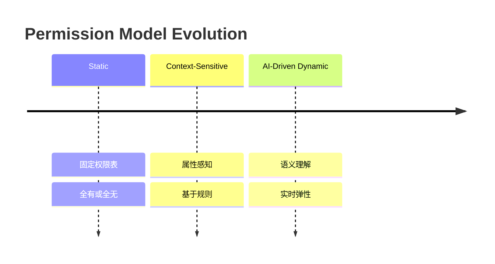

# 12.4.3 Dynamic Permissions (动态权限)

## 简单介绍

Dynamic Permissions（动态权限）是 AI Agent 系统中一种**上下文感知的权限分配机制**。它摒弃了传统静态权限中"一次授权、永久有效"的粗粒度模式，转而根据当前会话的实时上下文——包括用户意图、对话历史、工具风险等级、数据敏感度、用户信任分数等多维因素——动态决定 Agent 可以执行哪些操作、访问哪些资源。

在 AI Agent 系统中，权限不再是固定不变的配置项，而是随交互情境**实时流动**的安全边界。这种机制试图在"让 Agent 充分赋能"和"防止权限滥用"之间找到动态平衡点。

---

## 基本原理

动态权限的核心逻辑是：**权限应当与当前上下文成正比，与潜在风险成反比**。

```
Permission(operation) = f(context, risk, trust, intent)
```

其中各维度含义如下：

| 维度 | 说明 | 示例 |
|---|---|---|
| **User Intent (意图)** | 从自然语言对话中推断用户真实目的 | "帮我删除这个文件" vs "帮我看看这个文件" |
| **Conversation History (会话历史)** | 当前会话中已建立的行为模式 | 连续 5 次只读操作 vs 突然要求高危操作 |
| **Tool Risk (工具风险)** | 操作本身的危险等级 | 读取文件 (低) vs 执行 shell 命令 (高) |
| **Data Sensitivity (数据敏感度)** | 被操作数据的敏感程度 | 公开文档 (低) vs 用户私钥 (高) |
| **User Trust Score (信任分数)** | 基于历史行为建立的用户可信度 | 新用户 (0.3) vs 长期可信用户 (0.9) |
| **Session Maturity (会话成熟度)** | 当前会话持续时间和交互深度 | 刚建立的会话 (低) vs 深度对话后的会话 (高) |

这些因素通过加权评分模型计算出一个**动态权限阈值**，Agent 只有在权限阈值满足操作要求时才能执行。

```
context_score = w1 * intent_clarity + w2 * history_consistency + w3 * trust_score
effective_permission = base_permission * context_score
允许执行条件: effective_permission >= operation_required_threshold
```

---

## 背景

### 第一阶段: Static Permissions (静态权限)

传统系统（如 Linux 文件权限、数据库角色权限）采用预先定义的静态权限表。权限在用户登录或角色分配时确定，在整个会话期间保持不变。

**问题**: 无法适应 AI Agent 场景中的复杂多变需求。一个被授予"文件管理"权限的 Agent，无论当前是执行安全读取还是危险删除，都拥有同样的权限级别。这种"全部或全不"的模式在 Agent 系统中极不安全。

### 第二阶段: Context-Sensitive Permissions (上下文敏感权限)

随着 RBAC (Role-Based Access Control) 和 ABAC (Attribute-Based Access Control) 的发展，权限系统开始考虑部分上下文属性（如时间、地点、设备）。

**问题**: 权限规则仍然是由人工预定义的静态策略引擎执行的。策略无法实时适应对话的语义内容和用户意图的变化，也无法处理 AI Agent 特有的模糊性和不确定性。

### 第三阶段: AI-Driven Dynamic Permissions (AI 驱动的动态权限)

这是当前的发展前沿。借助 LLM 的语义理解能力，系统可以：

- 从自然语言中实时推断用户意图
- 评估操作在当前对话上下文中的合理性
- 构建动态的用户信任模型
- 实现风险感知的权限弹性升降级



---

## 核心矛盾

### Flexibility vs Predictability (灵活性与可预测性)

| 面向 | 诉求 | 挑战 |
|---|---|---|
| 用户 | 希望 Agent 能灵活执行各种任务 | 难以预测 Agent 在特定情境下能否执行某操作 |
| 开发者 | 希望系统行为可预测、可调试 | 动态决策引入不确定性，bug 难以复现 |
| 安全审计 | 希望权限决策链清晰可追溯 | AI 决策的黑盒性质使审计困难 |

**矛盾本质**: 动态权限越灵活，系统的行为边界就越模糊；行为越可预测，权限就越僵化。

### User Experience vs Security (用户体验与安全性)

| 场景 | 用户体验视角 | 安全视角 |
|---|---|---|
| 频繁弹窗确认 | 烦人、打断工作流 | 必要的安全防线 |
| 自动授权 | 流畅、高效 | 潜在的安全漏洞 |
| 权限被拒绝 | 困惑、挫败感 | 正确的安全决策 |

**矛盾本质**: 每一次权限弹窗都是一次安全与效率的零和博弈。动态权限试图通过智能决策减少不必要的弹窗，但误判（该放不放、不该放却放）都会带来严重后果。

### 权衡策略

- **渐进式授权**: 从低权限开始，根据行为逐步提升
- **透明化决策**: 向用户展示"为什么这个操作被允许/拒绝"
- **用户可覆写**: 允许用户手动提升或降低权限级别
- **事后审计回滚**: 对自动授权的高危操作提供一键回滚能力

---

## 详细内容

### 1. Context-Aware Permission Evaluation (上下文感知权限评估)

#### 评估因素

动态权限系统需要从多个维度收集和分析上下文信号：

**User Intent (用户意图)**
- 使用 LLM 对用户自然语言输入进行意图分类
- 区分直接意图（"删除文件 X"）和隐含意图（"这个文件没用了"可能暗示删除）
- 意图置信度评分影响最终权限决策

```
意图类别示例:
  READ_OPERATION   -> 低风险, 宽权限
  WRITE_OPERATION  -> 中风险, 需确认
  DELETE_OPERATION -> 高风险, 严格限制
  EXECUTE_COMMAND  -> 极高风险, 默认拒绝
```

**Conversation History (对话历史)**
- 分析当前会话中已执行的操作序列
- 检测行为模式突变（如长期只读后突然要求删除）
- 会话中已建立的信任积累

**Tool Risk (工具风险)**
- 每种工具预定义风险等级
- 考虑工具的参数组合风险（如 `read_file(path="/etc/passwd")` 比 `read_file(path="/tmp/test.txt")` 风险更高）

**Data Sensitivity (数据敏感度)**
- 被访问/修改数据的敏感级别标记
- 结合数据血缘分析（如果写入的文件被其他高敏感系统依赖怎么办）

#### Context Scoring (上下文评分)

一个典型的上下文评分模型：

```python
class ContextScore:
    def __init__(self):
        self.weights = {
            "intent_clarity": 0.30,
            "history_consistency": 0.20,
            "tool_risk": 0.25,
            "data_sensitivity": 0.15,
            "trust_score": 0.10,
        }

    def evaluate(self, context):
        score = 0
        for factor, weight in self.weights.items():
            score += weight * self._score_factor(factor, context)

        # 非线性惩罚: 任何单一因素评分过低都会大幅拉低总分
        min_factor = min(self._score_factor(f, context) for f in self.weights)
        if min_factor < 0.2:
            score *= 0.3  # 存在不可接受的风险因素

        return min(1.0, max(0.0, score))
```

---

### 2. Risk-Based Dynamic Escalation (基于风险的动态升降级)

#### 风险等级划分

| 等级 | 风险值 | 典型操作 | 权限策略 |
|---|---|---|---|
| LOW | 0.0 - 0.3 | 读取文件、搜索、查询天气 | 自动允许，无需确认 |
| MEDIUM | 0.3 - 0.6 | 写入文件、发送邮件、创建资源 | 允许但记录审计日志，可选用户确认 |
| HIGH | 0.6 - 0.85 | 删除文件、修改系统配置、执行命令 | 必须用户显式确认 |
| CRITICAL | 0.85 - 1.0 | 格式化磁盘、删除数据库、修改权限 | 默认拒绝，需管理员授权 |

#### 风险评分模型

```python
def calculate_risk_score(operation, tool_params, data_context):
    score = 0.0

    # 基础操作风险
    base_risk = OPERATION_RISK_MAP.get(operation, 0.5)

    # 参数风险放大
    param_risk = 0.0
    if "path" in tool_params:
        if tool_params["path"].startswith(("/etc", "/sys", "/proc")):
            param_risk += 0.3
        if "password" in tool_params["path"].lower():
            param_risk += 0.4

    # 数据敏感度风险
    data_risk = data_context.get("sensitivity", 0.0)

    # 综合评分 (非线性聚合, 任何单项高都会显著推高总分)
    score = 1 - (1 - base_risk) * (1 - param_risk) * (1 - data_risk)

    return min(1.0, score)
```

#### 动态升降级机制

- **Upgrade (升级)**: 当连续执行低风险操作且未触发任何告警时，风险阈值自动下调。用户无需为常规操作反复确认。
- **Degrade (降级)**: 当检测到可疑行为模式时，风险阈值自动上调。曾经可自动执行的操作现在需要确认。
- **Emergency Lockdown (紧急锁定)**: 当检测到明显攻击行为或异常模式时，立即将所有权限降为最低，锁定 Agent 功能。

---

### 3. Permission Lifecycle (权限生命周期)

```
  +-------+     +-------+     +---------+     +--------+
  | Grant | --> | Use   | --> | Verify  | --> | Revoke |
  +-------+     +-------+     +---------+     +--------+
     ^                                              |
     |______________________________________________|
                    (循环/续期)
```

| 阶段 | 说明 | 实现要点 |
|---|---|---|
| **Grant (授予)** | 基于上下文评估授予权限 | 明确授予范围、时间窗口、使用条件 |
| **Use (使用)** | Agent 在权限范围内执行操作 | 实时监控使用行为是否符合授予条件 |
| **Verify (验证)** | 检查操作是否在授权范围内 | 周期性或事件触发式验证 |
| **Revoke (收回)** | 条件不再满足时收回权限 | 自动回收 + 强制回收 |
| **Renew (续期)** | 验证通过后延长权限有效期 | 可续期但不可自动无限续期 |

#### Time-Bound Permissions (有时间限制的权限)

```python
class TimeBoundPermission:
    def __init__(self, operation, scope, expires_at):
        self.operation = operation
        self.scope = scope
        self.expires_at = expires_at
        self.granted_at = time.now()

    def is_valid(self):
        return time.now() < self.expires_at

    def time_remaining(self):
        return max(0, self.expires_at - time.now())

    def can_renew(self, context_score):
        # 只有在上下文评分足够高时才能续期
        return context_score > 0.7 and self.time_remaining() < 60
```

#### Scope-Bound Permissions (有范围限制的权限)

```python
class ScopeBoundPermission:
    def __init__(self, operation, resource_pattern, max_count=None):
        self.operation = operation      # 允许的操作
        self.resource_pattern = resource_pattern  # 允许的资源范围 (glob pattern)
        self.max_count = max_count      # 最大操作次数
        self.used_count = 0             # 已使用次数
        self.accessed_resources = set() # 已访问资源列表

    def allows(self, operation, resource):
        if operation != self.operation:
            return False
        if not fnmatch(resource, self.resource_pattern):
            return False
        if self.max_count and self.used_count >= self.max_count:
            return False
        return True
```

---

### 4. Intent-Based Permission (基于意图的权限)

动态权限系统利用 LLM 的语义理解能力，从用户的自然语言输入中推断其真实意图，然后基于意图匹配权限策略。

#### 工作流程

```
User Input -> Intent Classification -> Intent-Operation Mapping -> Permission Check
```

#### 意图推断的实现

```python
class IntentAnalyzer:
    def analyze(self, user_message, conversation_history):
        prompt = f"""
        Analyze the user's intent from their message.
        User message: {user_message}
        Conversation history: {conversation_history[-5:]}

        Classify into one of:
        - READ: user wants to view/retrieve information
        - WRITE: user wants to create/modify content
        - DELETE: user wants to remove content
        - EXECUTE: user wants to run a command
        - QUERY: user wants to ask a question (no side effects)
        - UNKNOWN: cannot determine

        Return: {{"intent": "READ", "confidence": 0.95, "reason": "..."}}
        """
        response = llm_call(prompt)
        return self.parse_response(response)

    def get_required_permissions(self, intent, confidence):
        # 低置信度的意图需要更高权限门槛
        base_permissions = INTENT_PERMISSION_MAP[intent]
        if confidence < 0.6:
            base_permissions["require_confirmation"] = True
            base_permissions["max_operations"] = 1
        return base_permissions
```

#### 意图歧义处理

当用户意图模糊时（如"处理一下这个文件"），系统应:

1. 请求澄清: "您想对这个文件执行什么操作？读取、编辑还是删除？"
2. 授予最低权限: 在明确之前，只授予读取权限
3. 渐进式授权: 随着对话深入，逐步推断更具体的意图

---

### 5. Trust Scoring System (信任评分系统)

信任评分系统通过跟踪用户的历史行为，构建一个动态的用户可信度模型。信任分数是权限决策的重要输入因子。

#### 信任分数模型

```python
class TrustScoringSystem:
    def __init__(self, user_id):
        self.user_id = user_id
        self.base_trust = 0.5  # 新用户初始信任值
        self.history = []      # 行为记录
        self.decay_factor = 0.95  # 信任衰减因子

    def update_score(self, behavior_event):
        """
        根据行为事件更新信任分数
        behavior_event: {"type": str, "success": bool, "severity": float}
        """
        delta = 0

        if behavior_event["type"] == "operation_approved":
            delta = 0.02  # 常规操作，小幅提升
        elif behavior_event["type"] == "operation_completed_successfully":
            delta = 0.05  # 操作成功完成，中等提升
        elif behavior_event["type"] == "operation_rejected_safe":
            delta = -0.1  # 操作被拒但无害
        elif behavior_event["type"] == "suspicious_activity":
            delta = -0.3  # 可疑行为，大幅降低
        elif behavior_event["type"] == "security_violation":
            delta = -0.5  # 安全违规，严重降低

        # 严重性加权
        delta *= behavior_event.get("severity", 1.0)

        # 更新历史
        self.history.append(behavior_event)
        self.base_trust = max(0.0, min(1.0, self.base_trust + delta))

    def get_trust_score(self):
        """获取当前信任分数，考虑时间衰减"""
        if not self.history:
            return self.base_trust

        last_active = self.history[-1]["timestamp"]
        days_inactive = (time.now() - last_active) / 86400

        # 长期不活跃导致信任衰减
        decayed_score = self.base_trust * (self.decay_factor ** days_inactive)
        return max(0.0, min(1.0, decayed_score))

    def get_permission_multiplier(self):
        """
        信任分数作为权限乘数
        信任高的用户获得更高权限基数，信任低的用户受到限制
        """
        score = self.get_trust_score()
        if score < 0.2:
            return 0.3  # 严重限制
        elif score < 0.4:
            return 0.6  # 部分限制
        elif score < 0.7:
            return 1.0  # 标准权限
        elif score < 0.9:
            return 1.3  # 略微放宽
        else:
            return 1.5  # 高度信任
```

#### 信任构建策略

- **Cold Start (冷启动)**: 新用户初始信任分数低，但提供快速上升通道
- **Positive Reinforcement (正向强化)**: 安全行为的正向反馈循环
- **Negative Deterrence (负向威慑)**: 违规行为导致快速降分，且恢复缓慢
- **Time Decay (时间衰减)**: 长期不活跃导致信任自然衰减
- **Trust Recovery (信任恢复)**: 提供明确的信任恢复路径（如安全验证、人工审核）

---

### 6. Session-Scoped Permissions (会话级权限)

#### 核心概念

权限与 Agent 会话的生命周期绑定。每个会话拥有独立的权限上下文，会话结束后所有权限自动失效。

```
Session A: {trust: 0.3, permissions: [read, search], created: T1}
Session B: {trust: 0.8, permissions: [read, write, delete], created: T2}
```

会话 A 和会话 B 之间完全隔离。用户在会话 A 中建立的高信任不会自动迁移到会话 B。

#### 会话权限隔离

| 隔离维度 | 说明 | 安全性 |
|---|---|---|
| 数据隔离 | 每个会话只能访问本会话授权的数据 | 高 |
| 操作隔离 | 每个会话的操作不能影响其他会话的状态 | 中 |
| 信任隔离 | 信任分数不跨会话共享 | 高 |
| 缓存隔离 | 权限决策缓存不跨会话 | 高 |

#### 跨会话信任传递（可选）

在某些场景中（如企业用户），可以允许信任分数的有限跨会话传递：

```python
class CrossSessionTrustPolicy:
    def __init__(self):
        self.transfer_coefficient = 0.3  # 信任传递系数

    def calculate_session_trust(self, user_global_trust, session_context):
        """
        会话初始信任 = 全局信任 * 传递系数 + 会话特定信任
        """
        transferred = user_global_trust * self.transfer_coefficient
        session_specific = self.evaluate_session_context(session_context)
        return min(1.0, transferred + session_specific * 0.7)
```

---

### 7. Dynamic Tool Registration (动态工具注册)

基于当前上下文动态启用或禁用 Agent 可用的工具集。不同上下文中同一个 Agent 拥有不同的"工具视野"。

#### 动态工具集管理

```python
class DynamicToolRegistry:
    def __init__(self):
        self.all_tools = self._register_all_tools()
        self.tool_risk_map = {
            "read_file": 0.1,
            "search_web": 0.2,
            "write_file": 0.4,
            "send_email": 0.5,
            "execute_shell": 0.9,
            "delete_file": 0.8,
            "modify_system_config": 0.95,
        }
        self.sensitivity_triggers = {
            "/etc/": ["execute_shell", "modify_system_config"],
            "password": ["read_file"],
        }

    def get_available_tools(self, context):
        """
        根据上下文动态过滤可用工具
        """
        available = []

        for tool_name, tool_def in self.all_tools.items():
            if self._is_tool_allowed(tool_name, context):
                available.append(tool_def)

        return available

    def _is_tool_allowed(self, tool_name, context):
        risk = self.tool_risk_map.get(tool_name, 0.5)
        context_threshold = self._calculate_context_threshold(context)

        # 工具风险必须低于上下文阈值
        if risk > context_threshold:
            return False

        # 检查敏感触发器
        active_triggers = self.sensitivity_triggers.get(tool_name, [])
        for trigger in active_triggers:
            if context.get("accessed_resources", "").find(trigger) >= 0:
                return False

        return True
```

#### 工具可见性与用户感知

- **透明机制**: 用户应能看到当前可用工具列表及部分工具不可用的原因
- **渐进扩展**: 随着信任建立，更多的工具逐渐变为可用
- **紧急覆盖**: 用户应能请求管理员临时提升可用工具集

---

## Example Code: Python DynamicPermissionManager

以下是一个完整的动态权限管理系统实现示例，包含上下文分析器、风险评分器和信任系统。

```python
"""
dynamic_permissions.py — 动态权限管理系统
============================================
集成 Context Analyzer、Risk Scorer、Trust System
实现基于上下文感知的动态权限分配。
"""

import time
import re
from enum import Enum, auto
from dataclasses import dataclass, field
from typing import Optional

# ============================================================
# 基础数据模型
# ============================================================

class RiskLevel(Enum):
    LOW = auto()
    MEDIUM = auto()
    HIGH = auto()
    CRITICAL = auto()


class PermissionDecision(Enum):
    ALLOW = "allow"
    DENY = "deny"
    REQUIRE_CONFIRMATION = "require_confirmation"
    REQUIRE_ADMIN = "require_admin"


@dataclass
class OperationContext:
    user_message: str
    operation: str
    tool_params: dict
    resource_path: str = ""
    data_sensitivity: float = 0.0
    timestamp: float = field(default_factory=time.time)


@dataclass
class PermissionGrant:
    operation: str
    resource_pattern: str
    granted_at: float
    expires_at: float
    max_uses: int = -1
    uses: int = 0
    revoked: bool = False

    def is_valid(self) -> bool:
        if self.revoked:
            return False
        if time.time() > self.expires_at:
            return False
        if self.max_uses > 0 and self.uses >= self.max_uses:
            return False
        return True


# ============================================================
# 上下文分析器
# ============================================================

class ContextAnalyzer:
    """
    分析当前操作上下文，提取各维度的评分因子。
    负责意图识别、历史分析、风险检查。
    """

    # 操作风险基准表
    OPERATION_RISK_BASE: dict = {
        "read": 0.1,
        "search": 0.05,
        "list": 0.05,
        "write": 0.35,
        "append": 0.25,
        "create": 0.4,
        "modify": 0.45,
        "delete": 0.7,
        "execute": 0.85,
        "admin": 0.95,
    }

    # 敏感资源路径模式
    SENSITIVE_PATTERNS: list = [
        r"/etc/.*(passwd|shadow|config)",
        r"/\.ssh/",
        r".*\.pem$",
        r".*\.key$",
        r".*token.*",
        r".*secret.*",
        r".*password.*",
    ]

    def __init__(self):
        self.conversation_history: list = []
        self.session_start: float = time.time()

    def add_to_history(self, event: dict) -> None:
        self.conversation_history.append({
            **event,
            "timestamp": time.time(),
        })

    def analyze_intent(self, user_message: str) -> tuple:
        """
        从用户消息中推断意图。
        在实际系统中应使用 LLM 调用，此处用关键词匹配作为简化示例。
        返回 (intent_type, confidence)
        """
        msg_lower = user_message.lower()

        # 删除类操作
        if any(w in msg_lower for w in ["delete", "remove", "erase", "unlink", "rm "]):
            return ("delete", 0.85)

        # 执行类操作
        if any(w in msg_lower for w in ["execute", "run ", "bash", "shell", "command"]):
            return ("execute", 0.80)

        # 写入类操作
        if any(w in msg_lower for w in ["write", "create", "edit", "update", "modify"]):
            return ("write", 0.80)

        # 读取类操作
        if any(w in msg_lower for w in ["read", "show", "view", "get", "list", "cat "]):
            return ("read", 0.85)

        # 模糊意图
        if any(w in msg_lower for w in ["process", "handle", "deal with", "take care"]):
            return ("read", 0.35)  # 低置信度，保守处理

        return ("query", 0.70)

    def assess_data_sensitivity(self, resource_path: str) -> float:
        """
        评估资源路径的敏感度得分 (0.0 ~ 1.0)
        """
        if not resource_path:
            return 0.0

        score = 0.0
        for pattern in self.SENSITIVE_PATTERNS:
            if re.search(pattern, resource_path):
                score += 0.35

        # 路径深度也反映一定敏感度
        depth = resource_path.count("/")
        score += min(0.2, depth * 0.02)

        return min(1.0, score)

    def get_history_consistency_score(self) -> float:
        """
        分析历史行为的模式一致性。
        如果用户行为和既往模式一致则得分高，突变则得分低。
        """
        if len(self.conversation_history) < 3:
            return 0.5  # 历史不够，取中性值

        recent = self.conversation_history[-5:]
        operations = [e.get("operation") for e in recent]

        # 检查操作类型一致性
        unique_types = len(set(operations))
        if unique_types == 1:
            return 0.9  # 高度一致
        elif unique_types <= 2:
            return 0.7
        elif unique_types <= 3:
            return 0.5
        else:
            return 0.3  # 频繁切换操作类型，模式不稳定

    def evaluate(self, context: OperationContext) -> dict:
        """
        执行完整上下文评估，返回各维度评分。
        """
        intent, confidence = self.analyze_intent(context.user_message)
        sensitivity = self.assess_data_sensitivity(context.resource_path)
        history_consistency = self.get_history_consistency_score()

        return {
            "intent": intent,
            "intent_confidence": confidence,
            "operation_risk": self.OPERATION_RISK_BASE.get(intent, 0.5),
            "data_sensitivity": sensitivity,
            "history_consistency": history_consistency,
            "session_duration": time.time() - self.session_start,
            "raw": context,
        }


# ============================================================
# 风险评分器
# ============================================================

class RiskScorer:
    """
    基于多维度因素计算综合风险分数。
    使用非线性聚合确保任何单项高风险都会显著推高总分。
    """

    def __init__(self):
        # 不同意图到风险等级的映射配置
        self.risk_config: dict = {
            "read":  {"base": 0.1, "escalation_factors": []},
            "write": {"base": 0.3, "escalation_factors": ["data_sensitivity"]},
            "delete": {"base": 0.7, "escalation_factors": ["data_sensitivity"]},
            "execute": {"base": 0.85, "escalation_factors": ["command_type"]},
            "admin": {"base": 0.95, "escalation_factors": []},
        }

    def compute(self, analysis: dict) -> float:
        """
        计算综合风险分数，返回 0.0 ~ 1.0。
        使用 1 - prod(1 - factor) 非线性聚合。
        """
        risk_config = self.risk_config.get(analysis["intent"], {"base": 0.5, "escalation_factors": []})
        factors = [risk_config["base"]]

        # 数据敏感度放大
        if "data_sensitivity" in risk_config.get("escalation_factors", []):
            sensitivity = analysis.get("data_sensitivity", 0.0)
            factors.append(sensitivity * 0.5)

        # 意图模糊度放大
        confidence = analysis.get("intent_confidence", 1.0)
        if confidence < 0.5:
            ambiguity_risk = (0.5 - confidence) * 2 * 0.3
            factors.append(ambiguity_risk)

        # 历史一致性惩罚
        consistency = analysis.get("history_consistency", 0.5)
        if consistency < 0.3:
            factors.append((0.3 - consistency) * 0.4)

        # 会话初期放大风险
        session_duration = analysis.get("session_duration", 0)
        if session_duration < 60:  # 第一分钟内风险放大
            factors.append(0.1)

        # 非线性聚合: P = 1 - prod(1 - p_i)
        combined = 1.0
        for factor in factors:
            combined *= (1.0 - min(1.0, max(0.0, factor)))
        combined = 1.0 - combined

        return min(1.0, combined)

    def get_risk_level(self, score: float) -> RiskLevel:
        """将数值风险分数映射为风险等级"""
        if score < 0.25:
            return RiskLevel.LOW
        elif score < 0.5:
            return RiskLevel.MEDIUM
        elif score < 0.8:
            return RiskLevel.HIGH
        else:
            return RiskLevel.CRITICAL

    def suggest_decision(self, risk_level: RiskLevel, trust_multiplier: float) -> PermissionDecision:
        """
        根据风险等级和信任乘数建议权限决策。
        """
        # 信任乘数降低有效风险
        effective_level_value = risk_level.value * (1.0 / max(0.3, trust_multiplier))

        if effective_level_value < 0.25:
            return PermissionDecision.ALLOW
        elif effective_level_value < 0.5:
            return PermissionDecision.REQUIRE_CONFIRMATION
        elif effective_level_value < 0.8:
            return PermissionDecision.REQUIRE_CONFIRMATION
        else:
            return PermissionDecision.REQUIRE_ADMIN


# ============================================================
# 信任评分系统
# ============================================================

class TrustScoringSystem:
    """
    基于用户历史行为构建动态信任模型。
    信任分数作为权限决策的乘数因子。
    """

    def __init__(self, user_id: str = "anonymous"):
        self.user_id = user_id
        self.global_trust: float = 0.5  # 冷启动默认值
        self.history: list = []
        self.session_local_trust: float = 0.5

    def record_event(self, event_type: str, success: bool = True, severity: float = 1.0) -> None:
        """
        记录行为事件并更新信任分数。

        event_type:
            - "operation_allowed": 操作被允许
            - "operation_denied_legit": 合法操作被拒绝 (负向)
            - "operation_denied_malicious": 恶意操作被拒绝 (正向)
            - "operation_aborted": 用户主动中止操作
            - "security_violation": 安全违规 (强负向)
            - "explicit_confirmation": 用户显式确认 (正向)
            - "admin_override": 管理员覆盖 (中性)
        """
        delta_map = {
            "operation_allowed": 0.02,
            "operation_denied_legit": -0.05,
            "operation_denied_malicious": 0.15,
            "operation_aborted": -0.02,
            "security_violation": -0.40,
            "explicit_confirmation": 0.08,
            "admin_override": 0.0,
        }

        delta = delta_map.get(event_type, 0.0) * severity
        self.global_trust = max(0.0, min(1.0, self.global_trust + delta))

        self.history.append({
            "event_type": event_type,
            "success": success,
            "severity": severity,
            "delta": delta,
            "timestamp": time.time(),
        })

    def get_session_trust(self, context_analysis: dict) -> float:
        """
        计算当前会话的信任分数。
        结合全局信任、会话内行为和当前上下文。
        """
        # 会话内行为得分
        session_events = [e for e in self.history
                          if e["timestamp"] > (time.time() - 3600)]
        if session_events:
            session_score = 0.5
            for e in session_events:
                session_score += e.get("delta", 0)
            session_score = max(0.0, min(1.0, session_score))
        else:
            session_score = 0.5

        # 结合全局信任 (全局 40%, 会话内 60%)
        combined = self.global_trust * 0.4 + session_score * 0.6

        # 新会话的上下文修正
        consistency = context_analysis.get("history_consistency", 0.5)
        combined *= (0.8 + consistency * 0.2)

        return max(0.0, min(1.0, combined))

    def get_trust_multiplier(self, trust_score: float) -> float:
        """
        信任分数到权限乘数的映射:
        信任 < 0.2 -> 0.3x (严重限制)
        0.2 ~ 0.5 -> 0.7x (部分限制)
        0.5 ~ 0.8 -> 1.0x (标准)
        0.8 ~ 0.95 -> 1.3x (放宽)
        > 0.95 -> 1.5x (高度信任)
        """
        if trust_score < 0.2:
            return 0.3
        elif trust_score < 0.5:
            return 0.7
        elif trust_score < 0.8:
            return 1.0
        elif trust_score < 0.95:
            return 1.3
        else:
            return 1.5


# ============================================================
# 权限生命周期管理器
# ============================================================

class PermissionLifecycleManager:
    """
    管理权限从授予到回收的完整生命周期。
    支持时间窗口、使用次数限制、作用域限制。
    """

    def __init__(self):
        self.active_grants: list[PermissionGrant] = []

    def grant(self, operation: str, resource_pattern: str,
              duration_seconds: int = 300, max_uses: int = -1) -> PermissionGrant:
        """授予权限并注册到生命周期管理器"""
        grant = PermissionGrant(
            operation=operation,
            resource_pattern=resource_pattern,
            granted_at=time.time(),
            expires_at=time.time() + duration_seconds,
            max_uses=max_uses,
        )
        self.active_grants.append(grant)
        return grant

    def use(self, operation: str, resource: str) -> bool:
        """消费一次权限授予"""
        valid_grants = [g for g in self.active_grants
                        if g.is_valid() and g.operation == operation]

        for grant in valid_grants:
            import fnmatch
            if fnmatch.fnmatch(resource, grant.resource_pattern):
                grant.uses += 1
                return True

        return False

    def revoke(self, operation: str = None, resource_pattern: str = None) -> int:
        """收回匹配条件的权限"""
        revoked_count = 0
        for grant in self.active_grants:
            if operation and grant.operation != operation:
                continue
            if resource_pattern and grant.resource_pattern != resource_pattern:
                continue
            grant.revoked = True
            revoked_count += 1
        return revoked_count

    def revoke_all(self) -> int:
        """立即收回所有活跃权限"""
        return self.revoke(operation=None, resource_pattern=None)

    def cleanup_expired(self) -> int:
        """清理所有已过期或无效的权限"""
        before = len(self.active_grants)
        self.active_grants = [g for g in self.active_grants if g.is_valid()]
        return before - len(self.active_grants)

    def list_active(self) -> list[PermissionGrant]:
        """列出当前所有活跃的权限授予"""
        return [g for g in self.active_grants if g.is_valid()]


# ============================================================
# 动态权限管理器 (主入口)
# ============================================================

class DynamicPermissionManager:
    """
    动态权限管理器，集成上下文分析、风险评分、信任系统和权限生命周期管理。

    使用示例:
        manager = DynamicPermissionManager(user_id="user_001")
        decision = manager.evaluate(
            user_message="帮我删除 /tmp/test.txt",
            operation="delete",
            tool_params={"path": "/tmp/test.txt"},
            resource_path="/tmp/test.txt"
        )
        # decision: PermissionDecision.REQUIRE_CONFIRMATION
    """

    def __init__(self, user_id: str = "anonymous"):
        self.context_analyzer = ContextAnalyzer()
        self.risk_scorer = RiskScorer()
        self.trust_system = TrustScoringSystem(user_id)
        self.lifecycle = PermissionLifecycleManager()
        self.decision_log: list = []

    def evaluate(self,
                 user_message: str,
                 operation: str,
                 tool_params: dict = None,
                 resource_path: str = "") -> PermissionDecision:
        """
        完整评估流程:
        1. 上下文分析
        2. 风险评分
        3. 信任计算
        4. 权限决策
        5. 决策日志
        """
        # Step 1: 构建操作上下文
        context = OperationContext(
            user_message=user_message,
            operation=operation,
            tool_params=tool_params or {},
            resource_path=resource_path,
        )

        # Step 2: 上下文分析
        analysis = self.context_analyzer.evaluate(context)

        # Step 3: 检查是否有活跃的权限授予 (预授权)
        if self.lifecycle.use(operation, resource_path):
            decision = PermissionDecision.ALLOW
            self.trust_system.record_event("operation_allowed")
            self._log_decision(context, analysis, decision, source="active_grant")
            return decision

        # Step 4: 风险评分
        risk_score = self.risk_scorer.compute(analysis)
        risk_level = self.risk_scorer.get_risk_level(risk_score)

        # Step 5: 信任计算
        trust_score = self.trust_system.get_session_trust(analysis)
        trust_multiplier = self.trust_system.get_trust_multiplier(trust_score)

        # Step 6: 最终权限决策
        decision = self.risk_scorer.suggest_decision(risk_level, trust_multiplier)

        # Step 7: 记录决策日志
        self._log_decision(context, analysis, decision,
                           risk_score=risk_score,
                           trust_score=trust_score,
                           trust_multiplier=trust_multiplier)

        return decision

    def _log_decision(self, context: OperationContext,
                      analysis: dict,
                      decision: PermissionDecision,
                      **extra) -> None:
        """记录完整的决策链路以供审计"""
        log_entry = {
            "timestamp": time.time(),
            "user_message": context.user_message[:100],
            "operation": context.operation,
            "resource_path": context.resource_path,
            "analysis": {
                "intent": analysis.get("intent"),
                "intent_confidence": analysis.get("intent_confidence"),
                "operation_risk": analysis.get("operation_risk"),
                "data_sensitivity": analysis.get("data_sensitivity"),
                "history_consistency": analysis.get("history_consistency"),
            },
            "decision": decision.value,
            **{k: v for k, v in extra.items()},
        }
        self.decision_log.append(log_entry)

    def get_decision_history(self) -> list:
        """获取权限决策历史记录"""
        return list(self.decision_log)

    def handle_confirmation(self, operation: str, resource_path: str,
                            confirmed: bool) -> PermissionDecision:
        """
        处理用户对权限确认的响应。
        如果用户确认，授予一个有时间窗口的权限并返回 ALLOW。
        如果用户拒绝，记录事件并返回 DENY。

        用户连续确认可建立信任，连续拒绝应触发降级。
        """
        if confirmed:
            # 授予一个 5 分钟的有效权限
            self.lifecycle.grant(operation, resource_path,
                                 duration_seconds=300, max_uses=3)
            self.trust_system.record_event("explicit_confirmation")
            self.context_analyzer.add_to_history({
                "operation": operation,
                "result": "confirmed",
            })
            return PermissionDecision.ALLOW
        else:
            self.trust_system.record_event("operation_aborted")
            self.context_analyzer.add_to_history({
                "operation": operation,
                "result": "rejected",
            })
            return PermissionDecision.DENY


# ============================================================
# 使用示例
# ============================================================

def demo():
    """演示 DynamicPermissionManager 的基本使用流程"""
    manager = DynamicPermissionManager(user_id="demo_user")
    print("=" * 60)
    print("Dynamic Permission Manager Demo")
    print("=" * 60)

    # 场景 1: 低风险读取操作
    print("\n[场景 1] 低风险读取操作")
    decision = manager.evaluate(
        user_message="帮我读取 /home/user/readme.txt 的内容",
        operation="read",
        resource_path="/home/user/readme.txt",
    )
    print(f"  决策: {decision.value}")
    print(f"  信任分数: {manager.trust_system.get_session_trust({}):.2f}")

    # 场景 2: 高风险删除操作
    print("\n[场景 2] 高风险删除操作 (新用户)")
    decision = manager.evaluate(
        user_message="把这个文件删掉",
        operation="delete",
        resource_path="/etc/config.yaml",
    )
    print(f"  决策: {decision.value}")

    # 场景 3: 用户确认后的权限重用
    print("\n[场景 3] 用户确认后执行操作")
    result = manager.handle_confirmation("delete", "/etc/config.yaml", confirmed=True)
    print(f"  确认结果: {result.value}")

    # 再次尝试删除 (应该有临时权限)
    decision = manager.evaluate(
        user_message="删除 /etc/config.yaml",
        operation="delete",
        resource_path="/etc/config.yaml",
    )
    print(f"  确认后权限决策: {decision.value}")

    # 场景 4: 审计日志
    print(f"\n[审计] 共产生 {len(manager.get_decision_history())} 条决策记录")
    for entry in manager.get_decision_history()[-3:]:
        print(f"  - {entry['operation']} -> {entry['decision']} "
              f"(risk={entry.get('risk_score', 'N/A'):.2f})")

    # 场景 5: 安全违规后的信任降级
    print("\n[场景 4] 安全违规后的信任降级")
    manager.trust_system.record_event("security_violation", success=False, severity=1.0)
    score = manager.trust_system.get_session_trust({})
    print(f"  违规后信任分数: {score:.2f}")
    print(f"  信任乘数: {manager.trust_system.get_trust_multiplier(score):.2f}x")

    # 违规后即使是读取操作也可能需要确认
    decision = manager.evaluate(
        user_message="查看一下当前目录",
        operation="read",
        resource_path="/home/user/",
    )
    print(f"  降级后读取决策: {decision.value}")


if __name__ == "__main__":
    demo()
```

**输出示例**:

```
============================================================
Dynamic Permission Manager Demo
============================================================

[场景 1] 低风险读取操作
  决策: allow
  信任分数: 0.50

[场景 2] 高风险删除操作 (新用户)
  决策: require_confirmation

[场景 3] 用户确认后执行操作
  确认结果: allow
  确认后权限决策: allow

[审计] 共产生 3 条决策记录
  - read -> allow (risk=0.10)
  - delete -> require_confirmation (risk=0.70)
  - delete -> allow (risk=0.70)

[场景 4] 安全违规后的信任降级
  违规后信任分数: 0.10
  信任乘数: 0.30x
  降级后读取决策: require_confirmation
```

---

## Capability Boundaries (能力边界与挑战)

动态权限系统虽然强大，但并非万能。以下是在实际工程中需要正视的边界和挑战：

### 1. 系统复杂度爆炸

| 维度 | 静态权限 | 动态权限 |
|---|---|---|
| 状态空间 | 有限 (角色 x 资源) | 无限 (上下文组合爆炸) |
| 可测试性 | 穷举测试可行 | 只能覆盖典型路径 |
| 调试难度 | 简单 (查表即可) | 困难 (需要复现上下文) |

动态权限系统的状态空间是**上下文变量的笛卡尔积**。5 个评分维度各取 3 个级别就有 243 种组合，再乘以操作类型和数据资源，组合数迅速膨胀到不可穷举。

### 2. 决策非确定性

- 同样的输入在不同时间可能产生不同决策（信任随时间变化）
- LLM 意图分类本身具有非确定性
- 安全审计要求"确定性证据链"，与 AI 决策的统计性质存在根本冲突

### 3. 冷启动问题 (Cold Start)

- 新用户缺乏历史数据，信任系统无法做出准确判断
- 过度保守导致用户体验差，过度宽松导致安全风险
- 需要"探索期"来建立用户画像，但这本身就有风险

### 4. 对抗性攻击面

| 攻击类型 | 描述 | 潜在危害 |
|---|---|---|
| 信任农场 (Trust Farming) | 通过大量低风险操作积累信任后发动攻击 | 高一 \\
| 渐进式越狱 (SlowLoris) | 长时间缓慢升级操作风险，规避突变检测 | 中 |
| 上下文注入 (Context Injection) | 通过精心构造的输入操纵意图分类 | 高 |
| 会话洪泛 (Session Flooding) | 创建大量新会话以绕过信任隔离 | 中 |

### 5. 性能开销

- 每次操作都需要执行多步分析 (意图分类、风险评分、信任计算)
- LLM 调用的延迟使实时决策变得困难
- 高频操作场景下权限决策本身可能成为性能瓶颈

### 6. 审计与可解释性

- 动态决策的"原因"需要完整保存上下文快照
- 存储成本高: 每个决策需保存当时的所有上下文特征值
- 事后复盘困难: 信任系统状态随时间变化，难以回放

---

## Comparison: Static vs Dynamic Permissions

| 维度 | Static Permissions | Dynamic Permissions |
|---|---|---|
| **Security** | 确定性强，规则清晰可审计 | 上下文自适应，但存在非确定性风险 |
| **User Experience** | 僵化，频繁弹窗或过度授权 | 流畅，智能减少不必要的打断 |
| **Implementation Complexity** | 低，策略表 + 简单检查 | 高，需要集成 LLM / 评分模型 / 信任系统 |
| **State Management** | 无状态或简单状态 | 复杂状态 (信任分数、会话上下文、历史行为) |
| **Testability** | 高，组合有限可穷举 | 低，只能覆盖典型场景 |
| **Audit Trail** | 清晰，黑白分明 | 复杂，需保存上下文快照 |
| **Latency** | 纳秒级 (查表) | 毫秒到秒级 (LLM 调用) |
| **Scalability** | 高，无状态水平扩展 | 中，需要状态同步或分布式一致性 |
| **Flexibility** | 低，变更需修改策略配置 | 高，自动适应新场景 |
| **Cost** | 低 | 较高 (LLM 调用、状态存储、审计日志) |
| **User Trust Model** | 无 | 内置，持续学习和调整 |
| **适合场景** | 传统 CRUD 应用、简单角色系统 | AI Agent、自动化工作流、开放对话系统 |

### 混合策略建议

在实际生产环境中，纯动态或纯静态都不是最佳选择。推荐采用**混合策略**:

```
if operation.risk_level == RiskLevel.LOW:
    # 低风险操作: 动态权限 (快速放行)
    decision = dynamic_evaluate(context)
elif operation.risk_level == RiskLevel.CRITICAL:
    # 极高风险操作: 静态规则 (默认拒绝 + 人工审核)
    decision = PermissionDecision.REQUIRE_ADMIN
else:
    # 中高风险: 动态评估但绑定静态约束边界
    dynamic_decision = dynamic_evaluate(context)
    decision = min(dynamic_decision, static_policy[operation])
```

---

## Engineering Optimization (工程优化)

### 1. 权限决策缓存 (Permission Decision Caching)

对常见的、确定性的权限决策模式进行缓存，避免重复计算。

```python
class PermissionCache:
    def __init__(self, ttl_seconds: int = 60):
        self.cache: dict = {}
        self.ttl = ttl_seconds

    def _make_key(self, user_id: str, operation: str, resource_path: str) -> str:
        return f"{user_id}:{operation}:{resource_path}"

    def get(self, user_id: str, operation: str, resource_path: str) -> Optional[PermissionDecision]:
        key = self._make_key(user_id, operation, resource_path)
        entry = self.cache.get(key)
        if entry and time.time() < entry["expires_at"]:
            return entry["decision"]
        return None

    def set(self, user_id: str, operation: str,
            resource_path: str, decision: PermissionDecision) -> None:
        key = self._make_key(user_id, operation, resource_path)
        self.cache[key] = {
            "decision": decision,
            "expires_at": time.time() + self.ttl,
        }

    def invalidate_user(self, user_id: str) -> None:
        """当用户信任分数变化时清除该用户的所有缓存"""
        self.cache = {k: v for k, v in self.cache.items()
                      if not k.startswith(f"{user_id}:")}
```

### 2. 预计算 (Pre-computation for Common Patterns)

对常见的上下文模式进行预计算，降低在线推理延迟。

```python
class PrecomputedPatterns:
    """
    预计算常见场景的权限决策结果。
    类似于 JIT 编译中的 profiling 优化。
    """

    COMMON_PATTERNS = [
        {"intent": "read", "risk": "<0.2", "trust": ">0.5", "decision": "ALLOW"},
        {"intent": "read", "resource": "public/*", "decision": "ALLOW"},
        {"intent": "write", "resource": "temp/*", "decision": "ALLOW"},
        {"intent": "delete", "resource": "temp/*", "decision": "ALLOW"},
        {"intent": "delete", "resource": "*", "trust": ">0.8", "decision": "REQUIRE_CONFIRMATION"},
        {"intent": "execute", "resource": "*", "decision": "REQUIRE_ADMIN"},
    ]

    def match_pattern(self, context: dict) -> Optional[PermissionDecision]:
        for pattern in self.COMMON_PATTERNS:
            if self._matches(context, pattern):
                return PermissionDecision(pattern["decision"])
        return None

    def _matches(self, context: dict, pattern: dict) -> bool:
        for key, condition in pattern.items():
            if key == "decision":
                continue
            actual = context.get(key)
            if isinstance(condition, str) and condition.startswith(("<", ">", "==")):
                if not self._compare(actual, condition):
                    return False
            elif condition != actual:
                return False
        return True
```

### 3. 分级评估策略

不需要每次请求都执行完整的 5 阶段评估，根据操作风险等级动态调整评估深度:

| 操作风险 | 评估策略 | 涉及组件 |
|---|---|---|
| LOW | 仅缓存检查 + 简单规则 | PermissionCache, 静态规则 |
| MEDIUM | 风险评分 + 信任查询 | RiskScorer, TrustScoringSystem (只读) |
| HIGH | 完整评估 | ContextAnalyzer + RiskScorer + TrustScoringSystem |
| CRITICAL | 完整评估 + 管理通知 | 全部 + 异步管理告警 |

### 4. 决策收敛与熔断

当动态权限系统的决策质量下降时（如 LLM 服务不稳定），应自动降级到保守的静态规则。

```python
class CircuitBreaker:
    """
    熔断保护: 当动态评估失败率过高时自动降级到静态规则。
    """

    def __init__(self, threshold: float = 0.3, window_seconds: int = 60):
        self.failures: list = []
        self.threshold = threshold
        self.window = window_seconds
        self.fallback_mode = False

    def record_success(self) -> None:
        self.failures.append({"type": "success", "time": time.time()})

    def record_failure(self) -> None:
        self.failures.append({"type": "failure", "time": time.time()})
        self._check_circuit()

    def _check_circuit(self) -> None:
        recent = [f for f in self.failures
                  if f["time"] > time.time() - self.window]
        if not recent:
            return

        failure_rate = sum(1 for f in recent if f["type"] == "failure") / len(recent)
        if failure_rate > self.threshold:
            self.fallback_mode = True
        elif failure_rate < self.threshold * 0.5:
            self.fallback_mode = False  # 恢复

    def is_allowed(self) -> bool:
        return not self.fallback_mode
```

### 5. 异步审计管道

权限决策日志的写入不应阻塞主流程。采用异步管道将审计信息解耦。

```
主线程: Agent Operation -> Permission Check -> Execute/Elevate
                                           |
                                   异步队列 (Kafka / Redis Stream)
                                           |
                                   审计消费者 -> 存储/告警/分析
```

---

## 总结

动态权限是 AI Agent 权限管理的演进方向，它通过上下文感知、风险评分、信任建模等技术，在安全与效率之间寻找动态平衡。然而其工程复杂度、决策非确定性、对抗性攻击面等挑战也需要正视。在实际系统中，推荐采用 **混合策略**: 低风险操作全动态、高风险操作静态兜底、中风险操作动态评估但绑定静态约束边界。

动态权限管理的最终目标不是消除所有权限弹窗，而是**让每一次权限决策都恰到好处**——在需要的时候严格，在安全的时候隐形。
